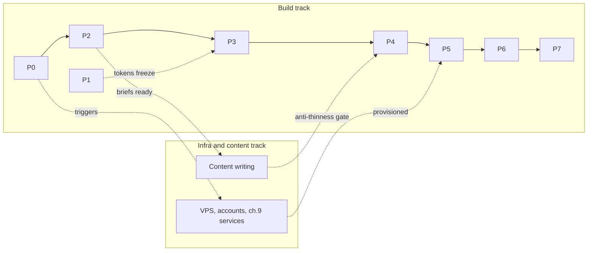

# GenMedha Hub — Specialist Ecommerce Agency Website: Complete Architecture Plan & Phase-Wise Build Blueprint

**Document type:** Build contract (no code) — executable by a development team or AI coding agent
**Version:** 2.2 (CRM & outbound stack added) | **Date:** 2026-07-29 | **Status:** Final
**Brand:** GenMedha Hub — genmedhahub.com (Genmedha Solutions Pvt Ltd)
**Scope:** Ecommerce-first digital engineering studio — flagship composable commerce practice (Medusa core, plus Vendure, Shopify, Adobe Commerce) with Build & Grow pillars (Web App Development, Mobile App Development, Digital Marketing), serving India, the USA, and the UAE & GCC.

---

## 1. Build Mandate, Locked Decisions, and Success Contract

This chapter states the contract the remaining twelve chapters fulfill: what will be built, on which locked baseline, against which gates, with which exclusions.

### 1.1 Engagement outcome and intended readers

#### 1.1.1 An executable build contract: executives read ch.1–3; builders read ch.4–13

The engagement outcome is a launched, lead-generating marketing site for GenMedha Hub on genmedhahub.com. This document is the build contract for that outcome: a dev team or AI coding agent must be able to execute from it without asking questions, because every table and checklist is a decision, not a topic. Two reader tracks apply: executives and the client-side approver read chapters 1–3 (mandate, positioning, information architecture) and return only for the open decisions in 13.3 and the gates in 1.5; builders read chapters 4–13 as the executable specification. Chapter 12 operationalizes the contract for AI execution, packaging chapter 11's phases into copy-paste Kimi Code prompts whose acceptance criteria quote this document verbatim — the agent is measured against the contract, not its own judgment.

### 1.2 Business scope and launch definition

#### 1.2.1 Final approved scope — commerce flagship, Build & Grow pillars, three markets, audit entry offer — and what "launched" means

The approved scope is an ecommerce-first digital engineering studio. The flagship **Commerce pillars** sell composable commerce across four named platforms — Medusa (core competency), Vendure, Shopify, Adobe Commerce — as ecommerce builds, legacy-to-modern replatforming/migration, and support & retainers, with the paid **Legacy Platform Audit** as the fixed-price entry offer. The adjacent **Build & Grow pillars** — Web App Development, Mobile App Development, Digital Marketing — extend the same TypeScript/React engineering core, for clients across **India, the USA, and the UAE & GCC**. Chapter 2 fixes the positioning; chapter 3 fixes the 54 launch routes. The brand appears only as the placeholder `GenMedha Hub` and the domain as `genmedhahub.com`, replaced by global find-replace once the naming decision (13.3) closes. **Launch definition:** launched means every phase gate P0–P7 (chapter 11) closed on runnable evidence and the 1.5 launch acceptance checklist passing against production on genmedhahub.com. Scope evolves only through change control (13.4); the 54-route baseline is the frozen truth.

### 1.3 Locked technical decisions

#### 1.3.1 Non-negotiable baseline, rationale chain, and the locked-decision register

The non-negotiable baseline: Next.js 16.2.x + Payload CMS 3.86 (embedded, PostgreSQL) + React 19 + Tailwind CSS v4 + shadcn/ui, delivered as a single Dockerfile. The rationale chain runs through the CMS: Payload's embedded model (one deployable unit, Local API without an HTTP hop) chose Next.js over Astro, because draft preview, booking embeds, and form handling are app-shaped requirements; Payload's support matrix then chose the version — Next.js 16.2.0+ supported since Payload v3.73.0, 15.5–16.1.x unsupported[^1^], Next.js 15 security support ending 2026-10-21[^2^].

**Locked-decision register.**

| Decision | Value | Rationale | Chapter ref |
|---|---|---|---|
| Framework | Next.js 16.2.x (App Router) | Payload requires 16.2.0+; 15.5–16.1.x unsupported[^1^]; 15 EOL 2026-10-21[^2^] | 6.1 |
| CMS | Payload CMS 3.86, embedded via `withPayload` | One deployable unit; Astro rejected | 6.1 |
| Language/runtime | TypeScript 5.x `strict`, Node.js 22 LTS | Generated types make ch.5 compile-time | 6.1 |
| Database | PostgreSQL 16 | Recommended adapter; jobs on Postgres — no Redis | 6.1, 6.8 |
| Styling | Tailwind CSS v4.3, CSS-first `@theme` | 2026 standard; shadcn/ui ships on v4 | 6.5 |
| UI primitives | shadcn/ui (v4 build) | Source-owned; accessible bases | 6.5 |
| Media storage | `@payloadcms/storage-s3` → Cloudflare R2; MinIO fallback | Zero egress; off-VPS durability | 6.7 |
| Email | Resend via `email-resend` + React Email | Free 3,000/mo; Pro $20/mo[^64^] | 7.4 |
| Forms | `@payloadcms/plugin-form-builder` | Maintained plugin; submissions in Postgres | 7.3 |
| Booking | Cal.com Cloud embed + Routing Forms | Free tier; self-host escape hatch | 7.2 |
| CRM (inbound) | HubSpot Free, private-app API | CRM of record; 1,000 contacts / 2 users free; Starter $20/seat deferred to triggers[^94^] | 7.10 |
| Newsletter | Listmonk + SES/Resend SMTP, double opt-in | ~$8–10/mo vs MailerLite $32–73/mo[^66^] | 7.5 |
| Analytics | Umami, self-hosted | Cookieless; no banner trigger | 7.8 |
| Hosting/CI | Dokploy VPS, standalone Dockerfile; GitHub Actions → GHCR → webhook | Client mandates self-hosting | 9.2, 9.3 |

Usage note: the register condenses the ch.6 stack decision record and ch.7/ch.9 choices; changing any row is a 13.4 change-control event.

### 1.4 Build-contract conventions

#### 1.4.1 Must/should/may, evidence labels, the no-code rule, and the terminology glossary

Three requirement levels apply: **must** is mandatory and gate-blocking; **should** is a strong recommendation whose deviation needs a recorded justification; **may** is a permitted option. Three evidence labels qualify factual statements: **verified fact** carries a registry citation; **(judgment call)** marks a defensible decision without a cited source; **open assumption** marks an unverified or client-input item tracked in 13.2/13.3. The **no-code rule**: this document specifies, never implements — code is written at execution time from chapter 12's prompts.

**Placeholder and terminology glossary.**

| Term | Meaning |
|---|---|
| `GenMedha Hub` / `genmedhahub.com` | Brand and domain placeholders; global find-replace pre-launch (13.5) |
| "the studio" / "the agency" | GenMedha Hub itself, the site owner |
| P0–P7 | The 8 build phases of chapter 11; each independently shippable |
| "Commerce pillars" | Ecommerce Builds, Replatforming & Migration, Support & Retainers |
| "Build & Grow" | Web App Development, Mobile App Development, Digital Marketing |
| Verified fact / judgment call / open assumption | Evidence labels defined above |

Usage note: exact service, pillar, and market spellings are enforced per 2.9.

### 1.5 Acceptance gates and launch criteria

#### 1.5.1 Phase-gate definitions and the launch acceptance checklist

Four gate types govern the build — shippable phase, accepted page, accepted integration, launch-ready site.

| Gate | Meaning | Evidence required |
|---|---|---|
| Phase gate (P-gate) | A phase P0–P7 is accepted; one failure keeps it open | Runnable evidence per ch.11 binary criteria — URL, CI run, admin state, scripted test; never prose (11.1) |
| Page gate | A single page is accepted | Renders from CMS content; matches its ch.4 blueprint; CTA matches its 3.6 row; ≥800 words unique copy; 3.7 linking passes |
| Integration gate | A lead flow is accepted | Ch.7 contract tests end-to-end: Postgres row first, downstream action confirmed, fallback renders (6.9) |
| Launch gate | The site is launch-ready | Full 10.7 checklist green; 9.8 cutover runbook executed; restore test signed off |

Usage note: gates are binary and close only on evidence attached to the gate record.

**Launch acceptance checklist** (rolls up ch.10's quality gate, ch.11's phase gates, and ch.13's pre-P0 decisions):

- [ ] All P0–P7 phase gates closed on runnable evidence (11.2–11.9)
- [ ] All 54 launch routes return 200; no orphan routes (3.2, 3.7)
- [ ] Lighthouse mobile ≥90/100/≥95/100 (Performance/Accessibility/Best Practices/SEO) on all 6 key templates, merge-blocking (10.2)
- [ ] CWV field eligibility: CrUX collecting; origin summary live in PageSpeed Insights (10.7)
- [ ] WCAG 2.2 AA checklist 100% on key templates; sign-off dated (10.3)
- [ ] JSON-LD validates on every template; sitemap.xml enumerates exactly the launch URLs; robots.txt live (10.7)
- [ ] Booking, launch forms, and newsletter verified end-to-end against production (10.7)
- [ ] Anti-thinness gate: no indexable page under 800 words unique copy (3.1.1)
- [ ] Restore test signed off; external monitor and Uptime Kuma green; rollback armed (9.4–9.6)
- [ ] Compliance register re-verified; counsel sign-off on jurisdiction rows (10.5)
- [ ] Claims-hygiene checklist passed; no prohibited claims live (13.5)
- [ ] `GenMedha Hub`/`genmedhahub.com` replaced globally; build-gating open decisions closed (13.3, 13.5)

### 1.6 Out-of-scope items and change triggers

#### 1.6.1 Excluded capabilities, and formal scope change vs informal drift

The matrix freezes the build boundary; each Out row records whether the capability is a future option.

| In scope (launch) | Out of scope | Future option? |
|---|---|---|
| 54 routes across 8 route groups (ch.3) | Multilingual / hreflang — single-language launch | Yes (13.3) |
| 16 collections, 5 globals, 13 block renderers (ch.5) | Ecommerce on GenMedha Hub's own site (cart, checkout) | No |
| 5 integration flows + analytics per ch.7 | Client portal / authenticated customer area | No |
| Quality gates: CWV, Lighthouse, WCAG 2.2 AA, security (ch.10) | Native iOS/Android outside React Native (Expo) | No |
| Single-Dockerfile Dokploy deployment, backups, monitoring, cutover (ch.9) | Ad-account ownership transfers — client-owned properties, agency admin (13.3) | No |
| 85–116 person-day estimate, P0–P7 (11.10) | Post-launch items per ch.13: Medusa Expert application, Apple/Google developer accounts, paid media | Yes — post-launch roadmap |

Usage note: anything unlisted is out. Two change triggers exist: **formal scope change** — touching any lock (stack pins, 54-route scope, integration matrix, budgets, estimates) requires the 13.4 change-request template and named client approval; **informal drift** — undocumented additions during execution — is prohibited: chapter 12's scope-outs and stop conditions halt the phase and escalate rather than absorb.

Every build decision in chapters 2–13 resolves back to the positioning statement approved in 2.3.1, quoted here verbatim as the north star:

> "GenMedha Hub is an ecommerce-first digital engineering studio. Our flagship practice designs, builds, migrates, and supports composable commerce — with Medusa as our core competency, plus Vendure, Shopify, and Adobe Commerce. The same TypeScript/React engineering core delivers web applications and mobile apps, and our digital marketing practice grows what we build — for clients across India, the USA, and the GCC/UAE."

## 2. Positioning, Messaging, and Offer Strategy

This chapter fixes what GenMedha Hub says, to whom, and with what proof; chapters 3–8 inherit its tables as contracts.

### 2.1 Market position

#### 2.1.1 "Ecommerce-first digital engineering studio"

GenMedha Hub positions as an ecommerce-first digital engineering studio. The flagship practice is composable commerce, combining the engineering credibility of a mono-platform Medusa specialist (the Agilo pattern[^12^]) with the honest multi-platform advisory posture of byte5 and Space 48 (per-platform pillar pages, openly narrated replatforms[^17^][^47^]). Three adjacent "Build & Grow" pillars — Web App Development, Mobile App Development, and Digital Marketing — extend the studio onto the same TypeScript/React engineering core for clients across India, the USA, and the UAE & GCC. The market claim is deliberately hierarchical: deep enough in Medusa to rank among its experts, honest enough to say when Medusa is the wrong answer, and disciplined enough never to claim equal depth across all pillars (anti-dilution rule, 2.8). Ecommerce carries certification and open-source proof; the Build & Grow pillars carry stack-coherence, dogfooding, and own-engine proof (2.6, 2.7). The site names exactly four commerce platforms and three adjacent services — never "any platform," never "full-service."

**Positioning-map figure (describe to designer).** Two-axis scatter. X: "single-platform specialist" (left) to "multi-platform generalist" (right). Y: "implementation shop" (bottom) to "engineering studio" (top). Plot: **Agilo** far-left/upper (Medusa-only specialist[^12^]); **306 Technologies** far-left/lower (quote-driven implementation[^16^]); **Domaine** left-center/mid (Shopify-native, broad capability pillars[^32^]); **Space 48** right/lower-mid (platform-agnostic[^47^]); **byte5** right/upper (per-platform technology pages[^17^]); **Elogic** right-center/upper-mid (multi-platform engineering[^41^]); **Generalist full-service agencies (category reference)** as a shaded region at far-right/lower-mid (x ≈ 90%, y ≈ 30%) — broad service menus, implementation-led delivery — plotted as a category, not a named firm, marking the dilution pole GenMedha Hub explicitly avoids (judgment call); **GenMedha Hub (intended)** at x ≈ 35%, y ≈ 80% — specialist-leaning, studio-grade engineering — as a distinct outline marker with an arrow labeled "intended position," since it is a claim to be proven, not an observed fact (judgment call). Add a dashed arrow labeled "Build & Grow reach" extending rightward from the GenMedha Hub marker toward mid-field: the adjacent pillars widen addressable demand without moving the specialist anchor (judgment call).

**Copy implication.** The site reads like an engineering studio: the hero stays ecommerce and leads with architecture and migration methodology; the Build & Grow pillars appear as a secondary capability band, each with a one-line stack-coherence proof (chapter 4); platforms are named competencies, never logo soup; design appears only inside Discovery and Build (2.5).

### 2.2 Priority audiences and buying situations

#### 2.2.1 Merchant profiles

Six buying situations cover the addressable market; chapter 4 maps each row to page sections with verbatim CTA language. The first four rows feed the Commerce pillar; the last two feed the Build & Grow pillars.

| Segment | Trigger / pain | Core message | Primary CTA |
|---|---|---|---|
| Merchant outgrowing platform | Store has outgrown its current system[^12^]; roadmap blocked | "Outgrow legacy platforms without downtime" — zero-downtime cutover with rollback[^30^] | Book a discovery call |
| Cost-pressured merchant | GMV tax / license fees: Plus ~$2,300/mo floor[^31^]; Adobe partner-estimated $22K–125K/yr[^38^] | "Own your stack: Medusa Cloud $29–$299/mo, 0% GMV fee"[^6^] | Get a Legacy Platform Audit |
| Technical buyer / CTO | Stack-literate; evaluates repos, docs, architecture before any call | Engineering depth: OSS plugins, deep-dives, "Medusa + Payload + Next.js" stack naming[^14^] | Read the migration guide |
| B2B buyer | Needs company accounts, quotes, approvals, contract pricing | "Vendure: the complete ecommerce platform for complex B2B"; only 17 official partners[^19^] | Book a discovery call |
| Startup/SME founder with an app mandate | Non-technical or lean-team founder in India, the USA, or the UAE & GCC; needs a web or mobile product scoped, built, and launched on a fixed budget | "One engineering core, end to end": Next.js/React/Node.js/PostgreSQL for web apps; React Native (Expo) with TypeScript for mobile — the same stack that runs this site (2.6.2) | Scope my app |
| Marketing-mandate buyer (founder/CMO) | Growth targets in India, the USA, or the UAE & GCC without in-house SEO/GEO, performance marketing, or lifecycle capability | "We rank ourselves first" — the agency's own content engine is the living case study, with build-in-public metrics (2.7) | Get a growth audit |

Usage note: the CTO row converts on content, not calls — hence a read CTA; the blog engine (chapter 8) is built for this segment. The two Build & Grow rows convert on demonstrated practice, not reputation: the app-mandate founder is shown the stack this very site runs on, and the marketing-mandate buyer is shown the agency's own rankings and traffic — both proof mechanisms are specified in 2.7.

### 2.3 Core positioning statement

#### 2.3.1 Approved working statement

> "GenMedha Hub is an ecommerce-first digital engineering studio. Our flagship practice designs, builds, migrates, and supports composable commerce — with Medusa as our core competency, plus Vendure, Shopify, and Adobe Commerce. The same TypeScript/React engineering core delivers web applications and mobile apps, and our digital marketing practice grows what we build — for clients across India, the USA, and the GCC/UAE."

Each clause commits the site to proof:

- **"Ecommerce-first digital engineering studio"** — the hierarchy is the claim: commerce leads, Build & Grow pillars follow; performance scores, published methodology, OSS artifacts; no lifestyle-agency aesthetic; never "full-service."
- **"Flagship practice designs, builds, migrates, and supports"** — the four-phase taxonomy (2.5); each phase a named page and engagement model; "flagship" carries the certification/OSS proof (2.7).
- **"Composable commerce"** — composable systems with named integration surfaces (Stripe, Algolia, Payload[^9^]).
- **"Medusa as our core competency"** — deepest platform hub; the Expert listing (2.7) is the proof milestone.
- **"Plus Vendure, Shopify, and Adobe Commerce"** — three real hubs (2.6); the claim forbids thin logo pages.
- **"The same TypeScript/React engineering core delivers web applications and mobile apps"** — the stack-coherence claim (2.6.2); the proof artifact is this site itself, which runs the same stack it sells.
- **"Our digital marketing practice grows what we build"** — the Build → Migrate → Support → Grow lifecycle (2.5); the proof is the agency's own content engine with build-in-public metrics (2.7).
- **"Clients across India, the USA, and the GCC/UAE"** — a logistical claim, not a presence claim: market pages document timezones, contracting, and payments; no local-office claims anywhere (2.8).

The retired promise language — "without downtime," "own your stack," "stop paying platform taxes" — is not lost; it moves into the message hierarchy (2.4) as the Commerce pillar's core promise and economics proof, where the sourced math lives.

### 2.4 Message hierarchy

#### 2.4.1 Core promise and proof pillars

| Level | Message | Proof assets | Site location |
|---|---|---|---|
| Core promise | "Own your commerce stack: no GMV tax, no license fees, no lock-in" (validated by Seeed, Agilo)[^14^][^12^] | Medusa Cloud pricing; 3-yr TCO table | Homepage hero, platform hubs |
| Pillar 1 — Platform economics | Medusa Cloud $29/$99/$299/mo, 0% GMV fee[^6^] vs Plus ~$2,300/mo floor[^31^] vs Adobe partner-estimated $22K–125K/yr[^38^] | TCO comparison; replatforming calculator[^51^] | Homepage economics section, migration pages |
| Pillar 2 — Migration de-risking | Zero-downtime cutover + rollback as named methodology[^30^]; SEO-preservation workstream[^48^] | Process diagram; "when not to migrate" section[^40^] | Migration hub and pair pages |
| Pillar 3 — Engineering depth | OSS plugins/starters (Lambda Curry pattern)[^13^]; deep-dives; Expert listing once earned[^10^] | Plugins/Tools section, blog, badges | Proof pages, footer trust strip |
| Pillar 4 — Web App Development | Engineering depth and stack coherence: web apps on the same Next.js/React/Node.js/PostgreSQL core as the commerce work (judgment call per scope-addendum D2) | Dogfooding artifact: this site runs the stack it sells; OSS starters | Web App Development service page, Build & Grow homepage band |
| Pillar 5 — Mobile App Development | React Native (Expo) with TypeScript and launch discipline: scoped MVP releases, store submission managed, crash-free targets in the contract (judgment call per scope-addendum D2) | Shipped-app case studies as they land; stack-coherence narrative (2.6.2) | Mobile App Development service page, Build & Grow homepage band |
| Pillar 6 — Digital Marketing | "We rank ourselves first" — own-engine proof: the agency's rankings, organic traffic, and newsletter growth are the case study | Build-in-public metrics posts; the service pages' own CWV, schema, and rankings as proof artifacts | Digital Marketing service page and child pages, blog |

Interpretation: the hierarchy is deliberately asymmetric. The core promise is an economic sentence, not a technical one — it survives the handoff from technical evaluator to budget holder. Pillar 1 converts cost-pressured merchants and carries the strongest quantitative hook (0% GMV fee vs a ~$2,300/mo floor); its Adobe figure always keeps the partner-estimate attribution (2.8). Pillar 2 exists because switching risk, not price, is the top objection across every agency teardown. Pillar 3 is the only pillar that compounds, and it substitutes for the client roster GenMedha Hub does not yet have. Copy rule: no page leads with Pillar 3; no page omits Pillars 1 and 2 entirely.

Pillars 4–6 play by different rules than Pillars 1–3, and the copy must not blur the difference. The commerce pillars lean on sourced market economics; the Build & Grow pillars lean on demonstrated practice, because no sourced benchmark proves app quality or marketing competence the way a $29/mo price tag proves platform economics. Pillar 4's promise is engineering depth through stack coherence — one TypeScript/React core across commerce and apps means no second team to coordinate (judgment call). Pillar 5's promise is launch discipline: the differentiator for an app-mandate founder is not the framework but a managed path from scope to store submission (judgment call). Pillar 6 is the only pillar whose proof is self-referential by design: a Digital Marketing page that does not itself rank, load fast, and carry valid schema contradicts its own pitch, so the chapter 8 content engine doubles as Pillar 6's case study. Copy rule: Build & Grow pages may cross-reference commerce proof ("the same engineering core as our commerce flagship"), but commerce pages never dilute the hero with pillar parity claims.

### 2.5 Service narratives

#### 2.5.1 Taxonomy and engagement models

Services follow a four-phase lifecycle — **Discovery → Build → Migrate → Support** — the plan's lifecycle taxonomy, following the Agilo engagement pattern[^12^] — mapped to engagement models and market pricing bands. The Build & Grow pillars extend the lifecycle to **Build → Migrate → Support → Grow**: Digital Marketing closes the loop, turning a delivered build into a retained growth engagement (cross-sell narrative per scope-addendum D5).

**Market benchmarks — GenMedha Hub sets final numbers:**

| Phase | Engagement model | Market benchmark |
|---|---|---|
| Discovery | Fixed-price audit / workshop | Elogic audit $25–85K[^41^]; Pinelab 2-day workshop €1,800[^22^]; Ask Phill paid discovery[^30^] |
| Build | Fixed project | $50–250K+ mid-market[^53^]; Pinelab full Vendure setup €8,500[^22^]; Ask Phill €20–60k / €50–200k / €200k+[^30^] |
| Migrate | Fixed project | $75–300K+[^53^]; Elogic B2B $75–150K, enterprise $200–500K+[^41^] |
| Support | Monthly retainer | $2.5–20K/mo, ~$14K ecommerce average[^52^]; full-service $10–50K+/mo[^53^] |
| Support (scaled) | Dedicated team | Elogic squad $35–60K/mo; $25K minimum engagement[^41^] |
| Ad hoc | Hourly | $75–250/hr US/EU[^53^] |
| Build — Web App Development | Fixed project | Inside the Build band: $50–250K+ mid-market[^53^]; MVP-first web-app scopes below the band (judgment call) |
| Build — Mobile App Development | Fixed project | Inside the Build band: $50–250K+ mid-market[^53^]; single-platform Expo MVP scopes below the band (judgment call) |
| Grow — Digital Marketing | Monthly retainer | $3–15K/mo by channel mix (judgment call — no sourced marketing benchmark in the registry; anchored against the sourced ecommerce retainer band $2.5–20K/mo, ~$14K average[^52^]) |
| Grow — Digital Marketing (scaled) | Dedicated team | Inside the sourced squad band: $35–60K/mo[^41^] |

**Service narratives — Build & Grow pillars.** Web App Development sells one accountable engineering core: the same Next.js/React/Node.js/PostgreSQL stack that powers the commerce flagship and this site, delivered as a fixed-scope build with a named architecture before a price (judgment call). Mobile App Development sells launch discipline: React Native (Expo) with TypeScript, native modules where required, MVP-first scoping, and store submission inside the engagement rather than after it (judgment call per scope-addendum D2). Digital Marketing sells demonstrated practice: SEO/GEO, performance marketing (Google/Meta Ads), content marketing, lifecycle email, and analytics/CRO — explicitly not a full-service creative scope (D2) — sold as a retainer whose pitch artifact is the agency's own rankings, traffic, and newsletter growth (2.7). Engagement-model rule: apps are fixed builds, marketing is a retainer, and either can scale to a dedicated team inside the sourced squad band.

Interpretation: three patterns shape GenMedha Hub's pricing posture. First, published pricing is a trust weapon for an agency without a roster — Pinelab publishes exact figures (€8,500 / €1,800), Ask Phill publishes full tiers; GenMedha Hub should publish "from" prices per engagement model. Second, Discovery is the wedge: a fixed-price Legacy Platform Audit below Elogic's $25–85K enterprise band lets a no-roster agency sell a low-risk first engagement and earn the Build phase through delivery. Third, the retainer band is the revenue-stability target, so Support is a first-class nav item (306 Technologies pattern[^16^]), not an afterthought. Final numbers remain GenMedha Hub's decision; these bands are the market frame the pricing copy must sit credibly inside.

### 2.6 Platform narratives

#### 2.6.1 Approved claims per platform

- **Medusa (flagship).** Approved: v2 capabilities — multi-region by default, price lists, promotions, official recipes (B2B, marketplace, subscriptions, digital products)[^5^][^8^]; Medusa Cloud $29/$99/$299/mo, 0.0% GMV fee, client-owns-billing agency model[^6^][^7^]; MCP/agentic tooling on all tiers[^6^]. Prohibited: claiming Expert status before listing (requires ≥1 live Medusa Cloud project)[^11^].
- **Vendure.** Approved: current v3.7.x; GPLv3 + dual commercial licensing since v3[^18^]; vendor's "complete ecommerce platform for complex B2B" at €40,000/yr flat[^19^]; only 17 official partners globally — a scarce trust asset[^19^]. Prohibited: implying partnership before acceptance; quoting vendor customer metrics as GenMedha Hub results.
- **Shopify.** Approved: honest Hydrogen economics — builds $50K–250K+ US / €150K–700K EU, $3–8K/mo maintenance, payback above ~$5M revenue[^29^][^31^]; Plus ~$2,300/mo floor[^31^]; Winter '26 update shows continued investment[^27^]. Prohibited: defaulting to headless below ~$5M revenue; the contested "Shopify discourages headless" claim except as "some analysts argue"[^28^].
- **Adobe Commerce.** Approved: the "three Magentos" frame — Magento Open Source (2.4.9), Commerce PaaS/on-prem, ACCS SaaS (GA mid-2025)[^36^][^37^]; licenses cited only as partner estimates ($22K–125K/yr on-prem, $40K–190K+/yr Cloud)[^38^]; EOS anchors — 2.4.4 → 2026-04-14, 2.4.5/2.4.6 → 2026-08-11, 2.4.8 → ~Apr–May 2028[^44^]. Prohibited: unattributed license prices; declaring Magento Open Source dead (Mage-OS fork, monthly patches)[^37^].

#### 2.6.2 Engineering stack narrative (Build & Grow pillars)

The Build & Grow pillars sell stack coherence, not platform breadth: one TypeScript/React engineering core across commerce, web apps, and mobile apps.

- **Web App Development.** Approved: Next.js / React / Node.js / PostgreSQL — the same stack as the commerce storefronts and this site (judgment call per scope-addendum D2; client may override). Dogfooding frame: the agency's own site runs Next.js 16.2.x + Payload CMS 3.86 (embedded, PostgreSQL) + React 19 + Tailwind CSS v4 + shadcn/ui, delivered as a single Dockerfile — a public, inspectable proof that the web-app stack narrative is practiced, not claimed. Prohibited: implying web-app delivery parity with the commerce flagship before case studies exist (anti-dilution rule, 2.8).
- **Mobile App Development.** Approved: React Native (Expo) with TypeScript; native modules where required; MVP-first release scoping with store submission inside the engagement (judgment call per scope-addendum D2). Prohibited: claiming native iOS/Android specialist depth; promising store approval timelines.
- **Digital Marketing.** Approved scope: SEO/GEO, performance marketing (Google/Meta Ads), content marketing, lifecycle email, analytics/CRO — explicitly not a full-service creative agency scope (scope-addendum D2). Prohibited: brand identity, video production, or offline creative claims; any guaranteed ranking or ROAS figure.

### 2.7 Trust and proof strategy

#### 2.7.1 Ecosystem-currency model

Without a big roster, GenMedha Hub builds trust in currencies the ecosystems mint, sequenced by effort:

- [ ] **Medusa Expert listing** — flagship badge; requires ≥1 project live on Medusa Cloud (ship an own-product or discounted project first); brings referrals and collaborative marketing[^10^][^11^].
- [ ] **Vendure partner application** — only 17 partners globally; a disproportionate signal[^19^].
- [ ] **Shopify Partner program** — 2026 evaluation purely commercial; credential requirements waived[^25^].
- [ ] **Adobe Solution Partner** — after first Adobe delivery; meanwhile JH's community-authority pattern[^46^].
- [ ] **OSS plugins/starters as proof** — Lambda Curry's lead-magnet pattern; Plugins/Tools section[^13^].
- [ ] **Founder authority content** — engineering deep-dives and migration guides for the CTO segment (2.2).
- [ ] **Published pricing posture** — "from" prices per model (Pinelab, Ask Phill)[^22^][^30^].
- [ ] **Outcome-led case studies as projects land** — Challenge → Solution → Results, 2–4 metric callouts[^54^].
- [ ] **Own content engine as the living Digital Marketing case study** — the agency's SEO/GEO/content engine (chapter 8) is the marketing practice's proof: build-in-public metrics posts publishing rankings, organic traffic, and newsletter growth — "we practice on ourselves first"; Digital Marketing service pages must themselves demonstrate the craft (own rankings, own schema, own CWV as proof artifacts).
- [ ] **OSS and dogfooding for app development** — open-source starters and tooling plus the demonstrable fact that the agency's own site runs the same Next.js/React/TypeScript core it sells for Web App Development and Mobile App Development (2.6.2).

### 2.8 Objection handling and claims discipline

#### 2.8.1 Objections and approved-vs-prohibited claims

Every migration and platform page answers five objections plus the honesty play; service and market pages additionally answer the dilution objection and the three regional objections:

| Objection | Approved response |
|---|---|
| Switching risk / downtime | Zero-downtime cutover methodology with rollback[^30^]; preview/pre-prod environments[^7^] |
| SEO loss | SEO-preservation workstream: crawl, 301 maps, canonicals, monitoring[^48^] |
| TCO doubt | 3-year TCO math with sourced figures (2.4); replatforming calculator[^51^] |
| Lock-in fear | Client owns billing and code; agency billing model explicit[^7^] |
| "Should we migrate at all?" | Honest "when not to migrate" section with stay-and-modernize alternatives (Elogic Hyvä counter-narrative)[^40^]; "we'll tell you when you don't need us" posture[^30^] |
| "Are you specialists or generalists?" (dilution) | Anti-dilution response: ecommerce is the flagship and carries the certification/OSS proof (2.7); the Build & Grow pillars are adjacent practices on the same TypeScript/React engineering core, proven by stack coherence, dogfooding, and the own-engine case study — depth is claimed hierarchically, never equally |
| Timezone overlap (India / USA / UAE & GCC) | Logistical answer only: published overlap windows per region, async-first status reporting, named response-time SLAs in every proposal (judgment call) |
| Contracting and payments across regions | Logistical answer only: remote contracting with standard international payment terms; jurisdiction specifics documented on the relevant market page (chapter 3) (judgment call) |
| Communication across regions | Logistical answer only: English-language delivery, written-first communication, weekly recorded demos (judgment call) |

Claims discipline — every comparative claim is sourced or banned:

| Approved (sourced) | Prohibited (unverifiable) |
|---|---|
| "Medusa Cloud from $29/mo, 0% GMV fee"[^6^] | "The cheapest commerce platform" |
| "Only 17 official Vendure partners globally"[^19^] | "World's leading Vendure agency" |
| "Adobe licenses: partner estimates $22K–125K/yr"[^38^] | "Adobe costs $125K/yr" (unattributed) |
| "Shopify headless pays back above ~$5M revenue"[^29^] | "Headless always wins" |
| "Zero-downtime cutover with rollback" as methodology[^30^] | "Guaranteed zero risk" |
| "Listed Medusa Expert" (only once listed)[^10^] | "The #1 Medusa agency" |
| "Ecommerce is our flagship; our app and marketing practices run on the same engineering core" | "Full-service agency"; "equal expertise across all services" |
| "Serving clients across India, the USA, and the UAE & GCC — remotely, with published overlap windows" | "Offices in Dubai / New York / Bangalore" or any local-presence claim |
| "Our own rankings, traffic, and newsletter growth — published monthly" | Any guaranteed ranking, traffic, or ROAS figure |

Usage note: this table is a gate — copy specs and content briefs (chapters 4, 8) reject prohibited-column claims; every comparative number carries its citation into the CMS. Regional claims are always logistical (timezones, contracting, payments, communication cadence) and never presence claims — GenMedha Hub does not claim physical offices in any market.

### 2.9 Voice, terminology, and conversion language

#### 2.9.1 Voice rules, CTA bank, and founder-bio template

**Voice.** Consulting register: conclusion first, then evidence. Headlines state outcomes, not capabilities (Tinloof pattern: "Commerce without Spinners", "Zero-Downtime Migration from Webflow")[^15^]. Sentences under 25 words; numbers over adjectives.

**Exact spellings (enforced in CMS copy).** Medusa (never "MedusaJS"), Medusa Cloud, Vendure, Shopify, Shopify Plus, Hydrogen, Adobe Commerce, Magento Open Source; service names exactly "Web App Development", "Mobile App Development", "Digital Marketing"; pillar names exactly "Commerce" and "Build & Grow"; market names exactly "India", "USA", "UAE & GCC"; spell out ACCS, CWV, and GMV on first use.

**CTA language bank** (one primary per page; secondary on pricing/migration pages; tertiary on content surfaces). Final labels for the Build & Grow pillars: Web App Development and Mobile App Development pages use "Scope my app" as primary and "Book a discovery call" as secondary; Digital Marketing pages use "Get a growth audit" as primary and "Book a discovery call" as secondary:

| Tier | CTA | Variants |
|---|---|---|
| Primary | "Book a discovery call" | "Book a call", "Let's talk"[^12^] |
| Primary | "Scope my app" | "Scope my web app", "Scope my mobile app" |
| Secondary | "Get a Legacy Platform Audit" | "Start with an audit" |
| Secondary | "Get a growth audit" | "Start with a growth audit" |
| Tertiary | "Read the migration guide" | "See the migration process" |
| Trust-adjacent | "View our work" | "See the open-source plugins"[^16^] |

**Regional messaging notes (India, USA, UAE & GCC).** One region-neutral international English (US spelling) across the entire site; no region-specific slang, idioms, humor, or cultural references, and no localized spelling variants. Regional differentiation lives only on the market pages and is strictly logistical — market context, timezone overlap, contracting, payments, compliance notes — never tonal (2.8 claims gate). Single-language launch: no hreflang at launch, noted as a future option (judgment call).

**Banned hype list** (reject in copy review): "revolutionary", "cutting-edge", "world-class", "best-in-class", unqualified "seamless", "supercharge", "game-changer", "next-level", "unmatched", "#1", "full-service", any unsourced percentage, any guarantee without a methodology behind it.

**Founder-bio template** (fill in only verified facts; never invent credentials):

```
[Name], [role, e.g., Founder & Principal Engineer] — [N] years building
commerce systems. Platforms shipped: [list with versions]. Open source:
[plugin/repo links with star/download counts]. Talks & writing: [event
names, dates, links]. Previously: [employers/clients, only with permission].
```

Any field without a verifiable value is omitted, not approximated — the trust strategy (2.7) depends on every on-site claim surviving a skeptical CTO's fact-check.

## 3. Information Architecture, Sitemap, and Conversion System

This chapter fixes where every page lives, how visitors move between pages, and how each route converts. Chapter 4 writes the blueprints referenced here; chapter 5 models the CMS collections that serve these routes; chapter 8 maps keywords to these URLs; chapter 11 schedules them into phases P0–P7.

### 3.1 IA principles

#### 3.1.1 Hybrid model and the anti-thinness rule

GenMedha Hub's information architecture (IA) is a five-axis hybrid, because no single-axis model fits a studio that sells commerce capabilities, application engineering, growth services, platforms, migrations, and commerce models at once:

1. **Capability pillars, split into two groups.** The **Commerce** group holds the three original pages matching the service taxonomy: Ecommerce Builds, Replatforming & Migration, Support & Retainers (Domaine's capability-pillar pattern[^32^]; Agilo's lifecycle sequence[^12^]). The **Build & Grow** group holds the three adjacent pillars added by the client scope directive: Web App Development, Mobile App Development, and Digital Marketing — the last with four child pages (SEO/GEO, Performance Marketing, Content Marketing, Email & Lifecycle). Per the anti-dilution rule (chapter 2), the groups are never presented as equal-depth: Commerce carries the certification and open-source proof; Build & Grow carries stack-coherence proof (same Next.js/React/TypeScript core) and own-engine proof (chapter 8).
2. **Platform hubs** — one hub per named platform, with Medusa as the flagship, deepest hub (byte5's per-technology pillar pattern[^17^]; 1Digital's per-platform service-page model[^49^]).
3. **Migration-pair pages** — one page per source-to-target pair, the proven search-engine optimization (SEO) workhorse observed at Elogic, Pointer Creative, and SplitDev[^39^][^35^][^50^].
4. **Commerce-model solutions** — B2B, DTC, Marketplace, Subscriptions, Multi-region, mirroring the "Medusa Cases" filter taxonomy buyers already use on the Medusa Experts directory[^10^] and Medusa's official recipes[^8^].
5. **Market pages** — a /markets index plus one page per target region (India, USA, UAE & GCC). These qualify and route regional visitors with market context, engagement logistics, and region-relevant proof; they are not a second service taxonomy and stay out of the primary nav (3.3).

**Anti-thinness warning (copy the structure, never the thinness).** Pointer Creative programmatically generates migration-pair and city pages at high coverage with thin content[^35^]. GenMedha Hub copies the pair-page *URL structure* but rejects the production method: every pair page is hand-written to a fixed blueprint (chapter 4) with pair-specific cost math, an honest "when not to migrate" section[^40^], and sourced EOS anchors[^44^]. Hard rules: no indexable page ships under 800 words of unique copy (judgment call on the floor); every pair page must answer "why does this pair differ from its siblings"; six pairs are the launch ceiling — more are added only after the first six rank (3.8). The same rule binds the two new IA elements. Region pages under /markets are substantive or they do not publish: each carries market context, engagement logistics (timezone overlap, contracting, payments), compliance notes, and region-relevant proof — never doorway or city-level pages, the exact pattern the Pointer warning flags[^35^]. Digital-marketing child pages ship only when each stands alone with unique copy plus the practice's own proof artifacts (the agency's own rankings, schema, and Core Web Vitals, per chapter 8); a child page that cannot demonstrate the discipline it sells stays unpublished until it can.

### 3.2 Complete sitemap

#### 3.2.1 Sitemap tree and route inventory

Indented tree (indentation = URL hierarchy; `[slug]` = CMS-driven template route):

```
/
├── services/
│   ├── ecommerce-builds            (Commerce group)
│   ├── replatforming-migration     (Commerce group)
│   ├── support-retainers           (Commerce group)
│   ├── web-app-development         (Build & Grow group)
│   ├── mobile-app-development      (Build & Grow group)
│   └── digital-marketing/          (Build & Grow group)
│       ├── seo-geo
│       ├── performance-marketing
│       ├── content-marketing
│       └── email-lifecycle
├── markets/
│   ├── india
│   ├── usa
│   └── uae-gcc
├── platforms/
│   ├── medusa                 (flagship — deepest hub)
│   ├── vendure
│   ├── shopify
│   └── adobe-commerce
├── migrate/
│   ├── magento-to-medusa
│   ├── shopify-to-medusa
│   ├── woocommerce-to-medusa
│   ├── shopify-to-vendure
│   ├── magento-to-vendure
│   └── adobe-commerce-to-accs (honest-alternative page)
├── solutions/
│   ├── b2b
│   ├── dtc
│   ├── marketplace
│   ├── subscriptions
│   └── multi-region
├── work/
│   └── [case-study-slug]
├── insights/
│   └── [article-slug]
├── resources/
│   ├── magento-migration-checklist    (gated)
│   ├── shopify-migration-checklist    (gated)
│   └── woocommerce-migration-checklist (gated)
├── tools/
│   └── replatforming-calculator
├── about
├── pricing
├── book
├── contact
├── legal/
│   ├── privacy
│   ├── terms
│   └── cookies
├── thank-you/
│   ├── booking
│   ├── download
│   └── newsletter
└── 404
```

Route inventory — every launch page. "Blueprint ref" points to the chapter 4 section that specifies the page; phase numbers match chapter 11 (P0–P7).

| URL | Page type | Parent | Blueprint ref (ch.4) | Primary intent | Phase |
|---|---|---|---|---|---|
| / | Homepage | — | 4.3 Homepage | Position + route all audience segments (ch.2); ecommerce stays hero, Build & Grow as secondary band | P3 |
| /services | Index | / | 4.4 Services index | Route to capability pillar | P3 |
| /services/ecommerce-builds | Capability pillar | /services | 4.5 Ecommerce Builds | Convert "new build" demand | P3 |
| /services/replatforming-migration | Capability pillar | /services | 4.6 Replatforming & Migration | Convert switching demand; feed /migrate | P3 |
| /services/support-retainers | Capability pillar (Commerce) | /services | 4.7 Support & Retainers | Sell retainers ($2.5–20K/mo band[^52^]) | P3 |
| /services/web-app-development | Capability pillar (Build & Grow) | /services | 4.18 Build & Grow capability pages | Convert app-build demand; stack-coherence proof | P3 |
| /services/mobile-app-development | Capability pillar (Build & Grow) | /services | 4.18 Build & Grow capability pages | Convert mobile mandate (React Native/Expo) | P3 |
| /services/digital-marketing | Capability pillar (Build & Grow) | /services | 4.18 Build & Grow capability pages | Convert growth demand; own-engine proof | P3 |
| /services/digital-marketing/seo-geo | Marketing child page | /services/digital-marketing | 4.19 Marketing child pages | SEO/GEO service intent; own rankings as proof artifact | P4 |
| /services/digital-marketing/performance-marketing | Marketing child page | /services/digital-marketing | 4.19 Marketing child pages | Google/Meta Ads demand; feed growth-audit offer | P4 |
| /services/digital-marketing/content-marketing | Marketing child page | /services/digital-marketing | 4.19 Marketing child pages | Content-program demand; ch.8 engine as living case | P4 |
| /services/digital-marketing/email-lifecycle | Marketing child page | /services/digital-marketing | 4.19 Marketing child pages | Lifecycle-email demand; Listmonk stack as dogfood proof[^66^] | P4 |
| /platforms | Index | / | 4.9 Platform hub template (index) | Signal platform fluency | P3 |
| /platforms/medusa | Platform hub (flagship) | /platforms | 4.9 Medusa hub | Own "Medusa agency" demand; deepest hub | P3 |
| /platforms/vendure | Platform hub | /platforms | 4.10 Platform hubs | Capture complex-B2B demand[^19^] | P3 |
| /platforms/shopify | Platform hub | /platforms | 4.10 Platform hubs | Honest Hydrogen economics[^29^][^31^] | P3 |
| /platforms/adobe-commerce | Platform hub | /platforms | 4.10 Platform hubs | EOS-driven demand[^44^] | P3 |
| /migrate | Migration hub | / | 4.11 Migration-pair pages (hub) | Consolidate pair pages; methodology | P4 |
| /migrate/magento-to-medusa | Migration pair | /migrate | 4.11 Migration-pair pages | EOS urgency anchor[^44^]; officially documented path[^9^] | P4 |
| /migrate/shopify-to-medusa | Migration pair | /migrate | 4.11 Migration-pair pages | Underserved SEO gap (3.2.2) | P4 |
| /migrate/woocommerce-to-medusa | Migration pair | /migrate | 4.11 Migration-pair pages | Underserved SEO gap (3.2.2) | P4 |
| /migrate/shopify-to-vendure | Migration pair | /migrate | 4.11 Migration-pair pages | B2B movers off Shopify | P4 |
| /migrate/magento-to-vendure | Migration pair | /migrate | 4.11 Migration-pair pages | B2B movers off Magento | P4 |
| /migrate/adobe-commerce-to-accs | Honest-alternative | /migrate | 4.11 Migration-pair pages | Stay-in-Adobe path; trust play[^40^] | P4 |
| /solutions | Index | / | 4.12 Commerce-model solution pages (index) | Route by commerce model | P4 |
| /solutions/b2b | Solution page | /solutions | 4.12 Commerce-model solution pages | B2B segment; Vendure cross-link[^19^] | P4 |
| /solutions/dtc | Solution page | /solutions | 4.12 Commerce-model solution pages | DTC brand demand | P4 |
| /solutions/marketplace | Solution page | /solutions | 4.12 Commerce-model solution pages | Marketplace builds; Medusa recipe[^8^] | P4 |
| /solutions/subscriptions | Solution page | /solutions | 4.12 Commerce-model solution pages | Subscription builds; Medusa recipe[^8^] | P4 |
| /solutions/multi-region | Solution page | /solutions | 4.12 Commerce-model solution pages | Multi-region; Medusa default capability[^5^] | P4 |
| /markets | Index | / | 4.20 Market pages (index) | Route by region; consolidate regional intent | P4 |
| /markets/india | Market page | /markets | 4.20 Market pages | India regional intent; engagement logistics + proof | P4 |
| /markets/usa | Market page | /markets | 4.20 Market pages | USA regional intent; engagement logistics + proof | P4 |
| /markets/uae-gcc | Market page | /markets | 4.20 Market pages | UAE & GCC regional intent; compliance notes (ch.10) | P4 |
| /work | Case-study index | / | 4.13 Work index and case-study detail | Proof browsing; tag filters | P4 |
| /work/[case-study-slug] | Case-study detail | /work | 4.13 Case-study detail template | Outcome proof; links 3 hubs (3.7) | P4 |
| /insights | Blog index | / | 4.14 Insights index and article template | CTO-segment content engine | P4 |
| /insights/[article-slug] | Article | /insights | 4.14 Article template | Organic acquisition; links ≥1 service page | P4 |
| /resources | Index | / | 4.15 Lead-magnet and utility pages (index) | Lead-magnet shelf | P5 |
| /resources/magento-migration-checklist | Gated landing | /resources | 4.15 Lead-magnet landings | Email capture → Listmonk | P5 |
| /resources/shopify-migration-checklist | Gated landing | /resources | 4.15 Lead-magnet landings | Email capture → Listmonk | P5 |
| /resources/woocommerce-migration-checklist | Gated landing | /resources | 4.15 Lead-magnet landings | Email capture → Listmonk | P5 |
| /tools/replatforming-calculator | Interactive tool | / | 4.15 Utility pages (calculator) | TCO proof; email-gated results[^51^] | P5 |
| /about | About | / | 4.15 About | Founder authority; trust | P3 |
| /pricing | Pricing | / | 4.16 Pricing | "From" prices per engagement model | P4 |
| /book | Booking | / | 4.15 Booking | Cal.com embed destination[^60^] | P3 |
| /contact | Contact | / | 4.15 Contact | Low-friction fallback conversion | P3 |
| /legal/privacy | Legal | / | 4.15 Legal | Compliance | P3 |
| /legal/terms | Legal | / | 4.15 Legal | Compliance | P3 |
| /legal/cookies | Legal | / | 4.15 Legal | Compliance | P3 |
| /thank-you/booking | Utility | / | 4.15 Thank-you | Post-booking confirmation + next step | P5 |
| /thank-you/download | Utility | / | 4.15 Thank-you | Deliver asset; pitch audit | P5 |
| /thank-you/newsletter | Utility | / | 4.15 Thank-you | Confirm subscription; set expectations | P5 |
| /404 | Utility | — | 4.15 404 (static route) | Recover lost visitors to hubs | P3 |

Route-group → CMS source mapping — all 54 routes resolve to exactly one owning model in chapter 5:

| Route group | Routes covered | CMS source (ch.5) |
|---|---|---|
| /services/* | /services index + 6 pillar pages + 4 digital-marketing child pages | Services collection — child services via the self-referential `parentService` field (5.3.1) |
| /platforms/* | /platforms index + 4 hub pages | PlatformHubs collection (5.3.1) |
| /migrate/* | /migrate hub + 6 pair pages | MigrationPages collection (5.3.1) |
| /solutions/* | /solutions index + 5 model pages | Solutions collection (5.3.1) |
| /markets/* | /markets index + 3 region pages | Markets collection (5.3.2) |
| /work/* | /work index + case-study detail template | CaseStudies collection (5.4) |
| /insights/* | /insights index + article template | Posts collection, with Authors, Categories, and Tags taxonomies (5.5) |
| /resources/* | /resources index + 3 gated checklist landings | LeadMagnets collection (5.5) |
| /, /about, /pricing, /book, /contact, /legal/*, /thank-you/* | Homepage, About, Pricing, Booking, Contact, 3 legal pages, 3 thank-you pages | Pages collection — layout-builder blocks (5.3, 5.11) |
| /tools/replatforming-calculator | 1 interactive tool | Pages collection + `@payloadcms/plugin-form-builder` form config (5.6) |
| /404 | 1 utility route | Static route — no CMS document |
| header/footer | Site chrome on every route | Navigation + SiteSettings globals (5.2) |

Usage note: index routes (/services, /platforms, /migrate, /solutions, /work, /insights, /resources, /markets) render as Pages documents per 5.3; the collections listed own their detail routes, and no route resolves to more than one owning model.

Usage note: 54 routes total (43 pre-scope-change rows plus the eleven added by the scope directive; the prior note's count of 42 undercounted by one and is corrected here). /pricing is assigned P4 (not in the P3 core list) because its copy depends on finalized pricing bands from chapter 2.5; chapter 11 confirms. The three gated checklist landings pair with the three priority migration pairs so every gated asset has an organic traffic source from day one. The scope directive adds eleven routes: the three Build & Grow pillar pages land in P3 alongside the Commerce pillars so the primary nav never ships a half-built Services dropdown; the four marketing child pages and the four /markets pages land in P4 because each must clear the anti-thinness gate (3.1.1) before launch, and chapter 11 re-rolls the P3/P4 effort estimates upward ~30–40% accordingly.

#### 3.2.2 SEO gap callout: Shopify→Medusa and WooCommerce→Medusa are the priority assets

Medusa's official documentation ships exactly one platform-migration guide — Magento — and no Shopify or WooCommerce equivalent[^9^]. The vendor has ceded two high-intent query clusters ("migrate Shopify to Medusa", "WooCommerce to Medusa") to whoever writes them first: the Magento pair competes against the vendor's own guide and every established Magento agency, while the other two compete against almost no specialist content. Consequence: the content calendar (chapter 8) prioritizes the underserved pairs — each receives a gated checklist and at least two deep-dive articles before the Magento pair gets supporting content. This is a sequencing decision, not a scope decision: all six pairs launch in P4, but supporting-content effort allocates roughly 2:2:1 across Shopify, WooCommerce, and Magento (judgment call). The four /markets pages play the parallel role for regional intent: they give queries with geographic qualifiers ("web app development company India", "ecommerce digital marketing UAE") a substantive landing target, backed by Search Console geo-signals and localized proof rather than hreflang (single-language launch; hreflang stays a documented future option). Chapter 8 owns the keyword-to-URL mapping and geo-targeting detail; this chapter fixes only the routes and the substantive-or-don't-publish gate.

### 3.3 Navigation model

#### 3.3.1 Primary navigation, footer, and mobile behavior

Primary nav, exact left-to-right order:

| Item | Label | Destination | Dropdown contents | Evidence |
|---|---|---|---|---|
| 1 | Services | /services | Two labeled groups — **Commerce:** Ecommerce Builds · Replatforming & Migration · Support & Retainers; **Build & Grow:** Web App Development · Mobile App Development · Digital Marketing (each linking its pillar page; marketing children reachable from the pillar, not the dropdown) | Capability pillars in nav (Domaine[^32^]); lifecycle sequence (Agilo[^12^]); grouped dropdown keeps six pillars scannable without a seventh nav item (judgment call) |
| 2 | Platforms | /platforms | Medusa (flagship, listed first) · Vendure · Shopify · Adobe Commerce | Top-level Medusa page (Lambda Curry[^13^]); per-technology pages (byte5[^17^]) |
| 3 | Migrate | /migrate | All six pair pages, grouped by target | Pair pages as SEO workhorse (Elogic[^39^], SplitDev[^50^]) |
| 4 | Solutions | /solutions | B2B · DTC · Marketplace · Subscriptions · Multi-region | Commerce-model taxonomy (Medusa Experts "Cases"[^10^]; Lambda Curry markets[^13^]) |
| 5 | Work | /work | — | "Work" as nav staple (Agilo, Lambda Curry, Tinloof)[^12^][^13^][^15^] |
| 6 | Insights | /insights | — | "Blog" in every specialist teardown[^12^][^13^][^16^] |
| 7 | About | /about | Markets group: /markets index · India · USA · UAE & GCC | Standard trust route (all teardowns); regional qualifiers live under the trust item, not as a tenth top-level entry |
| 8 | Pricing | /pricing | — | Published-pricing posture (Pinelab, Ask Phill)[^22^][^30^] |
| 9 | Book a call (button) | /book | — | Persistent single-action button: "Let's talk" (Agilo[^12^]), "Get A Quote" (306[^16^]) |

Support & Retainers lives in the Services dropdown rather than as a tenth top-level item; 306 Technologies shows maintenance converts when it is a named, visible nav destination, not a footer afterthought[^16^]. Markets likewise stays out of the primary nav by design: the teardown set reserves top-level slots for demand-capture hubs (capabilities, platforms, pair pages), while region pages qualify visitors rather than capture query demand — so they surface through the About dropdown, the footer, and contextual service-page links (judgment call, consistent with the no-top-nav decision in the scope directive).

**Footer.** Five link columns — Services (all six pillars, grouped Commerce / Build & Grow, with the four marketing children nested under Digital Marketing), Platforms, Migrate, Markets (/markets index plus India, USA, UAE & GCC), Company (About, Pricing, Insights, Contact, legal ×3) — plus a trust-badge strip (Medusa Expert, Vendure partner, Shopify Partner — rendered only once earned, per chapter 2.7), a single-field newsletter module feeding Listmonk[^66^], and a markets strip reading "Serving India · USA · UAE & GCC" that links the /markets index. The footer repeats every hub URL so no hub depends on a dropdown for crawlable discovery — with eleven new routes, the Markets column and nested Services links are what keep the new pages out of orphan territory (3.7).

**Mobile behavior.** Hamburger opens a full-screen accordion: Services (rendering its Commerce and Build & Grow groups as nested sub-accordions), Platforms, Migrate, Solutions, and About (with the Markets group) expand in place; Work, Insights, Pricing are direct links; the "Book a call" button is a sticky footer bar on scroll (persistent low-friction CTA, decision 6 of the research synthesis). **Breadcrumbs** render on every page below depth 1 (`Home › Migrate › Shopify to Medusa`; `Home › Services › Digital Marketing › SEO & GEO`; `Home › Markets › UAE & GCC`), matching the URL hierarchy exactly; case studies and articles get `Work › [title]` / `Insights › [title]`.

### 3.4 URL and slug taxonomy

#### 3.4.1 Rules

- [ ] All slugs lowercase, hyphen-separated; no underscores, no camelCase, no trailing parameters for content pages.
- [ ] Migration pairs follow exactly `/migrate/{source}-to-{target}`; source and target use the canonical short names (`magento`, `shopify`, `woocommerce`, `medusa`, `vendure`, `adobe-commerce`, `accs`) — never synonyms (`magento2`, `woo`).
- [ ] Digital-marketing child pages follow exactly `/services/digital-marketing/{child}` with the canonical child slugs (`seo-geo`, `performance-marketing`, `content-marketing`, `email-lifecycle`); the tree stops at this depth — no grandchildren (no `/services/digital-marketing/seo-geo/technical-seo`), further specializations live as page sections or articles.
- [ ] Market pages follow exactly `/markets/{region}` with region slugs from the canonical set (`india`, `usa`, `uae-gcc`); city- or state-level pages are prohibited outright (Pointer doorway-page warning[^35^]), and new regions enter the canonical set only through the scalability gate (3.8).
- [ ] No dates in URLs; article freshness is expressed in on-page timestamps and schema, never in `/insights/2026/07/...` paths.
- [ ] CMS slug routes are flat: `/work/{slug}`, `/insights/{slug}` — no category segments in URLs (categories live as tags and filters).
- [ ] Trailing-slash policy: canonical form is **no trailing slash**; the app 301-redirects the slashed variant, and every page emits a self-referencing `<link rel="canonical">` to the unslashed URL.
- [ ] Renames are forbidden without a 301 map; the SEO-preservation workstream pattern (crawl, 301 maps, canonicals, monitoring) applies to GenMedha Hub's own site on every restructure[^48^].
- [ ] One page, one URL: filtered views of /work and /insights are query parameters excluded from indexing (`noindex,follow`), never duplicate crawlable paths.

### 3.5 Conversion architecture

#### 3.5.1 Journey map

Four primary journeys, all terminating in a Cal.com booking with a routing form for qualification[^60^]:

1. **Problem-aware → booking.** Organic landing on an article or migration-pair page (problem-aware: "our platform is costing us / blocking us") → capability or platform hub (solution framing + economics proof) → proof assets (case study, TCO calculator, Expert badge) → **Get a Legacy Platform Audit** offer (fixed-price, low-risk first engagement) → **Book a discovery call**. The audit precedes the call for cost-pressured visitors; CTO-segment visitors often skip to the call after consuming technical proof.
2. **Lead-magnet → nurture → booking.** Gated checklist landing → email capture into Listmonk (~$8–10/mo with SES vs MailerLite $32–73/mo[^66^]) → 4-email nurture sequence (chapters 7.4–7.5) delivering migration economics → audit offer → discovery call.
3. **App-mandate → booking.** Startup/SME founder lands on /services/web-app-development or /services/mobile-app-development (nav, referral, or regional-intent search via /markets) → stack-coherence proof (same Next.js/React/TypeScript core as the site itself; React Native/Expo for mobile; dogfooding narrative, chapter 2) → relevant case study or OSS proof → **Scope my app** offer (structured scoping form feeding the booking routing form's app track) → **Book a discovery call**. The scoping step qualifies budget and timeline before the call, mirroring the audit's role in journey 1.
4. **Marketing-mandate → booking.** Founder/CMO in a target region lands on a digital-marketing child page or the pillar (organic, via the ch.8 keyword clusters) → own-engine proof block (the agency's own rankings, traffic, and newsletter growth as the living case study — "we practice on ourselves first") → **Get a growth audit** offer (paid, fixed-scope audit of the prospect's acquisition funnel) → **Book a discovery call**. The growth audit is the marketing analogue of the Legacy Platform Audit: a low-risk paid entry product that precedes any retainer conversation.

Every page declares its journey position (chapter 4 blueprints carry the field) and offers exactly one primary CTA from the chapter 2.9 language bank as extended by the pillar-locked offers in 3.6.1.

### 3.6 CTA hierarchy and routing rules

#### 3.6.1 CTA decision table

| Visitor state | Page type | Primary CTA | Secondary CTA | Destination | Evidence |
|---|---|---|---|---|---|
| Problem-aware, high intent | Migration-pair page | Get a Legacy Platform Audit | Book a discovery call | /contact?offer=audit → /book | Paid-audit entry product (Elogic $25–85K band[^41^]; Ask Phill paid discovery[^30^]) |
| Solution-evaluating | Platform hub | Book a discovery call | Read the migration guide | /book; /migrate hub | Persistent booking CTA via Cal.com embed[^60^] |
| Capability-shopping | Capability page | Book a discovery call | View our work | /book; /work | "Let's talk"/"Get A Quote" primacy[^12^][^16^] |
| App-mandate (founder) | Web App / Mobile App service page | Scope my app | View relevant work | /book routing form (app track); /work | Scoping-before-call qualification via routing forms[^60^]; booking CTA primacy[^12^][^16^] |
| Marketing-mandate (founder/CMO) | Digital Marketing pillar or child page | Get a growth audit | See our own-engine results | /contact?offer=growth-audit → /book; ch.8 proof content | Paid-audit entry product pattern (Elogic[^41^]; Ask Phill paid discovery[^30^]); own engine as living case study (ch.8) |
| Region-qualifying | Market page (/markets/*) | Book a discovery call | Explore services for your region | /book; contextual service page | Regional intent routed to booking; logistics-led claims only (ch.2) |
| Proof-seeking | Case study, /work | Book a discovery call | See the open-source plugins | /book | Outcome-led cases convert on evidence[^54^] |
| Researching (CTO) | Article, /insights | Read the migration guide | Newsletter signup | Related pair page; footer module | CTO converts on content, not calls (ch. 2.2) |
| Price-checking | /pricing | Get a Legacy Platform Audit | Book a discovery call | /contact?offer=audit | Published-pricing posture[^22^][^30^] |
| Tool-using | TCO calculator | Email-gate results → Get a Legacy Platform Audit | Book a discovery call | Listmonk → /contact | Calculator benchmark[^51^] |
| Lead-magnet seeking | Gated landing | Download the checklist | — | Listmonk + /thank-you/download | Per-platform checklists as magnets[^13^] |

Usage note: blueprints enforce this table — a page whose CTA does not match its row is rejected in review. "Read the migration guide" is never primary on a money page; booking and audit never appear as co-primary. Offer CTAs are pillar-locked: "Get a Legacy Platform Audit" appears only on Commerce-group and platform/migration pages, "Scope my app" only on the two app service pages, "Get a growth audit" only on Digital Marketing pages — cross-pillar leakage of offer CTAs fails review because it blurs the anti-dilution line (3.1.1).

### 3.7 Internal-linking model

#### 3.7.1 Hub-and-spoke rules

The graph is hub-and-spoke: platform hubs, capability pages (all six pillars), the migration hub, the digital-marketing pillar (hub for its four children), and the /markets index are hubs; case studies, articles, solutions, pair pages, marketing child pages, and region pages are spokes that must connect hubs to each other.

**IA tree figure (describe to designer, three levels deep).** Level 1: the homepage as the root node. Level 2: eight branch nodes in nav order — Services, Platforms, Migrate, Solutions, Work, Insights, About, Pricing — plus a Markets branch drawn hanging from About/footer (not the nav bar, marking its qualifier role), and a detached conversion node (Book) drawn as a filled terminal because every branch converges on it. Level 3: child leaves — under Services, two labeled group containers: the Commerce group with three capability pills (Ecommerce Builds, Replatforming & Migration, Support & Retainers) and the Build & Grow group with three pills (Web App Development, Mobile App Development, Digital Marketing), the Digital Marketing pill fanning to four child chips (SEO/GEO, Performance Marketing, Content Marketing, Email & Lifecycle); under Platforms, four hub cards with Medusa drawn ~1.5× larger to mark flagship depth; under Migrate, six pair chips; under Solutions, five model chips; under Markets, three region chips (India, USA, UAE & GCC); under Work and Insights, stacked cards marked "[slug] template". Annotate five spoke-relationship arrows: (a) a solid arrow from each case-study card fanning out to one platform hub, one capability pill, and one solution chip — the three-tag rule; (b) a double-headed arrow between each migration-pair chip and the two platform hubs it connects; (c) a dashed arrow from every article card to at least one capability pill; (d) an upward arrow from each marketing child chip to the Digital Marketing pill, plus a dashed arrow across to the Insights stack (own-engine proof content); (e) arrows from each region chip fanning out to the service pills it contextualizes. Orphan test: any leaf with no incoming arrow fails QA.

```mermaid
graph TD
  H[/] --> S[Services] & P[Platforms] & M[Migrate] & SO[Solutions] & W[Work] & I[Insights] & A[About] & PR[Pricing]
  S --> SC[Commerce group] & SG[Build & Grow group]
  SC --> S1[Ecommerce Builds] & S2[Replatforming & Migration] & S3[Support & Retainers]
  SG --> S4[Web App Development] & S5[Mobile App Development] & S6[Digital Marketing]
  S6 --> D1[seo-geo] & D2[performance-marketing] & D3[content-marketing] & D4[email-lifecycle]
  P --> P1[Medusa — flagship] & P2[Vendure] & P3[Shopify] & P4[Adobe Commerce]
  M --> M1[magento→medusa] & M2[shopify→medusa] & M3[woocommerce→medusa] & M4[shopify→vendure] & M5[magento→vendure] & M6[adobe-commerce→accs]
  SO --> SO1[B2B] & SO2[DTC] & SO3[Marketplace] & SO4[Subscriptions] & SO5[Multi-region]
  A --> MK[Markets — footer/About linked]
  MK --> R1[India] & R2[USA] & R3[UAE & GCC]
  W --> CS[case-study-slug] -. 3-tag links .-> P1 & S2 & SO1
  I --> AR[article-slug] -. ≥1 service link .-> S1
  M2 <--> P1 & P3
  D1 & D2 & D3 & D4 -. own-engine proof .-> I
  R1 & R2 & R3 --> S1 & S4 & S6
  S1 & S2 & S3 & S4 & S5 & S6 & P1 & P2 & P3 & P4 & M & SO & MK --> B((Book a call))
```

Verifiable rules for review:

- [ ] Every case study carries exactly three tag sets — platform, service, commerce model — and links the corresponding platform hub, capability page, and solution page in its closing "related" block.
- [ ] Every migration-pair page links **both** platform hubs it connects (source and target), the Replatforming & Migration capability page, and the /migrate hub.
- [ ] The /migrate hub links all six pair pages; all six link back.
- [ ] Every article links at least one service (capability) page within body copy — not only in a template sidebar.
- [ ] Every digital-marketing child page links UP to /services/digital-marketing (body copy, not only breadcrumb) and ACROSS to at least one own-engine proof artifact — the chapter 8 build-in-public articles and metrics posts that demonstrate the practice being sold.
- [ ] /services/digital-marketing links all four child pages; all four link back, and each links at least one sibling where disciplines overlap (e.g., seo-geo ↔ content-marketing).
- [ ] Every market page links the /markets index and every service page it contextualizes — at minimum one Commerce pillar and, where regionally relevant, Build & Grow pillars — plus at least one proof asset (case study or own-engine proof); a market page whose only exit is the contact form fails QA.
- [ ] The /markets index links all three region pages; each region page links back to the index. Region pages do not cross-link laterally to each other (no region-to-region mesh that reads as doorway interlinking).
- [ ] Web App Development and Mobile App Development cross-link to relevant case studies and, where commerce-adjacent, to platform pages (e.g., the web-app page links the Medusa hub for headless-commerce-adjacent builds); platform hubs reciprocate with a single contextual link in their "related services" block.
- [ ] Every platform hub links its relevant pair pages, relevant solutions, and at least one case study (placeholder state until work ships: link the OSS plugin proof instead).
- [ ] Medusa hub receives at least one inbound body link from every article in the Medusa topic cluster.
- [ ] Breadcrumbs, footer, and sitemap.xml expose every indexable route — no orphan pages (a route reachable only by direct URL fails launch QA).
- [ ] Gated landings are linked from their matching pair page; thank-you pages are `noindex` and excluded from sitemap.xml.
- [ ] Cross-links use descriptive anchor text naming the destination entity ("migrate Shopify to Medusa"), never "click here".

### 3.8 Scalability rules

#### 3.8.1 Growth without restructure

The IA absorbs six growth vectors without URL changes:

- **New platforms** (e.g., commercetools, Saleor): add one hub under /platforms, one dropdown row, one footer link. Pair pages are added only after the hub ranks — the Pointer lesson (3.1.1) caps programmatic expansion.
- **New markets/regions** (e.g., Singapore, UK): add one page under /markets/{region} (slug joins the canonical set per 3.4.1), one footer-column link, one About-dropdown row — no nav restructure, no new top-level route. The page ships only after clearing the anti-thinness gate (3.1.1): market context, engagement logistics, compliance notes, and region-relevant proof in place on day one.
- **New marketing sub-services** (e.g., analytics/CRO as a standalone offer): add one child under /services/digital-marketing/{child}, one nested footer link, one sibling cross-link from each overlapping child page. A sub-service graduates to its own top-level pillar only when it generates repeated inbound demand and its own proof portfolio — the same demand-earned rule applied to industries below.
- **New industries**: never new top-level pages. Industries are case-study and article tags; only an industry generating repeated inbound demand earns a /solutions child page.
- **New authors**: authors are an article attribute with an archive at /insights?author= (query-filtered, noindexed per 3.4.1); no /authors URL tree at launch scale.
- **Localized content**: Payload localization serves translated pages at the same slug with locale-prefixed paths (`/de/...`) natively[^56^]; the language switcher ships only with the first complete locale. Partial locales are prohibited — half-translated hubs replicate the thinness failure this chapter exists to prevent. Geo-targeting at launch is single-language (regional /markets pages plus Search Console signals); hreflang is a documented future option owned by chapter 8, not a launch dependency.

## 4. Page-by-Page Blueprints

This chapter is the per-page build contract for the 54 routes in chapter 3: chapter 6 renders these blueprints and chapter 12 prompts from them without further design decisions. Sections are named in terms of chapter 5 collections, fields, and the 13-block library — a section that cannot name its `collection.field` or block source fails review (5.10.1). Numbering note: chapter 3's route inventory "Blueprint ref" column cites this section numbering; refs resolve by page-type name. Scope Addendum v2 note: the eleven scope-directive routes are specified in appended sections 4.18–4.20; existing section numbers 4.1–4.17 are unchanged and the transition editor finalizes cross-references.

### 4.1 Blueprint format and completion rule

#### 4.1.1 Uniform per-page fields

Every page uses the same ten fields. The compact form (1–2 as prose, 4 as an ordered list, 5/6/10 as short lines) serves most pages; the verbose form is reserved for four template-defining pages: Homepage (4.3), Medusa hub (4.9), Migration-pair template (4.11), Case-study template (4.13).

```
PAGE BLUEPRINT — [route] (ref 4.x)
1.  Purpose: one sentence — the decision this page drives.
2.  Audience + intent: segment from ch. 2.2; search/buying intent served.
3.  Journey position: ch. 3.5 value; equals Pages.journeyPosition (5.3.1).
4.  Section sequence: ordered list; each entry =
    [block (ch. 5.11) or collection.field] · headline direction ·
    content goal · evidence source.
5.  CTA placement: primary CTA (ch. 2.9 bank) + position;
    secondary only where the ch. 3.6 row allows.
6.  Schema type: JSON-LD per ch. 8.4.1; FAQPage only if FAQ is visible.
7.  Internal links: required inbound / required outbound (ch. 3.7).
8.  CMS source: collection/global + fields populating the page.
9.  Analytics events: Umami events fired (vocabulary below).
10. Acceptance checks: 2–4 binary pass/fail items for launch QA.
```

**Completion rule:** all ten fields filled, plus four gates — (a) CTA matches the ch. 3.6 row; (b) schema matches ch. 8.4.1; (c) every section traces to a ch. 5 block or `bp:`-tagged field; (d) indexable pages specify ≥800 words unique copy (3.1.1).

**Analytics event vocabulary** (field 9, sitewide, Umami — ch.7.8): `cta_click`, `form_submit`, `booking_complete`, `download_complete`, `newsletter_subscribe`, `calculator_gate_submit`.

**Page inventory and status** (all 54 routes; phase per ch. 11; "spec" = buildable as written, copywriting still a phase task):

| Route(s) | Ref | Phase | Status |
|---|---|---|---|
| / | 4.3 | P3 | Verbose spec |
| 7 indexes: /services, /platforms, /migrate, /solutions, /work, /insights, /resources | 4.4–4.15 per page type | P3–P5 | Compact specs |
| /services/ecommerce-builds, /replatforming-migration, /support-retainers | 4.5–4.7 | P3 | Compact specs |
| /services/web-app-development, /mobile-app-development, /digital-marketing | 4.18 | P3 | Compact specs; pillar-locked CTAs |
| /services/digital-marketing/{seo-geo, performance-marketing, content-marketing, email-lifecycle} | 4.19 | P4 | Compact template ×4 + differentiators table; anti-thinness gate |
| /markets, /markets/{india, usa, uae-gcc} | 4.20 | P4 | Compact template; anti-thinness gate |
| /platforms/medusa | 4.9 | P3 | Verbose spec |
| /platforms/vendure, /shopify, /adobe-commerce | 4.10 | P3 | Compact specs |
| /migrate/* (6 pairs) | 4.11 | P4 | Verbose template + fixed per-pair anchors |
| /solutions/* (5) | 4.12 | P4 | Compact spec |
| /work/[slug] | 4.13 | P4 | Verbose template; 3 placeholder seeds |
| /insights/[slug] | 4.14 | P4 | Template + 3 seed articles (8.8) |
| /resources/*-migration-checklist (3 gated) | 4.15 | P5 | Compact spec |
| /tools/replatforming-calculator | 4.15 | P5 | Compact spec |
| /about, /contact, /book | 4.15 | P3 | Compact specs |
| /pricing | 4.16 | P4 | Spec; bands are market benchmarks |
| /legal/privacy, /terms, /cookies | 4.15 | P3 | Compact spec |
| /thank-you/booking, /download, /newsletter | 4.15 | P5 | Spec; noindex |
| /404 | 4.15 | P3 | Spec; noindex |

Usage note: no route outside this table may be added without a blueprint amendment (5.1.1).

### 4.2 Global shell

#### 4.2.1 Header, nav, footer, announcement, persistent CTA, breadcrumbs, consent surface, empty states

Built once in P3; consumed by every blueprint.

| Surface | Specification | CMS source |
|---|---|---|
| Header + primary nav | 9 items in exact ch. 3.3 order; dropdowns for Services, Platforms, Migrate, Solutions; sticky on scroll | `navigation.primaryNav` |
| Announcement bar | One dismissible line; dated urgency only (e.g., "Magento 2.4.5 security support ends 2026-08-11"[^44^]); never promotional | build-time config |
| Persistent CTA | Desktop "Book a call" header button; mobile sticky footer bar on scroll (3.3.1) | `cta-config`, `navigation.mobileCtaLabel` |
| Breadcrumbs | Every page below depth 1, matching URL hierarchy; emits BreadcrumbList | route path (3.4.1) |
| Consent surface | Cookieless Umami needs no tracking banner; consent checkbox on gated forms (5.6.1); /legal/cookies documents the posture | form-builder plugin |
| Footer | Five columns — Services (all six pillars grouped Commerce / Build & Grow, with the four marketing children nested under Digital Marketing), Platforms, Migrate, Markets (/markets + India, USA, UAE & GCC), Company — repeating every hub URL; markets strip reading "Serving India · USA · UAE & GCC" linking /markets (addendum D9); trust strip gated on `showTrustBadges`; newsletter module | `navigation.footerColumns`, `clients` |
| Empty states | /work without case studies shows OSS projects (Lambda Curry substitution[^13^]); zero-result filters link the nearest hub | query fallback (ch. 6) |

Acceptance: every hub reachable from nav AND footer; breadcrumbs validate at depth 3 (including `Home › Services › Digital Marketing › SEO & GEO` and `Home › Markets › UAE & GCC`); markets strip renders the exact string "Serving India · USA · UAE & GCC" and links /markets; mobile bar fires `cta_click` (`book-call`); trust strip empty while `showTrustBadges` is false.

### 4.3 Homepage

#### 4.3.1 Full blueprint — / (Pages, pageKind=home)

**Purpose:** position GenMedha Hub in one screen; route all four buyer segments (2.2) to their hub within two clicks. **Audience:** all segments; navigational/category intent. **Journey position:** mixed.

| # | Block / source | Headline direction | Content goal | Evidence |
|---|---|---|---|---|
| 1 | Hero (default) | Outcome + ownership promise: "Own your commerce stack: no GMV tax, no license fees, no lock-in" | Core promise; CTA Book a discovery call | Seeed, Agilo[^14^][^12^] |
| 2 | TrustStrip (clients; fallback oss) | "Proof, not promises" | OSS substitutes for the absent roster | [^13^] |
| 3 | FeatureGrid (3 ← `services.shortPitch`, Commerce pillar) | "Design, build, migrate, support" | Route to the three commerce capability pillars | Agilo lifecycle[^12^] |
| 4 | PillarCards (13th block, 5.11; `ad:D9`) | "Build & Grow: the same engineering core, beyond commerce" | Three pillar cards — Web Apps, Mobile Apps, Digital Marketing — each with a one-line stack-coherence proof (`proofLine` ≤120 chars ← `services.proofPoints`) and a link to its pillar route; FeatureGrid cannot serve this band (no per-item link field, 5.11) | Addendum D9; D1 anti-dilution (band is secondary to the commerce hero, never equal-depth) |
| 5 | CaseStudyCardList (manual, 1) | Outcome-led title, not client name | Proof preview; placeholder until real work ships | [^15^][^54^] |
| 6 | RichTextSection + MetricsCalloutRow (urgency block) | "Magento 2.4.5/2.4.6 security support ends 2026-08-11" | Route EOS anxiety to pair pages | [^44^] |
| 7 | FeatureGrid (4 ← `positioningLine` + `economics.costLine`) | "Four platforms, named — never 'any platform'" | Fluency signal; Medusa first, ~1.5× weight | 2.1; [^6^] |
| 8 | Latest insights (auto: 3 newest Posts) | Founder-voice deep-dives | CTO entry into the content engine | 2.2 |
| 9 | CtaBand | "Start with a fixed-price audit" | Primary Book a discovery call; secondary Get a Legacy Platform Audit | [^30^][^41^] |

**CTA:** primary "Book a discovery call" (hero + closing band); secondary "Get a Legacy Platform Audit" (closing band only); the Build & Grow band carries no offer CTA — its cards are navigational links, keeping "Scope my app" and "Get a growth audit" pillar-locked to their service pages (3.6.1). **Schema:** Organization + ProfessionalService + WebSite. **Links out:** all four axis hubs, the three Build & Grow pillar pages, featured case, 3 articles. **CMS:** `pages` (routePath `/`); sections 3–4 pull Services (filtered by `servicePillar`), section 7 pulls PlatformHubs. **Events:** `cta_click`, `newsletter_subscribe`.

Acceptance: hero stays ecommerce and carries the 2.4 ownership promise verbatim (addendum D9 — the band never displaces the hero); PillarCards renders exactly three cards, each linking its pillar route with a non-empty `proofLine`; urgency block shows 2026-08-11 with source footnote; all four hubs linked within one scroll; Lighthouse mobile targets pass (ch.10.2).

### 4.4 Services index

#### 4.4.1 Capability-pillar overview — /services

Purpose/audience: route capability-shoppers to the right pillar in one click; solution-evaluating. Sections: Hero ("Discovery → Build → Migrate → Support → Grow"[^12^]) → two grouped FeatureGrids mirroring the nav dropdown (Commerce: 3 cards; Build & Grow: 3 cards — ← `shortPitch`, `icon`, first `engagementModels.priceFrom`, grouped by `servicePillar`; Commerce group rendered first per the anti-dilution rule, 3.1.1) → CaseStudyCardList → CtaBand (Book a discovery call / View our work). Schema: BreadcrumbList. CMS: `pages` + Services query. Acceptance: each card shows a "from" price (published-pricing posture[^22^][^30^]) and links its pillar route; group labels render exactly "Commerce" and "Build & Grow"; the four marketing children are reachable from the Digital Marketing pillar page, not this index.

### 4.5 Ecommerce Builds page

#### 4.5.1 /services/ecommerce-builds (Services)

Purpose/audience: convert new-build demand from outgrowing merchants and B2B buyers. Sections: Hero ← `title`/`shortPitch` → FeatureGrid (engagement ladder Discovery → design → build → support ← `engagementModels`; Agilo sequence[^12^]) → ComparisonTable (platform-fit guidance: Medusa default, Vendure for complex B2B[^19^], standard Shopify below ~$5M revenue[^29^]) → RichTextSection (process: discovery output, architecture, sprints, handover) → CaseStudyCardList ← `relatedCaseStudies` → FaqAccordion (`emitSchema`) → CtaBand (Book a discovery call / View our work). Schema: Service + BreadcrumbList + FAQPage. Acceptance: four ladder phases each show a "from" price; FAQ validates; fit table holds at least one "don't build headless yet" row.

### 4.6 Replatforming and Migration page

#### 4.6.1 /services/replatforming-migration (Services)

Purpose/audience: convert switching demand; feed the six pair pages. Sections: Hero ("Outgrow legacy platforms without downtime"[^30^]) → RichTextSection (cost-of-staying reframe: GMV fees, license, EOS risk — sourced math only[^6^][^31^][^38^]) → FeatureGrid (named zero-downtime methodology + rollback, 5–6 step preview) → FeatureGrid (SEO-preservation workstream: crawl, 301 maps, canonicals, monitoring[^48^]) → ComparisonTable (3-year TCO framing) → CaseStudyCardList → FaqAccordion → CtaBand (primary Get a Legacy Platform Audit; secondary Book a discovery call) → link block to all six pairs, descriptive anchors (3.7). Schema: Service + BreadcrumbList + FAQPage. Acceptance: audit CTA routes to `/contact?offer=audit` (5.6.1); every TCO figure footnoted.

### 4.7 Support and Retainers page

#### 4.7.1 /services/support-retainers (Services)

Purpose/audience: sell the retainer as a first-class offer — maintenance converts when it is a named nav destination (306 Technologies[^16^]). Sections: Hero ("Support is a product, not an afterthought") → PricingTable (3 SLA tiers ← `engagementModels`: response/restore targets, included hours, "from" price inside the $2.5–20K/mo band, ~$14K ecommerce average[^52^]) → ComparisonTable (maintenance scope — patches, monitoring, backups — vs optimization — CRO, roadmap velocity) → Testimonial → FaqAccordion → CtaBand (Book a discovery call with Routing Form budget question[^60^]). Schema: Service + BreadcrumbList + FAQPage. Acceptance: SLA tiers state numeric response targets (placeholders until ops commits — judgment call); retainer price-from published; scope table draws a hard maintenance/optimization line.

### 4.8 Legacy Platform Audit page

#### 4.8.1 Fixed-scope paid entry product — offer surface on /pricing, /services/replatforming-migration, /contact?offer=audit

The audit is a named offer section template, not a separate route, backed by the audit-inquiry form (5.6.1). All elements mandatory wherever it renders:

| Element | Specification | Evidence |
|---|---|---|
| Deliverables | Architecture/code review; platform-spend/TCO analysis; migration feasibility memo; prioritized recommendation (migrate / modernize / stay) | Elogic audit $25–85K enterprise band[^41^] |
| Timeline | 2–4 weeks kickoff to readout (judgment call; inside Elogic's 1-month automated tier[^39^]) | — |
| Inputs | Read-only platform admin, 12 months of platform invoices, analytics access, one stakeholder interview (judgment call) | — |
| Pricing posture | Fixed price, credited against subsequent build/migration; below the $25–85K band, €5–15K lighter tier | [^41^]; lighter-tier benchmark (dim02) |
| Qualification rules | Spend/revenue threshold enforced by Routing Form; unqualified leads get the checklist | [^60^] |
| Booking flow | audit-inquiry form → scoping call (`audit-scoping` event type) → fixed proposal | 5.6.1 |

Acceptance: deliverables and timeline in numbers, never adjectives; pricing text carries "market benchmarks — GenMedha Hub sets final numbers"; every surface fires `form_submit` (`audit-inquiry`).

### 4.9 Platform hub template and Medusa hub

#### 4.9.1 Reusable template + flagship Medusa page — /platforms/medusa (PlatformHubs, tier=flagship)

**Reusable hub template** (applies verbatim to 4.10; Medusa adds depth, never different structure):

| # | Section | CMS source |
|---|---|---|
| 1 | Hero (variant platform): promise + fit line | `positioningLine` |
| 2 | Economics block: cost line, license note, source footnote | `economics` → ComparisonTable `footnote` |
| 3 | Capabilities grid: native platform strengths | FeatureGrid |
| 4 | Fit guidance: when right AND when wrong | RichTextSection |
| 5 | Ecosystem proof: OSS projects; badges only once earned | TrustStrip (oss) ← `open-source-projects` |
| 6 | Migration cross-links: pair pages touching this platform | `migrationPagesFrom` (3.7) |
| 7 | Solutions cross-links | `relatedSolutions` |
| 8 | FAQ accordion (required on every hub, 5.3.1) | FaqAccordion `emitSchema` |
| 9 | CtaBand: Book a discovery call / Read the migration guide | `cta-config` |

**Medusa hub additions (verbose).** Purpose: own "Medusa agency" demand — the P1 authority target (8.2.1). Capabilities name v2 facts: multi-region by default, price lists, promotions[^5^]; official recipes for B2B, marketplace, subscriptions, digital products[^8^]. Economics: Medusa Cloud $29/$99/$299/mo, 0.0% GMV fee[^6^]; client-owns-billing agency model as the lock-in answer[^7^]. Agentic readiness: MCP/agentic tooling on all Cloud tiers[^6^]. Ecosystem proof: GenMedha Hub OSS plugins first; the Expert badge renders only after listing (hard requirement: ≥1 project live on Medusa Cloud[^11^]; claiming earlier is prohibited, 2.8). Cross-links: all three *-to-medusa pairs. Schema: Service + BreadcrumbList + FAQPage.

Acceptance: all three Cloud tiers shown with footnote; ≥3 inbound links from Medusa-cluster articles (3.7); FAQ validates; no Expert claim in copy.

### 4.10 Vendure, Shopify, and Adobe Commerce pages

#### 4.10.1 Template applied with honest platform-fit guidance

- **/platforms/vendure.** Complex-B2B fit first (the vendor's own positioning); economics context: the managed Vendure Platform runs €40,000/yr flat, framing GenMedha Hub's self-hosted delivery as the ownership alternative[^19^]. License: v3.7.x, GPLv3 + dual commercial licensing since v3[^18^]. Trust line: only 17 official partners — pursued, never claimed, until accepted[^19^]. Cross-links: shopify-to-vendure, magento-to-vendure, /solutions/b2b.
- **/platforms/shopify.** Honesty is the differentiator: below ~$5M revenue the default is a standard Shopify build, not headless; Hydrogen builds run $50K–250K+ US / €150K–700K EU plus $3–8K/mo maintenance, payback above ~$5M[^29^][^31^]; Plus floor ~$2,300/mo[^31^]. The headless-tension claim appears only attributed: "some analysts argue Shopify's Winter '26 direction discourages headless"[^28^]. Cross-links: shopify-to-medusa, shopify-to-vendure.
- **/platforms/adobe-commerce.** Structured on the "three Magentos" frame: Magento Open Source (2.4.9, monthly patches, Mage-OS fork — never declared dead), Commerce PaaS/on-prem, ACCS SaaS (GA mid-2025)[^36^][^37^]. EOS ladder as urgency table: 2.4.4 → 2026-04-14; 2.4.5/2.4.6 → 2026-08-11; 2.4.8 → ~Apr–May 2028[^44^]. Licenses only as partner estimates ($22K–125K/yr on-prem, $40K–190K+/yr Cloud)[^38^]. Cross-links: magento-to-medusa, magento-to-vendure, adobe-commerce-to-accs (the honest stay-in-Adobe path).

Shared acceptance: each hub holds a "when this platform is wrong" paragraph; economics figures footnoted; FAQPage validates.

### 4.11 Migration-pair pages

#### 4.11.1 Mandatory fixed section template — all six pairs (MigrationPages)

Section order is fixed and enforced by required fields (5.3.1); no pair page reorders, skips, or adds. The template copies the pair-page structure proven at Elogic and SplitDev while rejecting Pointer Creative's thinness[^39^][^50^][^35^].

| # | Section (fixed order) | Content requirement | CMS field |
|---|---|---|---|
| 0 | Hero | "Migrate {source} to {target}" + pair-specific outcome subhead | `hero.headline/subhead` |
| 1 | Cost of staying | Quantified status quo: GMV fees, license, EOS exposure; sourced math only (2.4 Pillar 1) | `costOfStaying` |
| 2 | Urgency anchor | One dated, sourced event (per-pair table below) | `urgencyAnchor` |
| 3 | 3-year TCO math block | Line-item source-vs-target; methodology note; every figure footnoted | `tcoBlock` → ComparisonTable |
| 4 | Zero-downtime cutover + rollback | 5–12 named steps with durations; named rollback triggers + procedure | `cutoverSteps`, `rollbackPlan`[^30^] |
| 5 | SEO-preservation workstream | Crawl, 301 maps, canonicals, post-launch monitoring as a workstream, not a paragraph | `seoPreservation`[^48^] |
| 6 | Timeline bands | 6–8 weeks simple / 12–16 mid / 16–24 enterprise B2B (Oronts[^23^]; Elogic 1/3/5-month tiers as cross-check[^39^]); each band with scope and price-from | `timelineBands` |
| 7 | When NOT to migrate | Honest counter-cases: Hyvä in 4–8 weeks, version upgrades, ACCS for Adobe shops; never empty | `whenNotToMigrate`[^40^][^36^] |
| 8 | FAQ | 4–10 pair-specific Q&As, visible, emitted as FAQPage | `faqs` |
| 9 | CTA | Primary Get a Legacy Platform Audit (audit-inquiry form); secondary Book a discovery call; tertiary Download the checklist | CtaBand + `gatedAsset` |

**Per-pair urgency anchors (field 2 values, fixed here):**

| Pair | Urgency anchor | Source |
|---|---|---|
| magento-to-medusa | 2.4.5/2.4.6 security support ends 2026-08-11 (2.4.4 ended 2026-04-14); the only vendor-documented target path | [^44^][^9^] |
| shopify-to-medusa | Hydrogen cost reality ($50K–250K+ builds, $3–8K/mo maintenance[^29^]) + exit-to-owned narrative (0% GMV fee[^6^]) (framing: judgment call) | [^29^][^6^] |
| woocommerce-to-medusa | Maintenance/security burden of self-managed plugin stacks (judgment call — phrase as operational risk, never incident claims) | (judgment call) |
| shopify-to-vendure | B2B ceiling: complex B2B outgrows Shopify's model (framing: judgment call; anchored on Vendure's B2B positioning) | [^19^] |
| magento-to-vendure | Same EOS ladder as magento-to-medusa, aimed at B2B merchants | [^44^][^19^] |
| adobe-commerce-to-accs | Honest-alternative: EOS ladder + ACCS GA mid-2025; the "migration" is stay-in-Adobe — trust play, not bait page | [^44^][^36^][^40^] |

Acceptance (every pair): ≥800 words unique copy with TL;DR (8.5.1); a "why this pair differs" paragraph no sibling could carry; both platform hubs + /migrate + capability page linked (3.7); FAQPage validates.

### 4.12 Commerce-model solution pages

#### 4.12.1 /solutions/{b2b,dtc,marketplace,subscriptions,multi-region} (Solutions)

One compact blueprint for all five: Hero (model pain ← `painSummary`) → FeatureGrid ← `capabilityChecklist` (each row with `platformNote`, e.g. "Medusa recipe exists"[^8^]) → ComparisonTable (platform fit for the model) → CaseStudyCardList ← `relatedCaseStudies` → CtaBand (Book a discovery call / View our work). Schema: Service + BreadcrumbList. Fixed platform-fit mapping:

| Model | Primary platform fit | Evidence |
|---|---|---|
| B2B | Vendure first (native complex B2B); Medusa B2B recipe second | [^19^][^8^] |
| DTC | Medusa (ownership economics); standard Shopify below ~$5M | [^6^][^29^] |
| Marketplace | Medusa marketplace recipe | [^8^] |
| Subscriptions | Medusa subscriptions recipe | [^8^] |
| Multi-region | Medusa multi-region by default | [^5^] |

Acceptance: each page names at least one poor-fit platform for the model (honesty rule); `recommendedPlatforms` minRows 1 enforced.

### 4.13 Work index and case-study detail

#### 4.13.1 /work filters + case-study template (CaseStudies)

**/work index.** Filters on the three tag sets (platform, service type, commerce model) as `noindex,follow` query views (3.4.1); cards show outcome-led title, platform from/to, top metric.

**Case-study template (verbose; fields match ch. 5 CaseStudies one-to-one):**

1. **Outcome-led title** ← `outcomeTitle` — the result, not the client name[^15^]; `client`/`industry` as subline.
2. **Context strip** ← `platformFrom` (empty for greenfield), `platformTo`, `services`, `commerceModels` — the three tag sets driving the closing block (3.7).
3. **Metric callout row** ← `metrics` — display rules: 2–4 callouts; format signed value + metric ("+38% AOV") with a mandatory context line naming period and baseline ("90 days post-launch vs prior 90"); bare numbers and unsourced superlatives rejected (Domaine/ConversionTeam patterns[^32^][^54^]).
4. **Challenge → Approach → Solution → Results** ← the four richText fields[^55^]; Results repeats the metrics inline with context.
5. **Testimonial pull-quote** ← `testimonial` (optional).
6. **Gallery** ← `gallery` (alt enforced, 5.7) + **live link** ← `liveUrl`.
7. **Related block** — computed from tag sets: one platform hub, one capability page, one solution page. Schema: Article + about (8.4.1).

**Placeholder-state editorial rules.** Until real projects land, build-in-public entries use the identical schema with `isPlaceholder: true`: a "project in progress" badge renders, Challenge/Approach come from the build journal, and only real metrics appear (own-store performance, dated Lighthouse scores). Placeholders are excluded from every headline claim and aggregate stat (2.8); a real engagement replaces the placeholder — it is never edited into a client story.

Acceptance: three-tag rule renders three working related links; every metric row has non-empty `context`; placeholder badge visible when flagged.

### 4.14 Insights index and article template

#### 4.14.1 /insights + /insights/[slug] (Posts)

**Index:** filters over the fixed six categories (5.8.1) as noindexed query views. **Article layout:** TL;DR block (3–5 bullets) under the H1 (8.5.1) → answer-first H2s, each opening with a 1–3 sentence direct answer → body → visible FAQ only where FAQPage is emitted → related band ← `relatedService` (required) + `relatedMigrationPage` → author card ← `author` (bio + `sameAs` — entity authority for generative engines[^69^]). **Newsletter points:** after the TL;DR and at article end, both feeding Listmonk (`newsletter_subscribe`). Schema: BlogPosting + BreadcrumbList with `dateModified` (8.9). Acceptance: ≥1 in-body capability link (3.7); TL;DR present; author card with sameAs.

### 4.15 About, contact, booking, lead-magnet, and utility pages

#### 4.15.1 Compact specs (Pages documents unless noted)

- **/about** — Studio story + founder bio from the ch. 2.9 template (verified facts only); Approach/Process lives here as a section (no separate route in ch. 3); TrustStrip. Schema: AboutPage + Person. CTA: Book a discovery call.
- **/contact** — contact-general form + audit-inquiry prefill when `?offer=audit`; email ← `site-settings.contactEmail`. Schema: ContactPage. Fires `form_submit`.
- **/book** — Cal.com inline embed ← `cta-config.bookingUrl` + `bookingEventTypes` (discovery-30, audit-scoping); Routing Form qualifies budget and project type before slots show[^60^]. Fires `booking_complete`.
- **/resources/{slug} (×3, LeadMagnets)** — landingContent: Hero (asset promise) → RichTextSection (contents) → form gate (leadmagnet-gate) → FaqAccordion → signed-URL delivery → /thank-you/download; linked from its pair page (3.2.1). Fires `download_complete`.
- **/tools/replatforming-calculator** — sliders → line-item estimate + 3-year TCO; results email-gated into Listmonk[^51^]; post-gate pitch: Get a Legacy Platform Audit. Schema: WebPage + SoftwareApplication. Fires `calculator_gate_submit`.
- **/thank-you/{booking,download,newsletter}** — confirmation + exactly one next step; `noindex` forced by hook; excluded from sitemap.xml.
- **/legal/privacy, /terms, /cookies** — RichTextSection documents; cookies page states the cookieless-analytics posture.
- **/404** — noindex; recovery links to the four axis hubs; never a dead end.

Acceptance: booking embed loads both event types; signed URL only after form submit; thank-you and 404 pages carry `noindex`.

### 4.16 Engagement models and pricing bands

#### 4.16.1 Pricing page spec — /pricing (Pages, pageKind=pricing)

**Page structure:** Hero (published-pricing posture — Pinelab/Ask Phill[^22^][^30^]) → PricingTable block with three named engagement models — **Fixed-scope project**, **Monthly retainer**, **Dedicated squad** — each with "from" price and features → ComparisonTable (bands below) → RichTextSection (audit credit against project work, 4.8) → CtaBand (primary Get a Legacy Platform Audit; secondary Book a discovery call). Schema: WebPage + OfferCatalog, one `itemListElement` per model with price-from (8.4.1).

**Benchmark bands (rendered on-page under the label "Market benchmarks — GenMedha Hub sets final numbers"):**

| Model | What it includes | Market benchmark band | Benchmark source |
|---|---|---|---|
| Fixed project (build) | Discovery-output build, fixed scope/price | $50–250K+ mid-market; Ask Phill €20–60k / €50–200k / €200k+; Pinelab full setup €8,500 | [^53^][^30^][^22^] |
| Migration (fixed) | Zero-downtime replatform + SEO workstream | $75–300K+; Elogic B2B $75–150K, enterprise $200–500K+ | [^53^][^41^] |
| Monthly retainer | SLA-backed maintenance + optimization hours | $2.5–20K/mo (~$14K ecommerce avg); full-service $10–50K+/mo | [^52^][^53^] |
| Dedicated squad | Named team, monthly | Elogic $35–60K/mo; $25K minimum engagement | [^41^] |
| Hourly | Ad hoc senior engineering | $75–250/hr US/EU | [^53^] |
| Hybrid | Project + retainer bundle (default for $10M+ brands) | e.g., $100K redesign + $15K/mo retainer | [^53^] |
| Paid audit | Fixed-scope Legacy Platform Audit (4.8) | $25–85K enterprise; €5–15K lighter tier | [^41^]; dim02 benchmark |
| Paid workshop | 2-day discovery/alignment | Pinelab €1,800 precedent | [^22^] |

Interpretation: three signals should shape GenMedha Hub's final numbers. First, the transparency outliers outperform: Pinelab publishes exact figures (€8,500 setup, €1,800 workshop) and Ask Phill publishes full tiers — both weaponize published price as trust, exactly what a no-roster agency needs. Second, the audit band is the wedge: the $25–85K enterprise audit sits at the top of the market, leaving the €5–15K lighter tier under-served by specialists; pricing the Legacy Platform Audit there converts cost-pressured merchants into a low-risk first engagement that earns the build phase. Third, retainers are the stability target — the $2.5–20K/mo band with a ~$14K ecommerce average shows the market accepts five-figure monthly commitments when SLA scope is explicit, which is why 4.7 sells scope tables rather than hours. GenMedha Hub should publish "from" prices inside these bands, never above the cited medians at launch (judgment call).

Scope addendum: the marketing-retainer band ($3–15K/mo by channel mix — judgment call anchored to the sourced ecommerce retainer band[^52^]) is specified in chapter 2.5.1 and cross-referenced here rather than duplicated; /pricing renders it as an additional row under the same "Market benchmarks" label, and the growth audit's fixed price follows the lighter-audit tier logic (4.8) with final numbers reserved to GenMedha Hub.

### 4.17 Cross-page matrices

#### 4.17.1 Page → CMS source, page → schema, page → CTA

**Matrix A — page → CMS source** (all 54 routes):

| Route(s) | CMS source |
|---|---|
| /, 8 indexes (incl. /markets), /about, /pricing, /contact, /book, legal ×3, thank-you ×3, /404 | `pages` (routePath, pageKind, layout blocks) |
| /services/* (6 pillars: 3 Commerce + 3 Build & Grow) | `services` (`servicePillar`, `proofPoints`) + blocks |
| /services/digital-marketing/* (4 children) | `services` (`parentService` → digital-marketing, child `serviceCategory`) + blocks |
| /markets/* (3 region pages) | `markets` (typed fields 5.3.2 + `layout` blocks) + `case-studies`/`posts` via `proofLinks` |
| /platforms/* (4 hubs) | `platform-hubs` + blocks + `open-source-projects`, `clients` |
| /migrate/* (6 pairs) | `migration-pages` (typed fields, field-for-field with 4.11.1) |
| /solutions/* (5) | `solutions` + blocks |
| /work, /work/[slug] | `case-studies` + `testimonials` + `tags` |
| /insights, /insights/[slug] | `posts` + `authors` + `categories`/`tags` |
| /resources/* (3 gated) | `lead-magnets` + form-builder `forms` + `media` |
| /tools/replatforming-calculator | `pages` + calculator component (ch. 6) |
| Header/footer/shell | `site-settings`, `navigation`, `seo-defaults`, `cta-config`, `redirects` |

**Matrix B — page → schema** (matches ch. 8.4.1; population sources as in Matrix A). The rule below is confirmed identical in both chapters after the scope-addendum reconciliation: services = Service + BreadcrumbList; markets = Article + `about` + BreadcrumbList, never Service — service pages carry the Service offer schema, while region pages' structured `marketContext` content is editorial rather than an offer, so they take the Article + `about` pattern (as on case studies):

| Page type | JSON-LD |
|---|---|
| Sitewide shell | Organization + ProfessionalService + WebSite |
| Capability pillars (6) | Service + BreadcrumbList (+ FAQPage where FAQ visible) |
| Marketing child pages (4) | Service + BreadcrumbList (+ FAQPage where FAQ visible) |
| Market pages (4) | /markets index: WebPage + BreadcrumbList; region pages: Article + about + BreadcrumbList |
| Platform hubs (4) | Service + BreadcrumbList + FAQPage |
| Migration pairs (6) | Service + FAQPage + BreadcrumbList |
| Solution pages (5) | Service + BreadcrumbList |
| Case studies | Article + about |
| Articles | BlogPosting + BreadcrumbList |
| Lead-magnet landings (3) | WebPage + BreadcrumbList |
| TCO calculator | WebPage + SoftwareApplication |
| About | AboutPage + Person |
| Pricing | WebPage + OfferCatalog |
| Contact / book | ContactPage |
| Legal, thank-you, 404 | none (noindex) |

**Matrix C — page → CTA** (matches ch. 3.6 and the ch. 2.9 language bank; one primary per page):

| Page type | Primary CTA | Secondary CTA | Destination |
|---|---|---|---|
| Homepage | Book a discovery call | Get a Legacy Platform Audit | /book; /contact?offer=audit |
| Services index, Builds, Support | Book a discovery call | View our work | /book; /work |
| Replatforming page | Get a Legacy Platform Audit | Book a discovery call | /contact?offer=audit |
| Platform hubs (4) | Book a discovery call | Read the migration guide | /book; /migrate |
| Migration pairs (6) | Get a Legacy Platform Audit | Book a discovery call; Download the checklist (tertiary) | audit-inquiry; /book; `gatedAsset` |
| Solution pages (5) | Book a discovery call | View our work | /book; /work |
| App service pages (Web App, Mobile App) | Scope my app | View relevant work | /book routing form (app track); /work |
| Digital Marketing pillar + child pages (5) | Get a growth audit | See our own-engine results | /contact?offer=growth-audit; ch. 8 proof content |
| Market pages (/markets + 3 regions) | Book a discovery call | Explore services for your region | /book; contextual service pages |
| /work + case studies | Book a discovery call | See the open-source plugins | /book |
| /insights + articles | Read the migration guide | Newsletter signup | related pair page; footer module |
| /pricing | Get a Legacy Platform Audit | Book a discovery call | /contact?offer=audit |
| Calculator | Email-gate results → Get a Legacy Platform Audit | Book a discovery call | Listmonk → audit |
| Gated landings (3) | Download the checklist | — | Listmonk → /thank-you/download |
| About / contact / book | Book a discovery call | — | /book |

Usage note: specification matrices — a route failing any row fails chapter 12 QA. "Read the migration guide" is never primary on a money page; booking and audit never co-primary (3.6.1); every CTA key resolves against `cta-config.primaryCtas` (5.2.1). Offer CTAs are pillar-locked (3.6.1): "Scope my app" renders only on the two app service pages, "Get a growth audit" only on Digital Marketing pages, and "Get a Legacy Platform Audit" never on Build & Grow or market pages — cross-pillar leakage fails review because it blurs the anti-dilution line (3.1.1).

### 4.18 Build & Grow capability pages

#### 4.18.1 /services/web-app-development, /services/mobile-app-development, /services/digital-marketing (Services, servicePillar=build-grow)

These three pages carry the full service-page structure of the Commerce pillars (4.5–4.7) at compact-spec depth, with proof strategy per addendum D2/D5: app pages prove through stack coherence and dogfooding; the marketing page proves through the agency's own engine. Per the anti-dilution rule (3.1.1), none of the three claims certification or roster depth — that proof class stays Commerce-only.

- **/services/web-app-development.** Purpose/audience: convert the startup/SME founder with an app mandate (ch. 2.2) into a qualified scoping submission; solution-evaluating intent on "web app development company" queries incl. regional qualifiers (8.2). Sections: Hero ← `title`/`shortPitch` ("One engineering core, end to end") → RichTextSection (dogfooding narrative: every client app ships on the site's own stack — Next.js 16.2.x + Payload CMS 3.86 (embedded, PostgreSQL) + React 19 + Tailwind CSS v4 + shadcn/ui, delivered as a single Dockerfile — and this site is the running artifact) → FeatureGrid (engagement ladder scope → architecture → build → launch ← `engagementModels` with `priceFrom`, published-pricing posture[^22^][^30^]) → RichTextSection (when a web app is the wrong spend — honest-fit paragraph mirroring the hub rule) → CaseStudyCardList ← `relatedCaseStudies` (placeholder state: OSS projects, Lambda Curry substitution[^13^]) → FaqAccordion (`emitSchema`) → CtaBand (primary Scope my app → /book routing form app track[^60^]; secondary View relevant work → /work). Schema: Service + BreadcrumbList + FAQPage. Links out: /work; the Medusa hub for commerce-adjacent builds (3.7 cross-link rule, reciprocated in the hub's related-services block). Acceptance: the pinned stack sentence appears verbatim; ≥800 words unique copy; no Commerce offer CTA anywhere on the page; FAQ validates.
- **/services/mobile-app-development.** Purpose/audience: convert the same app-mandate segment where the product is mobile-first; "React Native app development" intent (8.2 P2 cluster). Sections: Hero ← `title`/`shortPitch` ("Launch discipline: MVP first, store submission inside the engagement") → FeatureGrid (stack ← `proofPoints`: React Native (Expo) with TypeScript; native modules where required; one codebase, two stores) → RichTextSection (delivery model: MVP-first scoping, phased roadmap, app-store submission as a scoped engagement phase — judgment call per addendum D2) → FeatureGrid (engagement ladder ← `engagementModels` with `priceFrom`) → RichTextSection (honest-fit paragraph: when native-only development or a PWA is the better answer) → CaseStudyCardList ← `relatedCaseStudies` → FaqAccordion (`emitSchema`) → CtaBand (primary Scope my app; secondary View relevant work). Schema: Service + BreadcrumbList + FAQPage. Links out: /work; /services/web-app-development as sibling. Acceptance: TypeScript/Expo stack named exactly; store submission named as an in-scope phase; ≥800 words unique copy; no Commerce offer CTA; FAQ validates.
- **/services/digital-marketing.** Purpose/audience: convert the marketing-mandate buyer (founder/CMO in India, the USA, or the UAE & GCC, ch. 2.2) into a growth-audit inquiry; hub for the four child pages (4.19). Sections: Hero ← `title`/`shortPitch` ("We rank ourselves first") → RichTextSection (scope definition: SEO/GEO, performance marketing (Google/Meta Ads), content marketing, lifecycle email, analytics/CRO — explicitly not a full-service creative scope, addendum D2) → own-engine proof block: RichTextSection + MetricsCalloutRow (the agency's own rankings, organic traffic, and newsletter growth as the living case study — every metric with a context line naming period and baseline, per the 4.13 metric display rules; build-in-public posts linked, ch. 8) → PillarCards-style link band to the four child pages (rendered from `services` where `parentService` = this document) → FeatureGrid (retainer engagement ← `engagementModels`; $3–15K/mo band per ch. 2.5.1, judgment call) → FaqAccordion (`emitSchema`) → CtaBand (primary Get a growth audit → /contact?offer=growth-audit; secondary See our own-engine results → ch. 8 proof content). Schema: Service + BreadcrumbList + FAQPage. Links out: all four child pages (3.7); ≥1 proof article. Acceptance: all four children linked with descriptive anchors; own-engine metrics present with context lines or the proof block does not ship (anti-thinness gate, 3.1.1); the page itself demonstrates the practice — valid schema, passing Core Web Vitals, ranking-target metadata (addendum D6); ≥800 words unique copy.

### 4.19 Digital marketing child pages

#### 4.19.1 Compact template applied 4× — /services/digital-marketing/{seo-geo, performance-marketing, content-marketing, email-lifecycle} (Services, parentService set)

One fixed compact template for all four children; the differentiators table below carries the per-child content. Sections (fixed order): Hero ← `title`/`shortPitch` → RichTextSection (discipline scope + named deliverables, per-child table) → own-engine proof block: RichTextSection + MetricsCalloutRow (the per-child proof artifact below; metrics carry context lines) → RichTextSection (process: 4–6 named steps) → sibling/parent link band (up-link to /services/digital-marketing in body copy; ≥1 sibling cross-link; ≥1 ch. 8 proof artifact — all three are hard 3.7 rules) → FaqAccordion (`emitSchema`) → CtaBand (primary Get a growth audit; secondary See our own-engine results). Schema: Service + BreadcrumbList (+ FAQPage where FAQ visible). CMS: `services` documents with `parentService` → digital-marketing and the child `serviceCategory` (hook-enforced, 5.3.1).

**Per-child differentiators:**

| Child page | Discipline scope | Own-engine proof artifact | Distinguishing content |
|---|---|---|---|
| seo-geo | Technical SEO + generative-engine optimization (GEO) | GenMedha Hub's own keyword rankings and the site's own emitted JSON-LD as inspectable artifacts (8.4.1); entity-first markup with stable `@id` and `sameAs`[^69^] | GEO method: answer-first sections, TL;DR blocks, entity authority (8.5.1) |
| performance-marketing | Google Ads + Meta Ads management | Build-in-public campaign metrics using the marketing metric types (ROAS, CPL, CAC) added to CaseStudies (5.4.1, `ad:D4`) | Landing-page/CRO loop: paid traffic converts on pages the same team builds |
| content-marketing | Content programs for commerce and app brands | The chapter 8 engine itself: article cadence, topic clusters, newsletter growth | Editorial method preview: brief template, cluster mapping, measurement |
| email-lifecycle | Lifecycle email: capture, nurture, retention | The site's own stack as dogfood: Listmonk + SES at ~$8–10/mo vs MailerLite $32–73/mo[^66^], plus the live 4-email nurture sequence (ch.7.5) | Sample sequence walkthrough; deliverability and consent posture |

Acceptance (every child): ≥800 words unique copy with a "why this discipline differs from its siblings" paragraph (3.1.1 gate — a child that cannot demonstrate the discipline it sells stays unpublished); up-link, ≥1 sibling link, and ≥1 proof-artifact link present in body copy; own-engine proof block populated or the page does not ship; FAQ validates; no CTA other than the pillar-locked pair.

### 4.20 Market pages

#### 4.20.1 Market page template — /markets index + /markets/{india, usa, uae-gcc} (Pages / Markets)

**/markets index** (`pages`, routePath `/markets`). Purpose: consolidate regional intent and route region-qualifying visitors to their region page or a contextual service page; it is a qualifier hub, not a demand-capture hub (3.3). Sections: Hero ("Serving India · USA · UAE & GCC — one remote-first engineering studio") → three region cards ← `markets` (`name`, `marketContext` excerpt) → RichTextSection (engagement model: remote-first delivery, logistics-led claims only — no physical-office claims, addendum D5) → CtaBand (primary Book a discovery call; secondary Explore services for your region). Schema: WebPage + BreadcrumbList. Acceptance: all three region pages linked; no region-to-region cross-links.

**Region page template** (`markets`, one document per region — fixed section order, fields per 5.3.2):

| # | Section | CMS field | Content requirement |
|---|---|---|---|
| 1 | Hero | `name` | Region H1 + one-line engagement promise; logistical claims only |
| 2 | Market context | `marketContext` (minLength 400 chars, hook-enforced) | Demand landscape, buyer behavior, sector notes; market and logistical facts only |
| 3 | Engagement logistics | `engagementLogistics` (`timezoneOverlap`, `contractingNotes`, `paymentNotes`) | Rendered as a three-row specification table: timezone overlap windows, contracting entity/currency/jurisdiction, invoicing rails |
| 4 | Compliance notes | `complianceNotes` | Data-protection summary cross-referencing the ch. 10 privacy register — India: DPDP Act 2023; UAE & GCC: UAE PDPL and Saudi PDPL (addendum D7) |
| 5 | Proof links | `proofLinks` (→ CaseStudies, Posts; hides when empty) | Region-relevant proof card list; empty state renders nothing, never a placeholder |
| 6 | Service cross-links | `layout` blocks (RichTextSection / FeatureGrid) | ≥1 Commerce pillar plus regionally relevant Build & Grow pillars, descriptive anchors (3.7) |
| 7 | FAQ | FaqAccordion (`emitSchema`) | 4–6 region Q&As: timezones, contracting, payments, engagement start |
| 8 | CTA | CtaBand | Primary Book a discovery call; secondary Explore services for your region (3.6 row) |

Schema: Article + about + BreadcrumbList (4.17 Matrix B default; ch. 8 is final and confirms the identical rule — markets = Article + about + BreadcrumbList, never Service). Links: /markets index up-link; the UAE & GCC page covers the whole region in one document — `marketContext` carries per-country notes (UAE, Saudi Arabia, and remaining GCC states) rather than separate country pages, and city- or state-level pages are prohibited outright (3.4.1; Pointer doorway-page warning[^35^]).

**Anti-thinness acceptance rule (every region page):** the page publishes only with substantive unique content — ≥800 words unique copy, every required 5.3.2 field non-empty, logistics table populated with real values, and at least one proof link attached or the proof block confirmed hidden; a region page that fails any item stays unpublished (draft) rather than shipping thin (3.1.1). No local-office or fake-presence claims anywhere on the page (addendum D5).

## 5. CMS Data Models and Editorial Operations

This chapter is the CMS contract: every collection, global, field, block, and access rule GenMedha Hub's Payload 3.86 instance must implement so that the 54 routes from chapter 3 render without further design decisions. The stack is fixed: Next.js 16.2.x + Payload CMS 3.86 (embedded, PostgreSQL) + React 19 + Tailwind CSS v4 + shadcn/ui, delivered as a single Dockerfile. Payload runs inside the Next.js app, so server components read these models through the Local API with no HTTP hop[^58^]; chapter 6 builds rendering on top, and chapter 7 wires the forms defined in 5.6.

**Scope update (Scope Addendum v2, decision D4).** The model surface expands to serve the three new Build & Grow pillars — Web App Development, Mobile App Development, and Digital Marketing, the latter with four child services — plus a new Markets collection backing the `/markets` index and three region pages (India, USA, UAE & GCC). The Services collection absorbs the new pillars through a `servicePillar` discriminator and extended `serviceCategory` values rather than a new collection (5.3.1); CaseStudies gains a `markets` relationship and extended metric types (5.4.1); the relationship matrix, seed checklist, and block library are extended in 5.8, 5.10, and 5.11. Per D4, no other schema changes: every existing collection, global, and block below remains valid as written.

### 5.1 Modeling principles

#### 5.1.1 Structured where the playbook enforces structure, flexible where marketing needs freedom

The modeling rule follows from the anti-thinness commitment (3.1.1): any page type whose quality depends on a mandatory section template is modeled as **typed fields**, not free-form blocks. MigrationPages and CaseStudies encode their chapter 4 blueprints as required fields and arrays — an editor cannot publish a migration page without `costOfStaying`, `whenNotToMigrate`, and `seoPreservation`; the blueprint is enforced at the data layer, not in review docs. Marketing pages get a `blocks` layout-builder field drawing from the closed block library (5.11) — editors compose, they do not invent layout. No one-off page models: a page type that appears once is a `Pages` document, never a new collection.

Four cross-cutting rules apply to every model below:

1. **Editor-safe fields.** Every editor-facing field carries `admin.description` guidance; validation lives in Payload (`required`, `minRows`/`maxRows`, `maxLength`, custom validators), never in frontend assumptions. Rich text only where inline links are needed; otherwise plain text so typography stays in components.
2. **Standard public-document field set.** Every public collection (Pages, Services, PlatformHubs, MigrationPages, Solutions, CaseStudies, Posts, LeadMagnets, Markets) includes, identically: `slug` (text, required, unique, auto-generated from `title` by a `beforeValidate` hook, lowercase-hyphen per 3.4.1), `seo` group (`metaTitle` text ≤60 chars, `metaDescription` textarea ≤160 chars, `ogImage` upload→Media, `noindex` checkbox default false), `publishedAt` (date, set once on first publish by hook, read-only in admin), and drafts via `versions.drafts` giving `_status` draft/published — required for Live Preview (5.9)[^56^]. Field tables below abbreviate this as **"Standard set (5.1.1)"** to avoid repetition.
3. **Preview support.** All public collections declare `admin.livePreview` and `admin.preview` URL functions pointing at the frontend route pattern, working through Next.js Draft Mode (5.9)[^56^].
4. **Timestamps.** Payload's automatic `createdAt`/`updatedAt` are kept everywhere and exposed to chapter 6 for `dateModified` schema output.

**Scope-expansion principle (addendum D4).** The expanded offer is absorbed by generalization, not by new model types: Services becomes a six-pillar collection via the `servicePillar` select (commerce | build-grow) rather than forking a second capability collection, and the four digital-marketing child services reuse the same collection through a self-referential `parentService` relationship — the no-one-off-models rule above holds. Exactly one genuinely new collection is added, Markets (5.3.2), because region pages carry structured fields (engagement logistics, compliance notes, proof links) that no existing collection has. The traceability convention (5.10.1) extends with the scope: fields that implement addendum decisions carry an `ad:D4` tag in `admin.description` alongside the existing `bp:` tags, so an auditor can grep the Payload config for `ad:` and diff against the addendum's decision list, the same mechanism used for blueprint traceability.

### 5.2 Global models

#### 5.2.1 Five globals carry site-wide configuration

Globals hold singleton data with no per-document workflow. Exactly five ship: SiteSettings, Navigation, SeoDefaults, Redirects, and CtaConfig. All are admin-role write, public-API read (5.9).

**Global: `site-settings`**

| Field | Type | Required | Validation | Relationship | Admin notes |
|---|---|---|---|---|---|
| brandName | text | yes | maxLength 40 | — | "GenMedha Hub until brand finalization; used in title templates and schema Organization name" |
| tagline | text | yes | maxLength 90 | — | Approved positioning statement short form (ch. 2.3) |
| logo | upload | yes | — | → Media | SVG preferred; dark variant below |
| logoDark | upload | no | — | → Media | Rendered on dark sections |
| socialLinks | array | no | maxRows 6 | — | Rows: `platform` (select: linkedin/github/x/youtube), `url` (text, URL format) |
| defaultOgImage | upload | yes | — | → Media | Fallback when a document's `seo.ogImage` is empty; 1200×630 |
| contactEmail | text | yes | email format | — | Shown on /contact; feeds schema |
| foundingYear | number | no | min 2000 | — | Used in Organization schema |

Usage note: editors never edit this global; it is set at build handoff and changed by admins only.

**Global: `navigation`**

| Field | Type | Required | Validation | Relationship | Admin notes |
|---|---|---|---|---|---|
| primaryNav | array | yes | minRows 1, maxRows 9 | — | Rows: `label` (text), `link` (text, relative path), `dropdown` (array of `{label, link}`, maxRows 8). Order matches ch. 3.3 exactly |
| footerColumns | array | yes | minRows 4, maxRows 4 | — | Rows: `heading` (text), `links` (array of `{label, link}`); columns: Services, Platforms, Migrate, Company (3.3.1) |
| showTrustBadges | checkbox | yes | default false | — | "Render footer trust strip only once badges are earned (ch. 2.7)" |
| mobileCtaLabel | text | yes | maxLength 24 | — | Sticky mobile bar label; default "Book a call" |

**Global: `seo-defaults`**

| Field | Type | Required | Validation | Relationship | Admin notes |
|---|---|---|---|---|---|
| titleTemplate | text | yes | must contain `%s` | — | e.g. `%s · GenMedha Hub`; applied when `seo.metaTitle` empty |
| defaultMetaDescription | textarea | yes | maxLength 160 | — | Fallback description |
| siteName | text | yes | — | — | OG `site_name` and schema `publisher` |
| twitterHandle | text | no | starts with @ | — | OG twitter:site |
| robotsPolicy | select | yes | options: allow-all, custom | — | Custom defers to chapter 6 robots.ts rules |

**Global: `redirects`** — the 301 map; the SEO-preservation discipline (crawl, 301 maps, canonicals, monitoring) applies to GenMedha Hub's own restructures[^48^].

| Field | Type | Required | Validation | Relationship | Admin notes |
|---|---|---|---|---|---|
| redirects | array | yes | — | — | Rows: `from` (text, must start with `/`, no trailing slash), `to` (text), `type` (select: 301, 302; default 301), `note` (text) |
| enforceUniqueness | — | — | custom validator: no duplicate `from` | — | Build-time check fails on duplicates or redirect chains (5.8.1) |

**Global: `cta-config`** — one CTA vocabulary for the whole site, sourced from the chapter 2.9 language bank so block CTA fields pick from a list instead of free-typing.

| Field | Type | Required | Validation | Relationship | Admin notes |
|---|---|---|---|---|---|
| primaryCtas | array | yes | minRows 2, maxRows 4 | — | Rows: `key` (select: book-call, get-audit, download-checklist, subscribe), `label` (text), `href` (text) |
| bookingUrl | text | yes | URL format | — | Cal.com base URL for embeds and links[^60^] |
| bookingEventTypes | array | yes | minRows 1 | — | Rows: `key` (select: discovery-30, audit-scoping), `calSlug` (text), `durationMin` (number) — booking metadata consumed by the Embed block (5.11) and /book shell |

### 5.3 Core marketing collections

#### 5.3.1 Pages, Services, PlatformHubs, MigrationPages, Solutions

**Collection: `pages`** — layout-builder documents for the homepage, all index pages (/services, /platforms, /migrate, /solutions, /work, /insights, /resources, /markets), About, Pricing, Contact, the three legal pages, and the three thank-you pages: every block-composed route in the ch. 3 inventory not owned by a typed collection. /404 is a static route per the ch. 3 route-group mapping, not a Pages document.

| Field | Type | Required | Validation | Relationship | Admin notes |
|---|---|---|---|---|---|
| title | text | yes | maxLength 80 | — | H1 source |
| routePath | text | yes | must start with `/`, unique | — | "Full path, e.g. `/services` or `/legal/privacy` — decouples flat CMS slugs from nested URLs (3.2.1)" |
| pageKind | select | yes | options: home, index, about, pricing, contact, legal, thank-you | — | Drives blueprint QA in review (traceability, 5.10.1); no not-found kind — /404 is a static route, not a Pages document (ch. 3 route-group mapping) |
| layout | blocks | yes | minRows 1 | → 5.11 block library | Compose from the closed block library only |
| journeyPosition | select | no | options: problem-aware, solution-evaluating, proof-seeking, researching, price-checking, utility | — | Must match the ch. 3.6 CTA row for this page type |
| Standard set (5.1.1) | — | yes | — | — | `noindex` forced true for the thank-you kind via hook (the static /404 route sets `noindex` at render) |

**Collection: `services`** — six capability pillars in one collection: three Commerce (New Builds, Replatforming & Migration, Support & Retainers) and three Build & Grow (Web App Development, Mobile App Development, Digital Marketing), plus four digital-marketing child services (SEO/GEO, Performance Marketing, Content Marketing, Email Lifecycle) modeled in the same collection via the self-referential `parentService` field. Structured fields for the economics proof, blocks for narrative.

| Field | Type | Required | Validation | Relationship | Admin notes |
|---|---|---|---|---|---|
| title | text | yes | maxLength 60 | — | e.g. "Replatforming & Migration", "Web App Development" |
| servicePillar | select | yes | options: commerce, build-grow | — | "Drives nav dropdown grouping (Commerce vs Build & Grow) and homepage band assignment; ad:D4" |
| serviceCategory | select | yes | options: new-build, replatforming-migration, support-retainer, web-app, mobile-app, digital-marketing, seo-geo, performance-marketing, content-marketing, email-lifecycle | — | "One service-taxonomy vocabulary site-wide; the four child values (seo-geo … email-lifecycle) are valid only when `parentService` is set — hook-enforced; ad:D4" |
| parentService | relationship | no | maxRows 1; target must have serviceCategory=digital-marketing | → Services (self, hasOne) | "Parent for the four marketing child pages (/services/digital-marketing/{slug}); top-level services leave empty; hook blocks cycles and grandparenting (child-of-child); ad:D4" |
| shortPitch | textarea | yes | maxLength 160 | — | Card copy on /services index, nav dropdown, and homepage Build & Grow band |
| icon | select | yes | options: build, migrate, support, web-app, mobile-app, marketing | — | Maps to shadcn/ui icon set |
| engagementModels | array | yes | minRows 1, maxRows 4 | — | Rows: `name` (text), `priceFrom` (text, e.g. "From $25K"), `typicalDuration` (text) — published-pricing posture (Pinelab, Ask Phill)[^22^][^30^] |
| proofPoints | array | no | maxRows 4 | — | Rows: `text` (textarea ≤120) — for Build & Grow services this carries the one-line stack-coherence proof (D1/D2), e.g. "Same Next.js/React/TypeScript core as this site" |
| relatedCaseStudies | relationship | no | maxRows 3 | → CaseStudies (hasMany) | Shown as case-study card list block at render |
| layout | blocks | yes | minRows 1 | → 5.11 | Body composition |
| Standard set (5.1.1) | — | yes | — | — | Route: `/services/{slug}`; child services render at `/services/digital-marketing/{slug}` via `parentService` (route config ch. 6) |

Usage note: `servicePillar` and `serviceCategory` are separate fields on purpose — the pillar is a presentation grouping (nav, homepage), the category is the taxonomy key other collections filter on; conflating them would force a rename to fork the vocabulary (the same one-vocabulary rule as `commerceModels`, 5.8.1).

**Collection: `platform-hubs`** — Medusa (flagship), Vendure, Shopify, Adobe Commerce.

| Field | Type | Required | Validation | Relationship | Admin notes |
|---|---|---|---|---|---|
| name | text | yes | maxLength 40 | — | Canonical short name: `medusa`, `vendure`, `shopify`, `adobe-commerce` (drives 3.4.1 slug rules) |
| tier | select | yes | options: flagship, hub | — | Exactly one `flagship` (Medusa); validated by hook |
| positioningLine | textarea | yes | maxLength 160 | — | Hub hero subhead |
| economics | group | yes | — | — | Sub-fields: `costLine` (text, e.g. "Medusa Cloud $29/$99/$299/mo, 0% GMV fee"[^6^]), `licenseNote` (textarea), `source` (text — citation note shown in footnote slot) |
| eosDate | date | no | — | — | "For platforms with published EOS (Magento 2.4.4 → 2026-04-14; 2.4.5/2.4.6 → 2026-08-11)[^44^]; feeds urgency anchors on pair pages" |
| services | relationship | yes | minRows 1 | → Services (hasMany) | Capabilities offered on this platform |
| migrationPagesFrom | relationship | no | — | → MigrationPages (hasMany) | Denormalized hub cross-link list; keeps 3.7 rule renderable without reverse queries |
| relatedSolutions | relationship | no | — | → Solutions (hasMany) | — |
| layout | blocks | yes | minRows 2 | → 5.11 | Must include one FAQ accordion block (blueprint 4.9) |
| Standard set (5.1.1) | — | yes | — | — | — |

**Collection: `migration-pages`** — the six pair pages. This collection is the playbook made data: every mandatory section of the ch. 4.11 pair-page template is a required field, so the anti-thinness rule (3.1.1) is enforced by the schema. The honest "when not to migrate" section is a first-class required field, following Elogic's counter-narrative pattern[^40^].

| Field | Type | Required | Validation | Relationship | Admin notes |
|---|---|---|---|---|---|
| title | text | yes | maxLength 80 | — | e.g. "Migrate Shopify to Medusa" |
| sourcePlatform | relationship | yes | — | → PlatformHubs | Drives ch. 3.7 cross-links and breadcrumb |
| targetPlatform | relationship | yes | must differ from sourcePlatform | → PlatformHubs | Same |
| hero | group | yes | — | — | Sub-fields: `headline` (text ≤80), `subhead` (textarea ≤200) |
| costOfStaying | richText | yes | — | — | "Quantified cost of the status quo: GMV fees, license, EOS risk; sourced math only (ch. 2.4 Pillar 1)" |
| urgencyAnchor | group | yes | — | — | Sub-fields: `date` (date), `label` (text, e.g. "Magento 2.4.4 end of security support"), `source` (text — e.g. Scandiweb EOS anchors[^44^]) |
| tcoBlock | group | yes | — | — | Sub-fields: `comparisonRows` (array, rows: `item` text, `sourceCost` text, `targetCost` text, `note` text), `methodologyNote` (textarea) |
| cutoverSteps | array | yes | minRows 5, maxRows 12 | — | Rows: `stepTitle` (text), `detail` (textarea), `durationWeeks` (text); zero-downtime sequence per Ask Phill methodology[^30^] |
| rollbackPlan | richText | yes | — | — | Named rollback triggers and procedure; non-negotiable for the de-risking pillar |
| seoPreservation | array | yes | minRows 3 | — | Rows: `action` (text) — crawl, 301 map, canonicals, monitoring workstream[^48^] |
| timelineBands | array | yes | minRows 2, maxRows 4 | — | Rows: `band` (text, e.g. "1–3 months"), `scope` (text), `priceFrom` (text) — Elogic tier pattern[^39^] |
| whenNotToMigrate | richText | yes | — | — | "Honest counter-cases; never leave empty — trust play[^40^]" |
| faqs | array | yes | minRows 4, maxRows 10 | — | Rows: `question` (text), `answer` (richText); rendered as FAQPage schema by chapter 6 |
| gatedAsset | relationship | no | — | → LeadMagnets | Matching checklist landing (3.2.1 pairing rule) |
| relatedCaseStudies | relationship | no | maxRows 3 | → CaseStudies (hasMany) | — |
| Standard set (5.1.1) | — | yes | — | — | Slug pattern `{source}-to-{target}` enforced by hook against the two platform relationships (3.4.1) |

**Collection: `solutions`** — the five commerce-model pages (B2B, DTC, Marketplace, Subscriptions, Multi-region), mirroring the Medusa Experts "Cases" taxonomy[^10^].

| Field | Type | Required | Validation | Relationship | Admin notes |
|---|---|---|---|---|---|
| title | text | yes | maxLength 60 | — | e.g. "B2B Commerce" |
| modelKey | select | yes | options: b2b, dtc, marketplace, subscriptions, multi-region | — | Must equal the CaseStudies `commerceModels` option set (5.4.1) — one vocabulary |
| painSummary | textarea | yes | maxLength 200 | — | Index card copy |
| capabilityChecklist | array | yes | minRows 3 | — | Rows: `capability` (text), `platformNote` (text — e.g. "Medusa recipe exists"[^8^]) |
| recommendedPlatforms | relationship | yes | minRows 1 | → PlatformHubs (hasMany) | B2B → Vendure first[^19^] |
| relatedCaseStudies | relationship | no | maxRows 3 | → CaseStudies (hasMany) | — |
| layout | blocks | yes | minRows 1 | → 5.11 | — |
| Standard set (5.1.1) | — | yes | — | — | — |

#### 5.3.2 Collection: `markets` — region pages for India, USA, and UAE & GCC

**Collection: `markets`** — one document per region page (`/markets/india`, `/markets/usa`, `/markets/uae-gcc`); the `/markets` index itself stays a `pages` document with `routePath` `/markets`. Region pages must be substantive — market context, engagement logistics, compliance notes, relevant proof — not doorway pages (3.1.1 anti-thinness; addendum D3). The schema enforces that with required rich-text and group fields rather than relying on editorial discipline, and the claims discipline of D5 applies at the data layer: regional claims are logistical (timezones, contracting, payments), never local-office claims.

| Field | Type | Required | Validation | Relationship | Admin notes |
|---|---|---|---|---|---|
| name | text | yes | maxLength 60 | — | e.g. "India", "United States", "UAE & GCC" — H1 source; ad:D4 |
| region | select | yes | options: india, usa, uae-gcc; one published document per value | — | Drives route `/markets/{slug}`; hook rejects a second published document with the same region value; ad:D4 |
| marketContext | richText | yes | minLength 400 chars (custom validator) | — | "Demand landscape, buyer behavior, sector notes for the region — market and logistical facts only, no physical-office claims (D5 claims discipline); ad:D4" |
| engagementLogistics | group | yes | all three sub-fields required | — | Sub-fields: `timezoneOverlap` (text, e.g. "IST = UTC+5:30; 4–6 h overlap with CET mornings"), `contractingNotes` (textarea — contracting entity, currency, jurisdiction), `paymentNotes` (textarea — invoicing rails: USD wire, Wise, local options where applicable); ad:D4 |
| complianceNotes | richText | yes | — | — | "Data-protection summary per region (India DPDP Act 2023; UAE PDPL, Saudi PDPL for GCC) cross-referencing the ch. 10 privacy register; ad:D4" |
| proofLinks | array | no | maxRows 6 | rows: `doc` (relationship → CaseStudies, Posts — polymorphic `relationTo`) | "Region-relevant proof rendered as a card list; when empty the render block hides itself rather than shipping a placeholder (anti-thinness); ad:D4" |
| layout | blocks | yes | minRows 1 | → 5.11 | Body composition between the structured fields and the closing CtaBand |
| Standard set (5.1.1) | — | yes | — | — | Route: `/markets/{slug}` |

Usage note: `proofLinks` is polymorphic — Payload models each array row as a relationship field with `relationTo: ['case-studies', 'posts']`, so editors attach either proof type through one field; the reverse direction (a case study tagged to a region) lives on `case-studies.markets` (5.4.1), and the two are deliberately both stored because they serve different render paths (region-page card list vs. case-study region chips).

### 5.4 Proof collections

#### 5.4.1 CaseStudies, Testimonials, Clients/PartnerBadges, OpenSourceProjects

**Collection: `case-studies`** — outcome-led proof; metrics array follows the ConversionTeam/Helium pattern of stat blocks with context, not bare numbers[^54^][^55^].

| Field | Type | Required | Validation | Relationship | Admin notes |
|---|---|---|---|---|---|
| outcomeTitle | text | yes | maxLength 80 | — | "Outcome-led headline, not client name (Tinloof pattern)[^15^]" |
| client | text | yes | maxLength 60 | — | — |
| industry | text | yes | maxLength 60 | — | — |
| platformFrom | relationship | no | — | → PlatformHubs | Empty for greenfield builds |
| platformTo | relationship | yes | — | → PlatformHubs | Drives case-study → hub link (3.7) |
| services | relationship | yes | minRows 1 | → Services (hasMany) | "Drives capability link; covers all six pillars including Build & Grow services (web-app, mobile-app, digital-marketing and its child services) — D4's 'serviceCategories relationship' is realized by this single existing hasMany field, not a second relationship, so service tagging stays one-vocabulary (reconciliation note; ad:D4)" |
| commerceModels | select (hasMany) | yes | minRows 1; options: b2b, dtc, marketplace, subscriptions, multi-region | — | Third tag set; completes the three-tag rule (3.7.1) |
| markets | relationship | no | maxRows 3 | → Markets (hasMany) | "Regions served by the engagement; renders as region chips on the case study and cross-references `markets.proofLinks` (5.3.2); ad:D4" |
| challenge | richText | yes | — | — | Challenge/Approach/Solution/Results narrative skeleton[^55^] |
| approach | richText | yes | — | — | — |
| solution | richText | yes | — | — | — |
| results | richText | yes | — | — | — |
| metrics | array | yes | minRows 1, maxRows 6 | — | Rows: `label` (text, e.g. "Conversion rate"), `value` (text, e.g. "+38%"), `context` (text, e.g. "90 days post-launch vs prior 90") — context is mandatory, unsourced superlatives rejected. Valid metric types extend per pillar (ad:D4): marketing metrics (ROAS, CPL, CAC, organic growth %) and app metrics (launch timeline, crash-free sessions %, store rating) are first-class `label`/`value` pairs; the context rule applies equally (e.g. "ROAS 4.2x, 90-day blended, platform-reported", "99.7% crash-free, first 30 days post-launch") |
| testimonial | relationship | no | maxRows 1 | → Testimonials | Rendered as pull-quote |
| liveUrl | text | no | URL format | — | — |
| gallery | upload (hasMany) | no | maxRows 6 | → Media | Screenshots; alt text enforced by Media model (5.7) |
| tags | relationship | no | — | → Tags (hasMany) | Free tags for /work filters |
| isPlaceholder | checkbox | yes | default false | — | "Build-in-public entries only; renders a 'project in progress' badge and excludes the document from headline claims (ch. 2.8 proof discipline)" |
| Standard set (5.1.1) | — | yes | — | — | Route: `/work/{slug}` |

**Collection: `testimonials`**

| Field | Type | Required | Validation | Relationship | Admin notes |
|---|---|---|---|---|---|
| quote | textarea | yes | maxLength 400 | — | — |
| authorName | text | yes | maxLength 60 | — | — |
| authorRole | text | yes | maxLength 80 | — | — |
| company | text | yes | maxLength 60 | — | — |
| headshot | upload | no | — | → Media | — |
| platform | relationship | no | — | → PlatformHubs | Lets hubs surface relevant quotes |

**Collection: `clients`** — logo wall and partner badges in one model (badges render only once earned, per the trust-strip rule in ch. 2.7).

| Field | Type | Required | Validation | Relationship | Admin notes |
|---|---|---|---|---|---|
| name | text | yes | maxLength 60 | — | — |
| logo | upload | yes | — | → Media | SVG preferred |
| kind | select | yes | options: client, partner-badge | — | partner-badge rows need `badgeUrl` |
| badgeUrl | text | no | URL format; required when kind=partner-badge | — | e.g. Medusa Experts listing once earned[^10^] |
| url | text | no | URL format | — | — |
| displayOrder | number | no | — | — | Trust strip ordering |

**Collection: `open-source-projects`** — the Pillar 3 engineering-depth proof; OSS plugins and starters substitute for a client roster at launch (Lambda Curry pattern)[^13^].

| Field | Type | Required | Validation | Relationship | Admin notes |
|---|---|---|---|---|---|
| name | text | yes | maxLength 60 | — | — |
| repoUrl | text | yes | URL format, github.com host | — | — |
| description | textarea | yes | maxLength 200 | — | Card copy |
| platform | relationship | yes | — | → PlatformHubs | Which hub claims it |
| starsSnapshot | number | no | min 0 | — | Manual snapshot; refresh quarterly, label with `asOf` |
| asOf | date | no | — | — | Date of starsSnapshot |
| status | select | yes | options: active, maintained, archived | — | Archived projects are delisted from blocks |

### 5.5 Editorial collections

#### 5.5.1 Posts, Authors, Categories, Tags, LeadMagnets

**Collection: `posts`** — the /insights engine.

| Field | Type | Required | Validation | Relationship | Admin notes |
|---|---|---|---|---|---|
| title | text | yes | maxLength 90 | — | — |
| excerpt | textarea | yes | maxLength 200 | — | Index card + fallback meta description |
| author | relationship | yes | — | → Authors | Bylined authority (GEO entity signal) |
| categories | relationship | yes | minRows 1, maxRows 2 | → Categories (hasMany) | Taxonomy limit enforced (5.8.1) |
| tags | relationship | no | maxRows 5 | → Tags (hasMany) | — |
| body | richText | yes | — | — | Answer-first structure; chapter 8 briefs enforce |
| relatedService | relationship | yes | minRows 1 | → Services | "Every article links ≥1 capability page in body copy (3.7) — this field drives the closing CTA band; the in-body link remains the writer's job" |
| relatedMigrationPage | relationship | no | maxRows 1 | → MigrationPages | Cluster support for pair pages |
| readingTimeMin | number | no | min 1 | — | Auto-estimated by hook; editor-overridable |
| Standard set (5.1.1) | — | yes | — | — | Route: `/insights/{slug}`; dates on-page, never in URL (3.4.1) |

**Collection: `authors`**

| Field | Type | Required | Validation | Relationship | Admin notes |
|---|---|---|---|---|---|
| name | text | yes | maxLength 60 | — | — |
| role | text | yes | maxLength 80 | — | e.g. "Founder, principal engineer" |
| bio | textarea | yes | maxLength 400 | — | Feeds Article schema author block |
| headshot | upload | no | — | → Media | — |
| socialUrl | text | no | URL format | — | LinkedIn/GitHub for sameAs |

**Collection: `categories`** and **`tags`** — one field table; both are minimal taxonomies.

| Field | Type | Required | Validation | Relationship | Admin notes |
|---|---|---|---|---|---|
| name | text | yes | maxLength 40, unique | — | — |
| slug | text | yes | unique, auto from name | — | Used in query filters only — no crawlable `/category/` URLs (3.4.1); filtered views are `noindex,follow` |
| description | textarea | no | maxLength 200 | — | Categories only; internal reference |

**Collection: `lead-magnets`** — gated assets (the three migration checklists at launch).

| Field | Type | Required | Validation | Relationship | Admin notes |
|---|---|---|---|---|---|
| title | text | yes | maxLength 80 | — | e.g. "Magento Migration Checklist" |
| assetFile | upload | yes | — | → Media | PDF; served via signed URL after capture (5.6.1) |
| landingContent | blocks | yes | minRows 1 | → 5.11 | Landing-page composition (blueprint 4.15) |
| form | relationship | yes | — | → Forms (plugin) | The gate; chapter 7 wires submission → Listmonk |
| migrationPage | relationship | no | maxRows 1 | → MigrationPages | Pair-page cross-link both ways (3.2.1) |
| listmonkListId | number | yes | min 1 | — | Target list for double opt-in nurture[^66^] |
| Standard set (5.1.1) | — | yes | — | — | Route: `/resources/{slug}` |

### 5.6 Conversion collections and plugin boundaries

#### 5.6.1 plugin-form-builder owns Forms and FormSubmissions; nothing is re-invented

The conversion layer uses `@payloadcms/plugin-form-builder` (maintained, UI improvements in v3.83.0)[^3^] exactly as shipped. The plugin creates two collections — `forms` (editor-built definitions) and `form-submissions` (stored in PostgreSQL) — and chapter 7 renders them with the official React pattern. No custom form engine, no custom submission collection; the boundary is: **Payload owns capture and storage; delivery (Resend transactional mail, Listmonk subscriber sync) happens in chapter 7 server-side hooks, not in the CMS schema.** Resend covers transactional email (free 3,000/mo, Pro $20/mo)[^64^]; Listmonk + SES covers newsletter at ~$8–10/mo versus MailerLite $32–73/mo[^66^].

Four configured forms ship at launch (documents in the plugin's `forms` collection, defined in seed 5.10.1):

| Form key | Fields (plugin builder) | Destination | Used on |
|---|---|---|---|
| newsletter-footer | email (required, email format) | Listmonk subscribe → /thank-you/newsletter | Footer module, sitewide |
| leadmagnet-gate | name, email, company (optional), consent (required checkbox) | Listmonk list per LeadMagnet + signed asset URL → /thank-you/download | /resources/{slug} |
| audit-inquiry | name, email, company, currentPlatform (select matching PlatformHubs keys), monthlyPlatformSpend (select band), message | Resend notification + stored submission → /contact?offer=audit prefill | MigrationPages, /pricing, /contact |
| contact-general | name, email, message | Resend notification → /thank-you pattern | /contact |

Usage note: booking is **not** a Payload form — Cal.com Cloud embeds and Routing Forms (budget, project-type qualification) own scheduling metadata[^60^]; the CMS stores only `bookingUrl` and `bookingEventTypes` (CtaConfig) so embeds stay config-driven. There is no subscribers collection: Listmonk is the subscriber store, avoiding dual-write drift.

### 5.7 Media and asset model

#### 5.7.1 One `media` collection, S3/R2-backed, alt text mandatory

**Collection: `media`** — served through `@payloadcms/storage-s3` to S3-compatible object storage (Cloudflare R2 preferred: zero egress; MinIO as self-hosted fallback)[^56^].

| Field | Type | Required | Validation | Relationship | Admin notes |
|---|---|---|---|---|---|
| alt | text | yes | maxLength 125 | — | "Required at upload — the frontend refuses to render an image without alt (Lighthouse Accessibility 100 target)" |
| caption | text | no | maxLength 200 | — | Rendered under images in rich content |
| credit | text | no | maxLength 120 | — | Attribution line when licensed |
| focalPoint | — | yes | auto | — | Payload's built-in focal point; editors set it on hero crops |
| kind | select | yes | options: image, document, video-embed-poster | — | Documents (PDFs) carry no focal point; validation hook enforces |

Video embeds are **not** Media documents: the Embed block (5.11) takes an external URL (YouTube/Vimeo/Cal.com) plus an optional poster upload to Media, keeping heavy assets off the frontend bundle. Image sizes are generated per chapter 6's `imageSizes` config (card 800w, hero 1920w, OG 1200×630); originals stay in R2.

### 5.8 Relationships, slugs, and taxonomy rules

#### 5.8.1 The graph implements chapter 3's internal-linking rules; slugs are machine-enforced

**Relationship matrix.** Rows hold the field; columns are targets. Cell: `field (cardinality)`; `—` = none. Reverse display (a hub listing its case studies) is computed by query at render, never stored — except `platform-hubs.migrationPagesFrom`, deliberately denormalized so the 3.7 cross-link block always renders.

| ↓ holds field → | PlatformHubs | Services | Solutions | CaseStudies | MigrationPages | Testimonials | LeadMagnets | Authors | Categories/Tags | Markets | Media | Forms |
|---|---|---|---|---|---|---|---|---|---|---|---|---|
| Pages | — | — | — | — | — | — | — | — | — | — | ogImage (N:1) | — |
| Services | — | parentService (1:1, self) | — | relatedCaseStudies (1:N) | — | — | — | — | — | — | ogImage (N:1) | — |
| PlatformHubs | — | services (N:N) | relatedSolutions (N:N) | — | migrationPagesFrom (1:N) | — | — | — | — | — | logo via ogImage (N:1) | — |
| MigrationPages | source+targetPlatform (N:2 fixed) | — | — | relatedCaseStudies (1:N) | — | — | gatedAsset (1:1) | — | — | — | ogImage (N:1) | — |
| Solutions | recommendedPlatforms (N:N) | — | — | relatedCaseStudies (1:N) | — | — | — | — | — | — | ogImage (N:1) | — |
| CaseStudies | platformFrom/To (N:1 each) | services (N:N) | via commerceModels (N:N, select-keyed) | — | — | testimonial (1:1) | — | — | tags (N:N) | markets (N:N) | gallery, ogImage (1:N) | — |
| Posts | — | relatedService (N:1) | — | — | relatedMigrationPage (N:1) | — | — | author (N:1) | categories, tags (N:N) | — | ogImage (N:1) | — |
| LeadMagnets | — | — | — | — | migrationPage (1:1) | — | — | — | — | — | assetFile, ogImage (N:1) | form (1:1) |
| Testimonials | platform (N:1) | — | — | — | — | — | — | — | — | — | headshot (N:1) | — |
| OpenSourceProjects | platform (N:1) | — | — | — | — | — | — | — | — | — | — | — |
| Markets | — | — | — | proofLinks (1:N, polymorphic with Posts) | — | — | — | — | — | — | ogImage (N:1) | — |

Usage note: the matrix shows the CaseStudy three-tag rule (platform, service, commerce model) is fully relational — chapter 6 can render the closing "related" block from joins alone, with no editor-maintained link lists. Two addendum extensions are visible here: `services.parentService` is the only self-relationship in the schema and is cycle-guarded by hook (5.3.1), and the Markets↔CaseStudies pair (`markets.proofLinks` outward, `case-studies.markets` inward) is the second deliberate denormalization after `platform-hubs.migrationPagesFrom` — each direction serves a different render path, and an `afterChange` validation warning flags drift when a case study is linked from a region page but not tagged to it (judgment call).

**Slug and redirect rules.**

| Rule | Applies to | Implementation | Enforcement |
|---|---|---|---|
| Lowercase-hyphen slugs, auto-generated from title | All public collections | `beforeValidate` hook (slugify); manual edit allowed pre-publish only | Hook + unique index |
| Pair slug = `{source}-to-{target}` | MigrationPages | Hook derives slug from the two platform relationships; manual override blocked | Hook; mismatch rejects save |
| No dates in URLs | Posts | Route is flat `/insights/{slug}` | Route config (ch. 6) |
| Nested paths decoupled from slugs | Pages | `routePath` field carries the full path | Unique index on `routePath` |
| Rename requires 301 | All | Any slug/routePath change prompts a Redirects entry (admin warning via `afterChange` hook) | Redirects global (5.2.1); duplicate `from` rejected[^48^] |
| No redirect chains | Redirects | Build-time script validates from→to targets resolve in one hop | CI check fails the build |
| Trailing slash canonicalization | All routes | App-level 301 to unslashed form + self-canonical (3.4.1) | Middleware (ch. 6) |

**Taxonomy limits.** Categories: launch set is fixed at six (Medusa engineering, Migration economics, B2B commerce, Platform comparisons, Performance, Agency operations); new categories require admin role. Tags cap at five per post/case study; commerce-model values exist in exactly one place — the shared option set used by `solutions.modelKey` and `case-studies.commerceModels` — so a rename never forks the vocabulary.

### 5.9 Workflow, access, drafts, and preview

#### 5.9.1 Two editorial roles, drafts everywhere, Live Preview through Draft Mode

`versions.drafts` is enabled on every public collection — the editorial safety net and a hard prerequisite for Live Preview with Next.js Draft Mode[^56^]. Drafts render only in preview; the public frontend queries with `draft: false`. Localization is config-ready (per-field opt-in stub) but **off** at launch: the first complete locale ships with the language switcher, and partial locales are prohibited (3.8.1)[^56^].

**Access/workflow matrix.**

| Capability | admin | editor | Public API (frontend) |
|---|---|---|---|
| Create/edit any document, any state | yes | yes (own drafts + others' drafts) | no |
| Publish / change `_status` to published | yes | no — submits for review (draft only) | no |
| Delete documents | yes | no | no |
| Edit globals (SiteSettings, Navigation, SeoDefaults, CtaConfig) | yes | no | read (published values) |
| Manage Redirects | yes | propose only (draft note) | read at build/runtime |
| Create forms / view FormSubmissions | yes | create forms yes; submissions no (personal data minimization) | create submissions only (public create access, no read) |
| Media upload/delete | yes | upload yes; delete no | read published assets via signed URLs for gated files |
| Manage users and roles | yes | no | no |
| Draft Mode preview / Live Preview | yes | yes | no — Draft Mode session required[^56^] |
| Read published content | yes | yes | yes (published only) |

Usage note: editor-cannot-publish is deliberate even for a solo founder — it forces every page through a second-pair-of-eyes state transition (judgment call).

### 5.10 Seed content and editorial operations

#### 5.10.1 Seed one of every page type so every blueprint renders on first boot

The seed script (idempotent, run at container init when the database is empty) creates exactly the content that lets chapter 6's templates and chapter 4's blueprints be verified visually before real copy exists.

- [ ] 1 admin user (from env credentials) + 1 editor user
- [ ] Globals populated: SiteSettings (GenMedha Hub placeholders, default OG), Navigation (exact ch. 3.3 order, trust badges off), SeoDefaults, CtaConfig (booking event types `discovery-30`, `audit-scoping`), Redirects (empty array, validated)
- [ ] 6 Services — the three Commerce pillars plus the three new Build & Grow pillars (Web App Development, Mobile App Development, Digital Marketing), each with `servicePillar` set and engagement-model rows (ad:D4)
- [ ] 1 digital-marketing child service seed (`/services/digital-marketing/seo-geo`) wired via `parentService` to the Digital Marketing parent, `serviceCategory=seo-geo` (ad:D4)
- [ ] 3 Markets documents — one per region (india, usa, uae-gcc) — with all required richText/group fields filled with substantive placeholder content; thin region seeds fail the anti-thinness gate and block P4 sign-off (ad:D4)
- [ ] 4 PlatformHubs (Medusa flagged `flagship`; Adobe Commerce carrying EOS dates[^44^])
- [ ] 6 MigrationPages, all required fields filled with sourced placeholder math; every `gatedAsset` wired where a checklist exists
- [ ] 5 Solutions (one per `modelKey`)
- [ ] 3 CaseStudies flagged `isPlaceholder: true` (build-in-public entries), each with ≥2 metrics rows carrying context
- [ ] 2 Testimonials, 4 Clients (kind=client only — no partner badges until earned), 2 OpenSourceProjects
- [ ] 6 Categories, 8 Tags, 2 Authors, 3 Posts (one per priority migration cluster, 3.2.2)
- [ ] 3 LeadMagnets with the four plugin forms (5.6.1) and their PDF placeholders uploaded to R2
- [ ] Pages documents for all block-composed routes: home, eight indexes (incl. /markets), about, pricing, contact, 3 legal, 3 thank-you — each with a minimal valid block composition (/404 excluded: static route, no CMS document)
- [ ] Editor documentation: a `docs/editorial.md` in the repo covering the three-tag rule, metrics-context rule, slug discipline, and the publish-approval flow (5.9)

**Ch.4↔Ch.5 traceability approach.** Traceability runs through two mechanisms, not prose cross-references: (1) every chapter 4 blueprint section header names its source as `collection.field` (e.g., "4.11 costOfStaying ← `migration-pages.costOfStaying`"); (2) every required field here that implements a blueprint mandate carries a `bp:4.x` tag in its `admin.description`, so an auditor can grep the Payload config for `bp:` and diff against chapter 4's section list. With the scope addendum, a second tag family applies: fields implementing addendum decisions carry `ad:Dx` tags (all ch. 5 additions are `ad:D4`, plus `ad:D9` on the PillarCards block), greppable the same way against the addendum's decision list. Review rule: a blueprint section without a `bp:`-tagged field, an addendum decision without an `ad:`-tagged field, or a tag pointing at a renumbered section, fails chapter 12 QA. Highest-risk mappings pinned: MigrationPages ↔ 4.11 template (field-for-field, 5.3.1); CaseStudies `metrics` ↔ 4.13 metric-callout rules; `faqs` array + FAQ accordion block ↔ 4.9/4.11 FAQ sections feeding the same FAQPage schema.

### 5.11 Block library

#### 5.11.1 Thirteen closed blocks; each maps to one renderer component

Editors compose `layout` fields (and LeadMagnet `landingContent`) from this library only; field names are exact, renderers are React Server Components unless interactivity forces a client boundary (chapter 6 decides). The FAQ accordion is the structured-data workhorse: its rows feed FAQPage JSON-LD, a priority schema type for classic and generative search[^68^][^69^].

| Block | Fields | Renderer component | Used in |
|---|---|---|---|
| Hero | `eyebrow` (text), `headline` (text, req), `subhead` (textarea), `ctaKey` (select from CtaConfig), `media` (upload→Media, opt), `variant` (select: default, platform, migration) | `<HeroBlock />` | Pages, Services, PlatformHubs, Solutions, LeadMagnets |
| RichTextSection | `content` (richText, req), `maxWidth` (select: prose, wide) | `<RichTextBlock />` | All block-composed types |
| FeatureGrid | `heading` (text), `items` (array 2–6: `icon` select, `title` text, `body` textarea, req) | `<FeatureGridBlock />` | Homepage, Services, Solutions |
| PillarCards | `heading` (text), `cards` (array exactly 3: `title` text, `proofLine` textarea ≤120, `link` text relative path, `icon` select — all req) | `<PillarCardsBlock />` | Homepage Build & Grow band only (ad:D9/D4) — FeatureGrid cannot serve this band because its items carry no per-item `link` field |
| MetricsCalloutRow | `metrics` (array 2–4: `label`, `value`, `context` — mirrors CaseStudies row shape, req) | `<MetricsRowBlock />` | Homepage, PlatformHubs, MigrationPages (manual) — CaseStudies render their own array |
| CaseStudyCardList | `heading` (text), `source` (select: manual, related), `caseStudies` (relationship→CaseStudies, required when manual) | `<CaseStudyCardsBlock />` | Homepage, Services, PlatformHubs, Solutions |
| CtaBand | `heading` (text, req), `body` (textarea), `ctaKey` (select from CtaConfig, req), `secondaryCtaKey` (select, opt) | `<CtaBandBlock />` | All money pages; CTA must match the ch. 3.6 row for the page type |
| FaqAccordion | `heading` (text), `faqs` (array 2–12: `question` text, `answer` richText, req), `emitSchema` (checkbox, default true) | `<FaqAccordionBlock />` (client for disclosure) | PlatformHubs, MigrationPages, Services, LeadMagnets — drives FAQPage schema[^68^] |
| TrustStrip | `source` (select: clients, partner-badges, oss), `heading` (text, opt) | `<TrustStripBlock />` | Homepage, Services, About — partner-badges source renders empty until earned |
| PricingTable | `heading` (text), `tiers` (array 2–4: `name`, `priceFrom` text, `features` array of text, `ctaKey` select, req), `footnote` (textarea) | `<PricingTableBlock />` | /pricing page, Services |
| Embed | `embedKind` (select: cal-inline, cal-popup, video, req), `url` (text URL, req), `eventTypeKey` (select from CtaConfig.bookingEventTypes, cal kinds only), `poster` (upload→Media, video only) | `<EmbedBlock />` (client: Cal.com embed script[^60^]) | /book shell, CtaBand-adjacent booking sections, video on About/CaseStudies |
| Testimonial | `testimonial` (relationship→Testimonials, req), `layout` (select: quote, card) | `<TestimonialBlock />` | Homepage, PlatformHubs, Services |
| ComparisonTable | `heading` (text), `columns` (array 2–4: `label` text), `rows` (array: `criterion` text, `cells` array of text matching columns, req), `footnote` (textarea — citation slot) | `<ComparisonTableBlock />` | MigrationPages (TCO), PlatformHubs, /pricing |

Usage note: `MetricsCalloutRow` and `ComparisonTable` mandate a `context`/`footnote` slot — every quantitative claim on the site is sourced. `PillarCards` is the single addendum-driven block addition: the homepage Build & Grow band needs exactly three cards, each with a one-line stack-coherence proof and a link to its service page (addendum D9), and FeatureGrid's link-less items cannot express that — so the library grows from twelve to thirteen blocks, and the band's card `link` values point at the three Build & Grow service slugs. New blocks require a code change plus a chapter 4 blueprint amendment; editors never request ad-hoc layout (5.1.1).

## 6. Technical Architecture and Frontend System

This chapter is the system-design contract: every stack decision, route, component, environment variable, and caching rule is specified so a builder executes without further questions. The stack is fixed: Next.js 16.2.x + Payload CMS 3.86 (embedded, PostgreSQL) + React 19 + Tailwind CSS v4 + shadcn/ui, delivered as a single Dockerfile. Chapter 7 wires integrations against 6.8; chapter 9 operationalizes the Dockerfile; chapter 10 enforces budgets against 6.3; chapter 12 quotes the 6.9 invariants verbatim.

### 6.1 Architecture overview

#### 6.1.1 Single deployable unit

One application serves everything. Payload 3.86 installs inside the Next.js app via `withPayload`, so admin panel, REST/GraphQL APIs, and public frontend are one deployable unit; React Server Components (RSC) query PostgreSQL through Payload's Local API with no HTTP hop[^58^]. Consequence: one Dockerfile, one CI pipeline, one Dokploy app, one Postgres. The anchor fact: Payload supports Next.js 16.2.0+ since v3.73 and explicitly does not support 15.5–16.1.x[^1^]; Next.js 15 security support ends 2026-10-21[^2^].

**Stack decision record.**

| Layer | Choice + version | Alternatives rejected | Reason | Source |
|---|---|---|---|---|
| Framework | Next.js 16.2.x (App Router) | Next.js 15 | Payload requires 16.2.0+; 15 EOL 2026-10-21 | [^1^][^2^] |
| CMS | Payload 3.86, embedded | Astro + separate Payload service | One unit + Local API; app-shaped needs (booking, forms, preview) outweigh Astro's JS advantage | [^75^][^76^] |
| Language/runtime | TypeScript 5.x `strict`, Node.js 22 LTS | Plain JavaScript | Generated collection types make ch.5 a compile-time contract (judgment call) | (judgment call — platform baseline) |
| Database | PostgreSQL 16 | MongoDB; SQLite | Recommended production adapter; SQLite dev/CI only; one DB hosts Payload jobs — no Redis | [^56^] |
| Styling | Tailwind CSS v4.3, CSS-first `@theme` | tailwind.config.js-era v3 | 2026 standard; no config file; shadcn/ui ships on v4 | [^59^] |
| UI primitives | shadcn/ui (v4 build) | Runtime libraries (MUI, Chakra) | Source-owned, no runtime theme cost, accessible bases | [^59^] |
| Media storage | `@payloadcms/storage-s3` → Cloudflare R2 | MinIO (fallback); local disk | Zero egress; off-VPS durability | [^56^] |
| Email | Resend via `email-resend` adapter + React Email | Self-hosted SMTP | Free 3,000/mo (100/day), Pro $20/mo; EU residency needs Pro+ | [^64^][^65^] |
| Forms | `@payloadcms/plugin-form-builder` | Custom form engine | Maintained plugin; submissions in Postgres | [^3^] |
| Analytics | Umami (self-hosted) | GA4; Plausible CE | Cookieless, GDPR-friendly, same VPS | [^81^] |
| Booking | Cal.com Cloud embed + Routing Forms | Calendly | Calendly: no self-host, API gated; Cal.com: free tier, white-label | [^60^][^61^] |
| Newsletter | Listmonk + SES/Resend SMTP | Mailchimp; MailerLite-as-default | ~$8–10/mo vs $32–73/mo; data stays on VPS | [^66^] |
| Deployment | Dokploy VPS, `output: 'standalone'` Dockerfile | Vercel hosting | Client constraint: self-hosted Dokploy; standalone output documented | [^70^][^77^] |

The pattern is consolidation over best-of-breed: nine of thirteen layers run in or beside the single app container, which is what makes a solo-operated VPS realistic. The three external dependencies (R2, Resend, Cal.com Cloud) each carry a documented fallback (MinIO, SES SMTP, Cal.com self-host), so no vendor failure is unrecoverable. Two rejections are deliberate trade-offs: Astro's static purity loses because draft preview, booking embeds, and form handling are app-shaped, not page-shaped, requirements[^75^][^76^]; Vercel loses because the client mandates a Dokploy VPS, and the standalone-Dockerfile pattern keeps the codebase host-portable regardless[^78^].

**Figure 1 — system context (describe to designer).** Center: one rectangle, "Next.js 16.2.x + Payload 3.86 container (port 3000)", inside a "Dokploy VPS" boundary. Left: "Browser" → "Traefik (Let's Encrypt TLS)" → container. Inside the boundary, internal-network arrows from the container to "PostgreSQL 16" (content, forms, jobs), "Listmonk + its Postgres", and "Uptime Kuma" (annotate "pair with one hosted external monitor"[^83^]); a "Umami" node receives a browser-beacon arrow. Outside: dashed arrows from the container to "Cloudflare R2 (media)" and "Resend (mail)"; from the browser to "Cal.com Cloud (embed)". Top CI/CD lane: "GitHub → GitHub Actions (lint, typecheck, test, image build) → GHCR → Dokploy webhook → container swap"[^78^]. Solid = request path; dashed = integration; dotted = CI/CD.

### 6.2 Repository and application topology

#### 6.2.1 One repository, route groups mirroring the sitemap

Single repo; no workspace split. Build exactly this layout:

```
src/
  app/
    (marketing)/   # /, /services/*, /platforms/*, /migrate/*, /solutions/*, /about, /pricing, /contact, /legal/*
                   # /markets, /markets/[region]  (index + 3 region pages)
    (work)/        # /work, /work/[slug]
    (insights)/    # /insights, /insights/[slug]
    (resources)/   # gated landings
    (tools)/       # /tools/replatforming-calculator
    (utility)/     # /book, /thank-you/*, 404
    (payload)/     # /admin, /api — Payload-owned
  collections/  globals/        # 16 collections, 5 globals per ch.5
  blocks/       components/     # 13 block renderers; ui/ primitives + composed
  lib/  payload.config.ts       # payload client, seo/JSON-LD builders
scripts/seed.ts  tests/  Dockerfile  .github/workflows/ci.yml
```

Usage note: route groups mirror chapter 3's sitemap, so the IA audit (3.7) maps to directories.

### 6.3 Rendering, data access, and caching strategy

#### 6.3.1 Static first, islands where interaction demands it

All indexable content is statically generated with Incremental Static Regeneration (ISR); server components fetch via the Local API with `draft: false`, so cache hits never touch the database. Revalidation is dual-triggered: time-based fallback plus on-demand `revalidatePath` from Payload `afterChange` hooks, making publishes visible within seconds. Draft preview is fully dynamic under Next.js Draft Mode, never cached. Client islands are confined to forms, FAQ disclosure, the Cal.com embed, the calculator, and the mobile menu; everything else stays RSC. `/admin` is excluded from Core Web Vitals budgets; public targets: LCP ≤2.5s, INP ≤200ms, CLS ≤0.1, TTFB <800ms[^84^][^85^].

**Route-to-rendering matrix.**

| Page type (ch.3) | Route group | Rendering mode | Revalidation rule |
|---|---|---|---|
| Homepage; indexes; pillars; hubs; solutions; about/pricing/contact | (marketing) | SSG + ISR | 3,600s + on-demand on publish |
| Migration-pair pages | (marketing) | SSG + ISR | 3,600s + on-demand (EOS-date content) |
| Case studies; articles | (work), (insights) | SSG + ISR via `generateStaticParams` | 3,600s + on-demand |
| Gated landings | (resources) | Static shell + client form island | 3,600s + on-demand |
| TCO calculator | (tools) | Static shell + client island | No per-request CMS fetch |
| /book | (utility) | Static shell + Cal.com embed island | None |
| Legal pages | (marketing) | SSG + ISR | 86,400s |
| Thank-you pages; 404 | (utility) | Static, `noindex`, excluded from sitemap.xml | None |
| Draft preview (all collections) | Shared preview route | Dynamic; Draft Mode session required | Never cached |
| /admin, /api | (payload) | Dynamic | Excluded from CWV budgets |

Usage note: a page that cannot state its row fails review; query-filtered views (`?tag=`) are dynamic, `noindex,follow` (3.4.1).

**Figure 2 — request flow (describe to designer).** Two swim-lanes. Lane A "Public page request": Browser → Traefik → Next.js → diamond "ISR cache hit?" — YES: serve cached HTML ("TTFB <800ms target"); NO: RSC render → "Payload Local API" → Postgres → HTML → "write ISR cache" → response. Lane B "Editor preview": Payload admin Live Preview panel → preview route with Draft Mode cookie → Local API with `draft: true` → Postgres drafts → draft streamed into the admin iframe via `@payloadcms/live-preview-react` ("never written to ISR cache"). A dashed arrow from "Payload afterChange hook" to "revalidatePath → ISR cache" connects editorial action to Lane A.

### 6.4 Routing and layout architecture

#### 6.4.1 Layouts, metadata, redirects, admin/public separation

Each route group owns one `layout.tsx`: marketing, work, insights, and resources share a header/footer shell driven by the Navigation global; (utility) renders a minimal booking-focused shell; (payload) is Payload's own, never touched. Every page implements `generateMetadata` reading the ch.5 `seo` group with SeoDefaults fallbacks; `app/sitemap.ts` enumerates published documents dynamically; `app/robots.ts` emits the ch.8 crawler policy — AI crawlers are not blocked[^69^]. Middleware loads the Redirects global and executes 301s before routing, enforcing the no-trailing-slash canonical (3.4.1); `not-found.tsx` implements the ch.4 404 blueprint. Nothing under (payload) inherits public layouts, budgets, or analytics.

### 6.5 Design system architecture

#### 6.5.1 CSS-first tokens, owned primitives, closed composed set

Tailwind v4 configuration lives entirely in CSS: `@theme` in `globals.css` declares color, typography, and spacing tokens — no `tailwind.config.js`[^59^]. shadcn/ui primitives are installed into `components/ui/` and owned by the repo. Ownership rule: primitives change only with a design-token amendment; composed components only with a chapter 4 blueprint amendment (5.11).

**Component inventory.**

| Component | Type | Renders block | Notes |
|---|---|---|---|
| Button, Badge, Card, Separator, Table | Primitive | — | CTA variants keyed to CtaConfig; Card/Table base the card and table blocks |
| Accordion, NavigationMenu, Sheet, Dialog | Primitive | — | Client; disclosure, nav, mobile menu, Cal.com pop-up |
| Input, Textarea, Select, Checkbox, Label, Form | Primitive | — | plugin-form-builder render pattern[^3^] |
| `<HeroBlock />` | Composed | Hero | Variants: default, platform, migration |
| `<RichTextBlock />` | Composed | RichTextSection | Prose width via `maxWidth` |
| `<FeatureGridBlock />` | Composed | FeatureGrid | 2–6 items, icon select |
| `<MetricsRowBlock />` | Composed | MetricsCalloutRow | Context line mandatory |
| `<CaseStudyCardsBlock />` | Composed | CaseStudyCardList | Manual or relationship-sourced |
| `<CtaBandBlock />` | Composed | CtaBand | CTA must match the ch.3.6 row |
| `<FaqAccordionBlock />` | Composed | FaqAccordion | Client island; emits FAQPage JSON-LD[^68^] |
| `<TrustStripBlock />` | Composed | TrustStrip | Partner badges only once earned |
| `<PricingTableBlock />` | Composed | PricingTable | "From" prices per engagement model |
| `<EmbedBlock />` | Composed | Embed | Client; cal-inline, cal-popup, video[^60^] |
| `<TestimonialBlock />` | Composed | Testimonial | Quote or card layout |
| `<ComparisonTableBlock />` | Composed | ComparisonTable | Footnote citation slot mandatory |
| `<PillarCardsBlock />` | Composed | PillarCards | Homepage Build & Grow band; exactly 3 cards with per-card link (5.11, ad:D9) |

Usage note: block renderers are RSC by default; only FaqAccordion, Embed, forms, and nav disclosure cross the client boundary.

### 6.6 Content preview and editorial experience

#### 6.6.1 Live Preview through Draft Mode

Every public collection declares `admin.livePreview` and `admin.preview` URL functions; the admin iframe loads a shared preview route that enables Next.js Draft Mode and re-queries with `draft: true`, while `@payloadcms/live-preview-react` updates in place as the editor types[^56^]. Hence `versions.drafts` is mandatory (5.9): without it, preview reads published state and lies to editors. Preview routes are excluded from ISR, robots, and analytics, and require an authenticated session.

### 6.7 Media and image pipeline

#### 6.7.1 R2-backed responsive images, dynamic OG, alt text enforced

Uploads land in Cloudflare R2 via `@payloadcms/storage-s3` (region `auto`, custom endpoint; MinIO fallback)[^56^]. Media generates three sizes (card 800w, hero 1920w, OG 1200×630, per 5.7); the frontend renders `next/image` with `srcset`, AVIF/WebP, lazy loading below the fold, `priority` on the LCP hero. Alt text is required at upload — the renderer refuses an image without it, protecting the Lighthouse Accessibility 100 target. Gated PDFs serve via signed URLs after form capture. Pages without an explicit `seo.ogImage` get dynamic OG images from `next/og`, so every shared link carries an image[^70^].

### 6.8 Configuration, environments, and secrets

#### 6.8.1 Sixteen environment variables, validated at boot

Three environments: local (`.env.local`; SQLite permitted for dev/CI only), staging (Dokploy branch preview), production (Dokploy env store). Secrets live only in Dokploy and local `.env` files — never in the repo, never in `NEXT_PUBLIC_*` unless genuinely public. `lib/env.ts` validates all variables at boot with zod; the container refuses to start on a missing value. No Redis: Payload jobs run on Postgres; Redis appears only if Cal.com is later self-hosted[^62^].

**Environment-variable table.**

| Name | Purpose | Where set | Secret? |
|---|---|---|---|
| DATABASE_URI | Postgres connection (content, forms, jobs) | Dokploy env | Yes |
| PAYLOAD_SECRET | Payload session/encryption key | Dokploy env | Yes |
| NEXT_PUBLIC_SERVER_URL | Canonical public URL (metadata, OG, sitemap) | Build args + env | No |
| RESEND_API_KEY | Transactional email | Dokploy env | Yes |
| EMAIL_FROM | Verified sender identity | Dokploy env | No |
| S3_ENDPOINT | R2 endpoint (or MinIO URL) | Dokploy env | No |
| S3_BUCKET | Media bucket | Dokploy env | No |
| S3_ACCESS_KEY_ID | R2 API token ID | Dokploy env | Yes |
| S3_SECRET_ACCESS_KEY | R2 API token secret | Dokploy env | Yes |
| S3_REGION | `auto` for R2 | Dokploy env | No |
| CALCOM_EMBED_URL | Cal.com Cloud embed base URL | Dokploy env | No |
| LISTMONK_URL | Internal Listmonk API URL (Docker network) | Dokploy env | No |
| LISTMONK_API_USER | Listmonk API username | Dokploy env | Yes |
| LISTMONK_API_TOKEN | Listmonk API token | Dokploy env | Yes |
| UMAMI_SCRIPT_URL | Umami tracker script URL | Dokploy env | No (public) |
| UMAMI_WEBSITE_ID | Umami site identifier | Dokploy env | No (public) |

Usage note: chapter 7 consumes every row; adding an integration means adding a row here first, and CI fails on undocumented variables.

### 6.9 Errors, empty states, and observability hooks

#### 6.9.1 Degrade gracefully, log without personal data, hold the invariants

Three failure classes, each with specified behavior. **Application errors:** `error.tsx` per route group renders a branded recovery state with hub links; unhandled errors fall to the ch.4 404/500 templates. **CMS-empty states:** every block renderer defines an empty render — a TrustStrip with no clients falls back to OSS projects, an empty /work index shows the build-in-public notice, and a `metrics` row missing context blocks publish rather than rendering an unsourced number. **Integration failures:** Resend failure retains the FormSubmission in Postgres and retries via a Payload job; Listmonk unreachable queues subscriber sync; Cal.com script failure falls back to a booking-link card; a blocked Umami is silent by design. Logging: structured logs to stdout (Dokploy viewer), no personal data in log lines; Uptime Kuma plus one hosted external monitor cover availability[^82^][^83^].

**Architecture invariants (chapter 12 quotes these verbatim).**

- [ ] Single Dockerfile deploys the entire application (`output: 'standalone'`); no second build artifact.
- [ ] No second database: content, forms, and jobs share one PostgreSQL.
- [ ] No Redis unless Cal.com is self-hosted in a later phase (recorded decision required).
- [ ] RSC-first: no client-side fetching of indexable content; all indexable content is fully server-rendered.
- [ ] `'use client'` is minimal and confined to forms, embeds, disclosure widgets, and the calculator.
- [ ] No new runtime dependency without a recorded justification appended to the 6.1 decision record.
- [ ] TypeScript `strict` everywhere; Payload-generated types are the single source for collection shapes.
- [ ] `/admin` and `/api` are excluded from public CWV budgets; public budgets are LCP ≤2.5s, INP ≤200ms, CLS ≤0.1, TTFB <800ms[^84^][^85^].
- [ ] Every indexable route renders complete HTML at first response — no skeleton-first content.
- [ ] Environment variables exist only in the 6.8 table; undocumented configuration fails CI.

## 7. Integrations and Lead Flows

This chapter wires every service to the stack fixed in chapter 6 — Next.js 16.2.x + Payload CMS 3.86 (embedded, PostgreSQL) + React 19 + Tailwind CSS v4 + shadcn/ui, delivered as a single Dockerfile — and specifies each lead flow end to end. **Env-var cross-reference:** configuration uses the 6.8 table's exact names — RESEND_API_KEY, EMAIL_FROM, S3_ENDPOINT, S3_BUCKET, S3_ACCESS_KEY_ID, S3_SECRET_ACCESS_KEY, S3_REGION, CALCOM_EMBED_URL, LISTMONK_URL, LISTMONK_API_USER, LISTMONK_API_TOKEN, UMAMI_SCRIPT_URL, UMAMI_WEBSITE_ID. This chapter adds no variables; an integration needing one is rejected until 6.8 is amended.

### 7.1 Integration architecture and ownership

#### 7.1.1 External vs self-hosted boundary map; data crossing each boundary; failure ownership

Three services cross the VPS boundary — Cloudflare R2 (media), Resend (mail), Cal.com Cloud (scheduling) — each with an in-boundary fallback (MinIO, SES SMTP, Cal.com self-host)[^56^][^62^]. Personal data stays on the VPS: submissions and consent records in PostgreSQL, subscribers in Listmonk, analytics in Umami. The matrix is the review artifact: an unlisted flow does not get built.

**Integration contract matrix.**

| # | Trigger | Source | Payload | Destination | Owner | Failure mode |
|---|---|---|---|---|---|---|
| 1 | Slot confirmed | Cal.com embed (client island) | Event time, attendee, event-type key | Cal.com Cloud; Cal.com sends confirmation | Cal.com | Script failure → booking-link card; Cal.com down → /contact fallback (6.9) |
| 2 | Routing Form submit | Cal.com routing form | Budget band, project type, name, email | Cal.com routing engine → calendar | Cal.com | As #1; unqualified reroute to /contact |
| 3 | Contact submit | `contact-general` form | name, email, message | Postgres + Resend | GenMedha Hub | Resend failure → submission retained; job retries |
| 4 | Audit request submit | `audit-inquiry` form | + company, platform, spend band | Postgres + Resend (agency + lead) | GenMedha Hub | As #3 |
| 5 | Lead-magnet gate submit | `leadmagnet-gate` form | name, email, consent flag | Postgres + Listmonk list + Resend delivery + signed R2 URL | GenMedha Hub | Listmonk down → sync queued |
| 6 | Newsletter subscribe | `newsletter-footer` form | email | Listmonk (double opt-in) | GenMedha Hub | As #5; form shows success regardless |
| 7 | Transactional send | Payload server hook | Rendered React Email + vars | Resend API | GenMedha Hub | Retry ×3 backoff; then alert |
| 8 | Subscriber sync | Submission hook | email, name, list ID, consent timestamp | Listmonk API (internal network) | GenMedha Hub | Postgres job queue; nightly reconciliation (7.9.1) |
| 9 | Media upload | Payload admin | File + generated sizes | R2 via `@payloadcms/storage-s3` | GenMedha Hub | R2 outage → placeholders; MinIO swap via S3_* envs |
| 10 | Campaign send | Listmonk campaign | HTML + list | SES or Resend SMTP | GenMedha Hub | Listmonk retry queue; bounce processing on |
| 11 | Analytics event | Browser interaction | Event name + props, no PII | Umami beacon | GenMedha Hub | Blocked → silent by design |
| 12 | Form lead → CRM | Submission hook (after Postgres write) | name, email, form key, source tag, landing URL, UTMs | HubSpot Contacts API (upsert by email; private-app token — free-tier limits, verify at implementation)[^94^] | GenMedha Hub | HubSpot outage → Postgres remains system of record; retry ×3; nightly reconciliation (7.9.1) |
| 13 | Booking → CRM | Cal.com webhook relay | name, email, event type, routing answers, slot | HubSpot Contacts API + engagement note on contact | GenMedha Hub | As #12 — booking confirmation never depends on HubSpot |
| 14 | Lead-magnet tag sync | Submission hook | LeadMagnet key, consent timestamp | HubSpot contact properties (lead_source, magnet_interest) | GenMedha Hub | Property-write retry; tag drift reconciled nightly |

Flows 1–2 are the only ones where lead data lives primarily outside GenMedha Hub's infrastructure — the reason Cal.com keeps the self-host escape hatch (7.2.1). Flows 3–6 share one principle: the Postgres write lands first and is the system of record, so downstream failure degrades to a retry, never a lost lead. Flow 8 runs on the internal network, so a Listmonk outage never reaches the visitor; flow 11 is deliberately expendable — analytics never gates the conversion path it measures. Ownership follows the data: GenMedha Hub owns everything in Postgres, Listmonk, or R2; Cal.com owns scheduling metadata until self-hosting brings it in-boundary. Thank-you routing note: flows 3–4 land on /thank-you/booking, which renders the lead-variant state specified in 7.3.1; the post-booking variant remains exclusive to flow 1.

### 7.2 Cal.com booking flow

#### 7.2.1 Cloud tier at launch; three embed patterns; Routing Form qualification; self-host deferred

Launch on Cal.com Cloud's free tier with three embed patterns[^60^]: **inline embed** on /book; **pop-up via element click** on every nav, hero, and CtaBand "Book a call" button; and an embeddable **Routing Form** that qualifies before showing availability — budget bands mirroring the Medusa Experts application ($1k–$5k to +$1M)[^11^] plus project type (new build, migration, retainer, audit). Cloud beats Calendly: Calendly has no self-host path and gates its API; Cal.com offers a free tier, open API/webhooks, white-label, routing forms[^61^].

**Booking sequence in words.** Booking CTA click → pop-up Routing Form → budget band and project type → routing sends qualified leads to the 30-minute discovery event type, unqualified to /contact → inline calendar → slot picked → Cal.com creates the booking, fires the webhook behind `booking_complete`, sends confirmation → /thank-you/booking (4.15.1).

**Options with recommendation — cloud vs self-host.** Self-hosting is AGPL, Docker-deployable on the same VPS, but needs Postgres plus Redis, ~4GB RAM, and 60–90 minutes of OAuth/SMTP setup; the community image lags cloud[^62^]. Recommendation: cloud at launch per the cross-verification resolution; self-host only if EU data residency (7.9.1) demands it, amending the 6.9 no-Redis invariant by recorded decision.

### 7.3 Lead capture and Payload forms

#### 7.3.1 plugin-form-builder; form inventory; spam controls; thank-you routing

All capture uses `@payloadcms/plugin-form-builder` as shipped (v3.83.0 UI improvements)[^3^]; submissions persist in PostgreSQL per the 5.6 boundary — Payload owns capture and storage; this chapter owns delivery hooks. Spam controls on every form: honeypot, time-to-submit check, server-side re-validation, Traefik rate limiting; no CAPTCHA (friction outweighs bot volume at launch scale — judgment call).

**Form inventory.**

| Form | Fields | Validation | Spam control | Destination action | Thank-you URL (ch.3) |
|---|---|---|---|---|---|
| contact-general | name, email, message | email format; message 20–2,000 chars | honeypot + time + rate limit | Resend notification; lead confirmation | /thank-you/booking |
| audit-inquiry | name, email, company, currentPlatform, monthlyPlatformSpend, message | email format; platform from PlatformHubs keys | honeypot + time + rate limit | Postgres + Resend agency + lead mails | /thank-you/booking |
| leadmagnet-gate | name, email, company (opt), consent (req) | email format; consent = true | honeypot + time | Listmonk list per LeadMagnet + signed URL + delivery mail | /thank-you/download |
| newsletter-footer | email | email format | honeypot + double opt-in | Listmonk subscribe | /thank-you/newsletter |
| calculator-gate (P5) | name, email | email format | honeypot + time | Results mail + Listmonk sync | Inline result reveal (7.6.1) |

Usage note: keys match the 5.6.1 seed documents; thank-you URLs are `noindex` per 3.7.

**Thank-you routing spec note — /thank-you/booking lead variant.** Ch. 3/ch. 4 (4.15.1) define /thank-you/booking as the post-booking page with exactly one next step; that definition stands unchanged for the booking flow (7.2). For contact-general and audit-inquiry form leads, the same route renders a defined lead-variant state: headline "Request received", and exactly one next step offered — book a discovery call or read a migration guide. The variant is a content state of the existing route, keyed on the arriving form submission, `noindex` unchanged; no new route is created.

**Gated-download sequence in words.** Gate-form submit on /resources/{slug} → Postgres write → Resend delivery email with the signed R2 asset URL → sync queues to Listmonk with the LeadMagnet's `listmonkListId` → double-opt-in confirmation sent → /thank-you/download renders the download plus the audit pitch (4.15.1).

**CRM sync (all forms).** After the Postgres write, every form fires a second post-write hook: a HubSpot contact upsert (create-or-update by email) carrying the source tag taxonomy — `organic`, `booking`, `lead-magnet`, `calculator`, `outreach` — plus landing URL and first-touch UTMs, implementing the 7.9.1 attribution goal inside the CRM (7.10). Ordering rule is unchanged: Postgres lands first and is the system of record; the HubSpot call is a retryable job, invisible to the visitor, and its failure degrades to nightly reconciliation, never to a lost or blocked lead.

### 7.4 Transactional email through Resend

#### 7.4.1 email-resend adapter; React Email templates; EU residency flag

Transactional mail runs through the official Payload `email-resend` adapter: free tier 3,000 emails/month (100/day), Pro $20/month at 50k[^64^]; React Email is the templating standard[^65^]. **GDPR decision flag:** EU data residency requires Pro or higher[^64^] — if 7.9.1 puts EU subjects in scope, budget Pro from day one.

**Email template inventory.**

| Template | Trigger | From | Tool | Notes (React Email) |
|---|---|---|---|---|
| contact-notification | Form #3/#4 submit | EMAIL_FROM | Resend | Plain-text-first; reply-to = lead |
| contact-confirmation | Form #3/#4 submit | EMAIL_FROM | Resend | States 1-business-day response expectation |
| leadmagnet-delivery | Form #5 submit | EMAIL_FROM | Resend | Signed URL + expiry; audit CTA |
| calculator-results | Calculator gate submit | EMAIL_FROM | Resend | Result table; estimate disclaimer (7.6.1) |
| booking-confirmation | Cal.com booking | Cal.com | Cal.com native | White-labeled; not React Email |
| newsletter-optin | Listmonk subscribe | Listmonk | Listmonk native | Double opt-in; brand-skinned |
| newsletter-campaign | Manual campaign | Listmonk | Listmonk + SES/Resend SMTP | HTML + plain-text part mandatory |

Usage note: the last three rows render outside React Email; the rest live in `emails/` with snapshot tests (ch.10).

**Audit-request sequence in words.** audit-inquiry submit (from /contact?offer=audit, a migration-pair page, or /pricing) → Postgres write → Resend sends the agency notification (platform and spend band pre-parsed) plus the lead confirmation → /thank-you/booking pitches the scoping call — converting a form lead into flow #1.

### 7.5 Listmonk newsletter flow

#### 7.5.1 Self-hosted Listmonk; double opt-in; cost math; managed fallbacks

Listmonk v6.1.0 (Go + PostgreSQL, ~512MB idle, AGPL) runs on the same VPS with its own database[^63^][^66^]; double opt-in is mandatory on every subscribe path. With no built-in SMTP, campaigns route through SES ($0.10 per 1,000 emails) or Resend SMTP; Payload→Listmonk sync uses the REST API over the internal network. Accepted caveats: single maintainer, no drip automation[^66^] — the 4-email nurture sequence (3.5.1) runs as four dated campaigns.

**Campaign send sequence in words.** Editor authors the campaign → selects the list → per-subscriber copies rendered → handoff to SES/Resend SMTP → delivery; bounces flow back for list hygiene → Umami captures resulting visits via UTM links.

**Options with recommendation — self-host vs managed fallback.**

| Option | Cost at 5–10k subs | Data location | Recommendation |
|---|---|---|---|
| Listmonk + SES | ~$8–10/mo [^66^] | On VPS | **Launch default** |
| Buttondown | ~$9–29/mo [^67^] | Vendor (US) | Fallback if ops burden bites |
| MailerLite | ~$10–73/mo [^67^] | Vendor (EU) | Fallback if automation is required |

The savings versus MailerLite (~$32–73/mo at comparable tiers[^66^]) are real but small; the decision rests on data ownership — the subscriber store sits beside the submission store, eliminating dual-write drift (5.6.1) — and on VPS consolidation. The fallback trigger is explicit: if the single-maintainer risk materializes or the nurture program outgrows dated campaigns into behavioral automation, migrate to MailerLite (EU-hosted, easing 7.9.1). The subscriber schema (email, name, list, consent timestamp) is built for one-shot export, so migration is an afternoon, not a project.

### 7.6 TCO calculator and gated resources

#### 7.6.1 Inputs/outputs spec, result capture, email gating, estimate boundary

The /tools/replatforming-calculator (blueprint 4.15.1; benchmark: Fraction Studio[^51^]) is a client island per 6.3. **Inputs:** current platform, monthly GMV band, SKU-count band, integrations count, current platform+app spend. **Outputs:** a three-year TCO comparison (current vs Medusa Cloud tiers $29/$99/$299/mo, 0% GMV fee[^6^]) plus a one-line migration-effort estimate. Results are email-gated via calculator-gate (7.3.1): the page shows a teaser range; the breakdown arrives via the calculator-results template. Boundary rule, on page and in email: figures are static illustrative estimates, not proposals — binding numbers come only from the paid audit. Static math suffices at launch; the interactive calculator ships in Phase 5.

### 7.7 Object-storage integration

#### 7.7.1 storage-s3 config, R2 vs MinIO, public vs private assets, URL generation

Media flows through `@payloadcms/storage-s3` (region `auto`, custom endpoint, path-style URLs) per 6.7[^56^]. R2 is the default for zero egress and off-VPS durability; MinIO is the fallback via S3_* env vars only — no code change. Public assets (images, OG) serve through long-cache public URLs; gated PDFs are private, served via time-limited signed URLs generated server-side after form capture (flows #5, #9). The frontend consumes `url` fields from Payload responses and never constructs object URLs, so an R2→MinIO swap is invisible to renderers.

### 7.8 Analytics and conversion events

#### 7.8.1 Self-hosted Umami; event inventory

Umami (self-hosted, cookieless, GDPR-friendly) runs on the VPS, loaded from UMAMI_SCRIPT_URL with UMAMI_WEBSITE_ID[^81^]. Events fire only from client islands, preserving the RSC-first invariant.

**Analytics event inventory.**

| Event | Trigger element | Tool | Purpose |
|---|---|---|---|
| cta_click | nav / hero / footer CTAs (location prop) | Umami | CTA performance per 3.6 table |
| booking_complete | Cal.com webhook-confirmed booking | Umami | Primary conversion KPI |
| routingform_qualified | Routing Form passes qualification | Umami | Lead-quality mix by budget band |
| form_start | First field focus, per form key | Umami | Funnel entry per form |
| form_submit | Successful submit, per form key | Umami | Form conversion rate |
| download_complete | Gate submit + /thank-you/download view | Umami | Magnet ROI per checklist |
| newsletter_subscribe | Double opt-in confirmed | Umami | List growth |
| calculator_gate_submit | Gated result requested | Umami | Tool engagement → audit pipeline |

Vocabulary note: `cta_click`, `form_submit`, `booking_complete`, `download_complete`, `newsletter_subscribe`, and `calculator_gate_submit` are the ch. 4 canonical Umami vocabulary; `form_start` and `routingform_qualified` are additive events that extend — never replace — the canonical set.

Usage note: events carry names, locations, and form keys only — no personal data; Umami's cookieless design (no cookies, no persistent identifiers)[^81^].

### 7.9 Failure, consent, and reconciliation rules

#### 7.9.1 Graceful degradation, retries, duplicates, consent records, attribution, manual recovery

Per 6.9: the Postgres write precedes external calls; Resend and Listmonk retry three times with backoff as Payload jobs; a nightly job diffs `form-submissions` against Listmonk subscribers and Resend logs, re-queuing gaps. Duplicates: idempotency keys (form key + email + day) on hooks; Cal.com webhooks deduplicated by event ID. Attribution: submissions store landing URL, referrer, and first-touch UTMs — channel ROI without a CRM. Manual recovery: failed deliveries re-trigger from /admin.

**GDPR-relevant decisions checklist** (GenMedha Hub is India-based; GDPR applies conditionally on EU targeting — decisions recorded, not assumed):

- [ ] **Target-market determination** — Are EU prospects actively targeted (EUR pricing, EU case studies, EU-directed marketing)? Yes → GDPR in scope; no → Indian DPDP Act baseline applies. Recommendation: assume in scope; the Medusa/Vendure buyer market is heavily European.
- [ ] **Resend data residency** — Free tier (US processing) vs Pro+ EU residency ($20/mo)[^64^]. Recommendation: Pro if GDPR in scope.
- [ ] **Umami cookieless baseline** — Keep the cookieless default: no analytics cookies, no banner trigger from analytics[^81^].
- [ ] **Listmonk double opt-in + consent records** — Mandatory on all subscribe paths; consent text and timestamp stored per submission; one-click unsubscribe per campaign.
- [ ] **Cal.com data location** — Cloud (vendor-controlled) vs VPS self-host. Deferred per 7.2.1; revisit if GDPR-in-scope leads object.
- [ ] **Cookie-banner decision tree** — Any non-essential cookies? Umami: no. Cal.com embed may set third-party cookies → if EU in scope, load the embed only behind the visitor's click (the pop-up pattern already does this) and disclose in /legal/cookies; a full banner ships only if a future integration (e.g., ad pixels) adds non-essential cookies. Re-run at every integration addition.
- [ ] **HubSpot as processor** — CRM data hosted vendor-side (US/EU region selectable at account creation; choose EU if GDPR in scope). Consent text + timestamp sync per contact; deletion requests propagate via API. Add HubSpot to the 10.5 processor register.
- [ ] **Outbound tools as processors** — Apollo/Clay process prospect data sourced outbound (legitimate-interest basis for B2B outreach where applicable; verify per jurisdiction). Prospect lists live in Apollo, not on the VPS; suppression/unsubscribe lists must sync back to Apollo sequences.

### 7.10 CRM and outbound sales stack

#### 7.10.1 HubSpot Free as CRM of record; Apollo for outbound; Clay deferred; deliverability separation

The integration boundary extends one step further than the pre-CRM design: **HubSpot (free tier) is the CRM of record for inbound**, while the website stack stays the system of capture. The division of labor across the four email-adjacent tools is strict — Resend = transactional, Listmonk = newsletter nurture, HubSpot = CRM + manual 1:1 sales emails (500/day via connected inbox), Apollo = outbound sequences[^98^]. No tool overlaps another's role; overlap is where deliverability and data quality go to die.

**HubSpot Free limits (verified 2026) and upgrade triggers.** Free tier covers ~1,000 contacts, 2 users, 1 pipeline, 10 custom properties, 2,000 branded marketing emails/mo, 1 automated email per form, and restricted API[^94^][^98^]. This is sufficient for launch: the website handles capture UX, HubSpot handles storage, pipeline, and manual follow-up. Triggers for Starter ($20/seat/mo): >1,000 contacts, a third sales user, branding removal on forms/emails, or multi-step automation[^94^]. Marketing-email nurture does NOT move to HubSpot — the 2,000 branded sends/mo lose to Listmonk's economics and ownership (7.5).

**Booking stays on Cal.com.** HubSpot free's single branded meeting page loses to Cal.com's white-label routing forms on every axis that matters here (qualification routing, embed patterns, self-host escape hatch)[^94^][^60^]; Cal.com remains the booking UX per 7.2, and bookings sync to HubSpot via webhook (matrix row 13).

**Apollo Free = outbound prospecting + sending, no CRM sync.** Free tier: 2 active sequences, ~250 emails/day fair use, 900 data credits/seat/yr, 5 mobile + 10 export credits/mo — and critically, **no HubSpot integration on free**[^95^][^96^]. Operating model: build and verify lists in Apollo (reported bounce rates 15–25% make the verification pass mandatory[^96^]), run sequences inside Apollo, and log replies into HubSpot manually or via the 10-export-credit CSV path. Upgrade trigger: >2 concurrent sequences or native HubSpot sync → Apollo Basic at $49/user/mo[^95^].

**Clay Free = evaluation sandbox only.** 100 Data Credits + 500 Actions/mo, 200-row tables, no phone enrichment, no CRM integration[^97^] — enough to prove an enrichment workflow, not to run one. Clay enters the production stack only at the Growth tier ($495/mo, CRM sync) when outbound volume justifies it; it is documented here so the architecture has a placeholder, not a dependency.

**Deliverability separation (non-negotiable).** Cold outreach never sends from genmedhahub.com. A lookalike sending domain (e.g., genmedhahub.co) with its own mailbox, SPF/DKIM/DMARC records, and a 2–3 week warm-up carries all Apollo sequences; bounce rate stays under 2%[^98^]. One burned domain at launch would poison the primary domain's transactional and newsletter deliverability — the highest-leverage cheap insurance in this entire stack (judgment call, standard outbound practice).

**Outbound-to-inbound handshake.** When an outbound prospect converts (books a call, submits a form), the contact already exists in Apollo; the website's HubSpot sync upserts by email, so the CRM record merges rather than duplicates, and the source tag becomes `outreach` — closing the attribution loop D15 requires without any paid integration.

## 8. SEO, GEO, and Content Strategy

With no big client roster, organic search and AI-answer visibility are GenMedha Hub's affordable acquisition channels; authority must come from content depth on queries incumbents ignore. The mid-build scope directive (addendum decisions D1/D3/D6) extends that engine to the three Build & Grow pillars — Web App Development, Mobile App Development, Digital Marketing — and to region-qualified demand across India, the USA, and the UAE & GCC, without displacing composable commerce as the flagship cluster. This chapter fixes the keyword map, technical SEO and structured-data specification, generative-engine optimization (GEO) rules, editorial engine, and measurement loop on the locked stack: Next.js 16.2.x + Payload CMS 3.86 (embedded, PostgreSQL) + React 19 + Tailwind CSS v4 + shadcn/ui, delivered as a single Dockerfile.

### 8.1 Search and AI-visibility objectives

#### 8.1.1 Objectives and realistic expectations

Priorities: (1) rank the two underserved migration pairs — Medusa documents only Magento migration[^9^], leaving "Shopify to Medusa" and "WooCommerce to Medusa" effectively uncontested; (2) build topical authority around the Medusa hub so "Medusa agency" head queries become winnable in 6–12 months (judgment call); (3) earn AI-answer citations, where engines evaluate passages, not pages[^69^]. A new domain should not expect head terms before month 9–12; early wins are long-tail pair, end-of-support, and cost queries (judgment call). Success = audit and discovery-call conversions, not sessions.

### 8.2 Keyword and topic architecture

#### 8.2.1 Priority topics mapped to pages

P1 = the two underserved pairs plus the Medusa hub (3.2.2); P2 = high-intent but contested or supporting; P3 = authority-building.

| Topic / intent | Target URL | Page type | Priority | Evidence |
|---|---|---|---|---|
| migrate Shopify to Medusa | /migrate/shopify-to-medusa | Migration pair | P1 | Docs gap[^9^] |
| WooCommerce to Medusa | /migrate/woocommerce-to-medusa | Migration pair | P1 | Docs gap[^9^] |
| Medusa agency / developers | /platforms/medusa | Platform hub (flagship) | P1 | Experts demand[^10^] |
| migrate Magento to Medusa | /migrate/magento-to-medusa | Migration pair | P2 | Vendor guide; EOS[^9^][^44^] |
| Magento 2.4.5/2.4.6 end of life | /platforms/adobe-commerce | Platform hub | P2 | EOS 2026-08-11[^44^] |
| migrate Shopify/Magento to Vendure | /migrate/shopify-to-vendure, /migrate/magento-to-vendure | Migration pairs | P2 | B2B movers[^19^] |
| Medusa vs Shopify | /insights/[medusa-vs-shopify] | Comparison article | P2 | "Medusa vs X" precedent[^21^] |
| Medusa vs Saleor vs Vendure | /insights/[headless-comparison] | Comparison article | P2 | Contender to outrank[^21^] |
| headless Shopify / Hydrogen cost | /platforms/shopify | Platform hub | P2 | $50K–250K+ / €150K–700K[^29^][^31^] |
| Vendure B2B agency | /platforms/vendure | Platform hub | P2 | 17 partners only[^19^] |
| B2B ecommerce build | /solutions/b2b | Solution page | P2 | Vendure positioning[^19^] |
| replatforming cost calculator | /tools/replatforming-calculator | Interactive tool | P2 | Benchmark[^51^] |
| migration checklists | /resources/*-migration-checklist ×3 | Gated landings | P2 | Magnet pattern[^13^] |
| agentic commerce / AI-ready storefront | /insights (series) | Article series | P2 | Uncontested; MCP angle[^27^][^43^] |
| ecommerce retainer pricing | /services/support-retainers | Capability pillar | P3 | $2.5–20K/mo[^52^] |
| web app development company (India/USA/UAE variants) | /services/web-app-development; /markets/india, /markets/usa, /markets/uae-gcc | Capability pillar + market pages | P2 | Scope directive D6; regional-intent variants unverified (judgment call) |
| mobile app development / React Native development | /services/mobile-app-development | Capability pillar (Build & Grow) | P2 | Scope directive D6; volume/competition unverified (judgment call) |
| ecommerce digital marketing services | /services/digital-marketing + four child pages | Capability pillar + marketing children | P2 | Scope directive D6 (judgment call) |
| Shopify SEO services / Medusa SEO services | /services/digital-marketing/seo-geo | Marketing child page | P2 | Platform-qualified SEO intent; speculative until Search Console data (judgment call) |

The map is a barbell: three P1 assets winnable fast against weak competition, and a P2 comparison-and-cost layer compounding authority toward head terms. The outlier is the agentic series — little commercial intent today, but the queries are uncontested and AI engines already field them[^69^]. Implication: never work all rows at once — the calendar (8.8) sequences P1 first, and no P3 article ships until every P1/P2 asset is live. Each pair page owns its gated checklist from day one, so every magnet has an organic traffic source.

The four scope-directive rows behave differently from the commerce clusters and are resourced accordingly. They carry no registry-verified difficulty data, so every one is labeled a judgment call until Search Console query data replaces assumption. Structurally, they split into two plays. The two app-development rows are single-page plays: one pillar page per cluster, with region-qualified variants ("web app development company India") resolved by the /markets pages rather than by duplicate service pages — one canonical service URL, three regional qualifiers routing to it (8.3.2). The marketing rows are a hub play: the /services/digital-marketing pillar targets the generic head term while each child page owns one discipline-qualified cluster, including the platform-qualified "Shopify SEO services" / "Medusa SEO services" pair on the seo-geo child — the only new queries where GenMedha Hub's flagship competency compounds the new pillar's authority. Expected ranking difficulty is highest on the generic marketing head term (every agency contends for it) and lowest on the platform-qualified SEO pair (judgment call); the calendar therefore feeds the child pages before the pillar.

### 8.3 Technical SEO specification

#### 8.3.1 Next.js conventions and indexation rules

- [ ] `app/sitemap.ts` generates sitemap.xml from Payload collections via the Local API, excluding legal, thank-you, and `noindex` routes[^70^]; `app/robots.ts` emits permissive robots.txt (8.5.1) plus the sitemap reference.
- [ ] Title template `%s | GenMedha Hub`; every route sets metadata via `generateMetadata` from the CMS seo field group (fallback: seo title → page title → site default); static `opengraph-image` plus per-page `next/og` images for articles and case studies[^70^].
- [ ] Self-referencing canonical to the unslashed URL (3.4.1); filtered /work and /insights views are `noindex,follow`; paginated listings self-canonicalize with unique "page N" titles.
- [ ] Indexable set = chapter 3 inventory minus legal, thank-you, 404; `robots` meta is a CMS seo field defaulting to `index,follow`; any rename ships a 301 map (crawl, map, canonical, monitor) applied to GenMedha Hub's own site[^48^].

#### 8.3.2 Geo-targeting strategy (single-language launch)

The decision (per scope directive D6, not re-decided here): GenMedha Hub targets India, the USA, and the UAE & GCC in one language — English — and therefore ships **no hreflang at launch**. Hreflang exists to disambiguate language/regional variants of the same content; with a single English corpus there is nothing to disambiguate, and emitting it would add markup with zero function. It stays a documented future option: the CMS Markets collection (chapter 5) and the `/markets/{region}` URL scheme are designed so that a localized variant (e.g., Arabic for the GCC) can be added later by introducing a locale dimension and retrofitting hreflang across the pair.

Regional targeting at launch rests on three mechanisms instead:

1. **Substantive /markets pages as the landing targets.** The /markets index plus /markets/india, /markets/usa, /markets/uae-gcc give region-qualified queries ("web app development company India", "ecommerce digital marketing UAE") a dedicated, indexable destination. Each page carries market context, engagement logistics (timezone overlap, contracting, payment rails), compliance notes (chapter 10), and region-relevant proof — the substantive-or-don't-publish gate of 3.1.1 applies in full, and city- or state-level pages are prohibited outright (Pointer doorway-page warning)[^35^].
2. **Search Console and geo signals.** Each region page is monitored as its own Search Console page segment (queries, impressions, CTR by country filter); regional signals come from content (region-specific logistics, currency, and compliance references), from case studies tagged with the markets relationship (chapter 5), and from internal linking (3.7), not from domain or server-location tricks.
3. **Localized proof over localized claims.** Region pages qualify visitors with evidence — shipped work for clients in the region, timezone-overlap math, contracting mechanics — never with presence claims.

Region-intent content rules (binding, from the claims discipline of 2.8): every regional statement must be **logistically honest** — timezones, engagement models, payment and contracting mechanics are facts GenMedha Hub can verify about itself; **no fake local offices, local phone numbers, or "our team in Dubai" copy** — GenMedha Hub does not claim physical offices in any target region. A region page that cannot yet show region-specific proof publishes with logistics and market context only, and the proof block is added as the first regional engagement closes.

### 8.4 Structured-data plan

#### 8.4.1 Schema-by-page-type matrix

Entity-first JSON-LD: stable `@id` (`https://genmedhahub.com/#org`, `/#author/{slug}`), `sameAs` to verified profiles, Organization `knowsAbout` enumerating Medusa, Vendure, Shopify, Adobe Commerce, plus the Build & Grow competencies (Next.js web applications, React Native mobile apps, ecommerce digital marketing)[^68^]. Markup must match visible content; `Review`/`AggregateRating` only for genuine visible reviews; dates and pricing stay fresh per 8.9[^69^].

| Page type | JSON-LD types | Required properties | Population source (CMS fields) |
|---|---|---|---|
| Sitewide layout | Organization + ProfessionalService + WebSite | name, url, logo, sameAs, knowsAbout | Site-settings global |
| Capability pillar | Service + BreadcrumbList | serviceType, provider(→#org), offers(price-from) | ServicePages; CMS seo field group |
| Platform hub | Service + BreadcrumbList + FAQPage if FAQs visible | serviceType, provider, about(platform) | PlatformPages; FAQs array |
| Migration pair | Service + FAQPage + BreadcrumbList | serviceType, provider, about(source, target) | MigrationPages; MigrationPages.faqs |
| Solution page | Service + BreadcrumbList | serviceType, provider, about(commerce model) | SolutionPages |
| Case study | Article + about | headline, author, datePublished, about(sector) | CaseStudies; Authors collection |
| Article | BlogPosting + BreadcrumbList | headline, author(→#author), datePublished, dateModified, image | Articles; Authors collection |
| Lead-magnet landing | WebPage + BreadcrumbList | name, description, isPartOf | Resources |
| TCO calculator | WebPage + SoftwareApplication | name, applicationCategory, offers(0) | Tool page fields |
| About / author | AboutPage + Person | name, jobTitle, sameAs, knowsAbout | Authors collection |
| Pricing | WebPage + OfferCatalog | itemListElement per model, price-from | Pricing global |
| Contact / book | ContactPage | contactPoint, url | Site-settings global |
| Build & Grow pillar (/services/web-app-development, /services/mobile-app-development, /services/digital-marketing) | Service + BreadcrumbList (+ FAQPage if FAQs visible) | serviceType, provider(→#org), offers(price-from) | ServicePages (servicePillar = build-grow) |
| Marketing child page (/services/digital-marketing/{seo-geo, performance-marketing, content-marketing, email-lifecycle}) | Service + BreadcrumbList (+ FAQPage if FAQs visible) | serviceType, provider(→#org), isPartOf(→parent Service node) | ServicePages (child variant) |
| Markets index + region pages (/markets, /markets/{india, usa, uae-gcc}) | Article + about + BreadcrumbList | headline, author(→#author), datePublished, dateModified, about(region) | Markets collection; Authors collection |

Usage note: FAQPage only where the FAQ block is visibly rendered (chapter 4 enforces the pairing); where `CaseStudy` is unsupported, emit `Article` with an `about` node. All schema renders server-side from Payload fields so markup cannot drift from content.

Scope-change rule (chapter 4 mirrors this matrix row-for-row): **every page that sells a service directly emits Service + BreadcrumbList** — this includes the three Build & Grow pillars and the four marketing child pages, which are Service nodes nested via `isPartOf` under the digital-marketing pillar node. **/markets pages never emit Service**: they inform, qualify, and route to the service pages that do, so the index and all three region pages emit Article + about(region) + BreadcrumbList, keeping the about node on the region rather than a platform or commerce model. One rule, no exceptions: if the page's primary CTA is a service offer ("Scope my app", "Get a growth audit", "Book a discovery call" into a service track), it is Service; if its job is regional qualification and routing, it is Article + about.

### 8.5 GEO and passage optimization

#### 8.5.1 Passage-first rules and AI-crawler policy

AI engines evaluate passages, not pages[^69^]; every money and article page obeys:

- [ ] Fully server-rendered HTML for indexable copy (RSC by default); AI crawlers time out at ~2–4s, so TTFB <800ms applies[^75^].
- [ ] Answer-first sections: each H2 opens with a 1–3 sentence direct answer; one idea per passage; question-phrased H2/H3; TL;DR block (3–5 bullets) atop every article and pair page.
- [ ] Visible FAQ sections on hubs and pair pages (doubles as FAQPage source).
- [ ] Off-site entity authority: author pages with `sameAs`, OSS repos, earned media — engines corroborate entities across sources[^69^].

| Crawler / artifact | Policy | Rationale |
|---|---|---|
| GPTBot, ClaudeBot, PerplexityBot, Google-Extended | Allow | Blocking forfeits AI-answer visibility; citations drive qualified traffic[^69^] |
| Common Crawl (CCBot) | Allow | Corpus presence aids model familiarity (judgment call) |
| llms.txt | Ship as hygiene | ~10% adoption (8.7% of top 1,000 domains, June 2026)[^71^][^72^]; no evidence of citation impact[^71^]; Google non-support, ~0.1% AI-bot traffic[^73^]; 30-min cost, dev-tool/RAG value — explicitly NOT a ranking lever[^74^] |

#### 8.5.2 llms.txt honest verdict

The verdict is fixed and never overstated in client-facing copy: adoption near 10% of domains, no evidence of increased AI citations, and Google ignores the file[^71^][^72^][^73^]. GenMedha Hub ships a concise `/llms.txt` (summary, key URLs, license note) in P6 for its ~30-minute cost and retrieval-augmented generation (RAG) ingestion value[^74^] — reported as hygiene, never as an optimization win.

### 8.6 Authority and editorial engine

#### 8.6.1 Content lines, cadence, and brief template

Six lines: Medusa deep-dives (founder voice), migration guides (P1/P2 clusters), "Medusa vs X" comparisons, and the agentic-commerce series — MCP across Medusa, Shopify, and Adobe, thinly contested and ownable[^27^][^43^] — plus two scope-directive lines (D6): a **marketing-practice line** (SEO/GEO methods, performance-marketing economics, lifecycle email, and the build-in-public metrics posts that double as the digital-marketing pillar's living case study) and an **app-engineering line** (Next.js/React Native build patterns, scoping and fixed-budget guides that feed the "Scope my app" CTA). Cadence: one substantive article weekly for 90 days, then 2–4 monthly (judgment call; quality gates override cadence); from month 4 the two new lines add 2 marketing + 1 app-engineering articles monthly on top (8.8.1, judgment call). OSS plugins and build-in-public posts double as proof in the Lambda Curry pattern[^13^]. Every article is produced from this brief, stored as Articles collection fields:

```
CONTENT BRIEF (fill in before drafting)
1. Working title          6. TL;DR bullets (3–5, draft first)
2. Target intent / query  7. H2 skeleton (each H2 a question;
3. URL /insights/[slug]      first sentence answers it)
4. Cluster (deep-dive /   8. Passage rules: answer-first; visible
   migration / comparison /  FAQ if FAQPage emitted
   agentic / marketing /  9. Schema per 8.4.1 matrix
   web-app / mobile-app)
5. Reader segment +       10. Internal links (3.7): ≥1 capability
   funnel stage              page; Medusa hub inbound if Medusa
11. Claims check (2.8): every comparative number cited; prohibited rejected
12. Primary CTA (3.6) + lead-magnet tie-in
13. Freshness owner + next review date (8.9)
```

### 8.7 Lead-magnet strategy

#### 8.7.1 Assets, gating, and nurture positioning

Three assets match research benchmarks: the interactive replatforming TCO calculator (line-item estimate + 3-year TCO, email-gated results)[^51^]; per-platform migration checklists, email-gated into Listmonk; and the fixed-price Legacy Platform Audit as the paid bridge from education to engagement (3.5). Nurture is education-first: a 4-email Listmonk sequence teaching migration economics, ending with the audit offer — never a hard sell. Listmonk + SES at ~$8–10/mo versus MailerLite $32–73/mo keeps the channel self-hosted[^66^].

Two magnets join the set for the new pillars (both judgment calls, no registry benchmark behind them): the **App Scoping Worksheet** — the structured brief GenMedha Hub sends app prospects, packaged as a fillable template (problem statement, user roles, must-have vs later features, budget band, launch date) that feeds the "Scope my app" track on /services/web-app-development and /services/mobile-app-development, email-gated on download; and the **Ecommerce Marketing Audit Checklist** — a self-assessment version of the growth-audit inspection list (technical SEO, CWV, feed quality, lifecycle coverage), email-gated, whose completion email ends with the paid "Get a growth audit" offer. Both reuse the existing mechanics — Listmonk gating, 4-email education-first nurture, paid-audit bridge — so no new funnel infrastructure is built; the worksheet mirrors journey 3 and the checklist mirrors journey 4 in 3.5.

**Funnel figure (describe to designer).** Horizontal five-stage funnel, widest left. Stage 1 "Organic landing" — article or pair page from search or an AI-answer citation (sub-label "search + AI citations"). Stage 2 "Lead magnet" — checklist or calculator results (connector "email capture"). Stage 3 "Listmonk nurture" — four stacked envelopes, the 4-email sequence (connector "migration economics education"). Stage 4 "Audit offer" — fixed-price card, "Legacy Platform Audit" (connector "low-risk first engagement"). Stage 5 "Discovery call" — Cal.com calendar tile as terminal node. A dashed bypass arrow runs Stage 1 → Stage 5, labeled "CTO segment skips nurture" (3.5.1).

### 8.8 Launch content plan

#### 8.8.1 Minimum publishable set and 90-day calendar

Launch set (P4): six pair pages, four platform hubs, calendar weeks 1–4. **Anti-thinness gate:** programmatic pages publish only with substantive unique copy — no indexable page under 800 words, every pair page must answer why its pair differs from siblings, and phased rollout (pairs ship as they clear the bar) is acceptable[^35^]. The gate binds the scope-directive pages identically: the three Build & Grow pillars ship in P3 with the Commerce pillars, while the four marketing child pages and four /markets pages ship in P4 only when each clears the same bar — marketing children additionally require at least one own-engine proof artifact (8.10.2), and region pages require the logistics-plus-market-context minimum of 8.3.2.

| Week | Title (working) | Cluster | Type | CTA / magnet tie-in |
|---|---|---|---|---|
| 1 | Migrate Shopify to Medusa: the complete guide | Shopify→Medusa | Migration guide | Shopify checklist |
| 2 | WooCommerce to Medusa: data model, cutover, SEO | WooCommerce→Medusa | Migration guide | WooCommerce checklist |
| 3 | The cost of staying on Magento 2.4.5 after August 2026 | Magento EOS | Deep-dive | Audit offer |
| 4 | Medusa vs Shopify: 3-year ownership economics | Comparison | Comparison | TCO calculator |
| 5 | Shopify→Medusa data mapping: products, orders, customers | Shopify→Medusa | Deep-dive | Shopify checklist |
| 6 | Zero-downtime replatforming: cutover and rollback | Migration | Deep-dive | Audit offer |
| 7 | Medusa vs Saleor vs Vendure: open-source headless 2026 | Comparison | Comparison | TCO calculator |
| 8 | WooCommerce→Medusa: plugins to keep, kill, rebuild | WooCommerce→Medusa | Migration guide | WooCommerce checklist |
| 9 | What "AI-ready commerce" means: MCP across platforms | Agentic | Agentic | Newsletter |
| 10 | Hydrogen economics: when headless Shopify pays back | Shopify | Deep-dive | TCO calculator |
| 11 | Agentic storefronts: Storefront MCP to checkout agents | Agentic | Agentic | Newsletter |
| 12 | The Legacy Platform Audit: what we inspect, you get | Migration | Deep-dive | Audit offer |

One article per week is a judgment call; slippage moves weeks 10–12, never 1–8, which feed the P1 pages.

From month 4 (week 13) the calendar adds the scope-directive layer: two marketing-practice articles and one app-engineering article per month on top of the ongoing 2–4 commerce pieces (volume is a judgment call per D6; quality gates override). The month-4 marketing slot is fixed as the first build-in-public metrics post — the digital-marketing pillar's proof engine starts publishing its own numbers from the first quarter it has them.

| Month | Title (working) | Cluster | Type | CTA / magnet tie-in |
|---|---|---|---|---|
| 4 | Our own SEO engine at 90 days: rankings, traffic, newsletter growth | digital-marketing | Build-in-public metrics | Get a growth audit |
| 4 | Ecommerce SEO after a replatform: the redirect map nobody ships | digital-marketing | Practice guide | Marketing audit checklist |
| 4 | Scoping a web app: the fixed-budget brief we send every client | web-app | Practice guide | App Scoping Worksheet |
| 5 | Google Ads for ecommerce: feed quality beats bid strategy | digital-marketing | Practice guide | /services/digital-marketing/performance-marketing |
| 5 | GEO vs SEO: what AI answers changed about agency discovery | digital-marketing | Practice guide | Get a growth audit |
| 5 | React Native with Expo for commerce-adjacent apps | mobile-app | Deep-dive | App Scoping Worksheet |
| 6 | Lifecycle email at $8–10/mo: Listmonk + SES vs MailerLite $32–73/mo[^66^] | digital-marketing | Deep-dive | /services/digital-marketing/email-lifecycle |
| 6 | Content marketing that compounds: our brief template, published | digital-marketing | Build-in-public | /services/digital-marketing/content-marketing |
| 6 | The web-app architecture we reuse: Next.js + PostgreSQL patterns | web-app | Deep-dive | Scope my app |

These nine rows follow the same rules as weeks 1–12: every marketing child page receives at least one inbound article before the pillar page is promoted, build-in-public posts publish only real measured numbers (Umami, Search Console, Listmonk), and slippage moves this layer before it ever touches weeks 1–8. **Per-page SEO launch checklist** (runs before any page is indexed):

- [ ] Unique title and meta description from the CMS seo field group; title matches `%s | GenMedha Hub`; OG image renders.
- [ ] Self-referencing canonical; `index,follow`; in sitemap.xml; reachable via breadcrumbs/footer (no orphans).
- [ ] Schema per 8.4.1 emitted, validated, matching visible content; FAQ visible if FAQPage emitted.
- [ ] ≥800 words unique copy; TL;DR present (articles/pairs); internal links per 3.7 with descriptive anchors.
- [ ] CWV budgets pass: LCP ≤2.5s, INP ≤200ms, CLS ≤0.1, TTFB <800ms[^84^][^85^].

### 8.9 Governance, freshness, and measurement

#### 8.9.1 Ownership and cadence

One named owner (the founder, initially) holds a freshness register of every dated claim with a re-verify date: Magento EOS anchors (2.4.4 → 2026-04-14; 2.4.5/2.4.6 → 2026-08-11; 2.4.8 → ~Apr–May 2028)[^44^], platform versions (Medusa v2.18.x[^4^], Vendure v3.7.x[^18^]), Medusa Cloud pricing $29/$99/$299/mo[^6^], and all /pricing figures. EOS dates monthly (conversion-critical urgency claims); versions, pricing, and outbound links quarterly. Each article carries a review-by date in `dateModified`; stale pages are refreshed or de-indexed — AI engines prefer current passages[^69^]. Measurement: Google Search Console (queries, indexation) plus self-hosted Umami (conversions); AI visibility is logged monthly by running the 15 target queries (8.2.1) through ChatGPT, Claude, and Perplexity and recording citation presence (judgment call — no mature tooling exists).

### 8.10 Ecosystem trust acquisition plan

#### 8.10.1 Partner listings as content assets

Each listing is a trust badge and an off-site entity-authority signal (8.5.1). In order of achievability: **Medusa Expert** — apply once the first client project is live on Medusa Cloud (hard requirement: ≥1 live project)[^11^]; the directory is itself a backlink and buyer-filter channel[^10^]. **Vendure partner** — only 17 exist globally, a scarce, quotable asset; pursue after one shipped Vendure build[^19^]. **Shopify Partner tiers** — Registered free, climbing Select → Plus → Premier → Platinum on purely commercial 2026 criteria; directory listing unlocks at Plus tier[^25^]. **Adobe Solution Partner** — last, when Adobe revenue justifies program cost (judgment call). Each earned listing ships with a press-style article, a `sameAs` update on the Organization node, and footer-badge activation (2.7 gate: badges render only once earned).

#### 8.10.2 Own-engine proof artifacts (marketing practice)

The digital-marketing pillar has no partner directory to climb, so its trust acquisition is the site itself: GenMedha Hub's own rankings, own Core Web Vitals scores, and own structured data are the proof artifacts, and every digital-marketing page must visibly demonstrate the discipline it sells (scope directive D6). Concretely: the seo-geo child page embeds a live-ish proof block citing GenMedha Hub's own Search Console rankings for the 8.2.1 target queries and its own AI-citation log (8.9.1); the performance and content children link the build-in-public metrics posts (8.8.1) with real Umami and Listmonk numbers; every marketing page ships valid Service schema, passes the CWV budgets (LCP ≤2.5s, INP ≤200ms, CLS ≤0.1, TTFB <800ms), and states so on the page. The claim discipline is absolute: numbers are measured and dated, screenshots are real, and a month with weak numbers publishes weak numbers — a marketing practice caught inflating its own metrics destroys the exact trust this pillar exists to build. The same dogfooding logic extends to the app pillars: the site is itself a Next.js/React/TypeScript build on the locked stack, and its Lighthouse scores (Performance ≥90, Accessibility 100, Best Practices ≥95, SEO 100) are the web-app practice's first portfolio piece.

## 9. Hosting, CI/CD, and Operations

The operational model is one VPS, one pipeline, one on-call habit: chapter 6's single Dockerfile runs on one Dokploy-managed virtual private server (VPS), builds happen in GitHub Actions (never on the server), backups leave the machine, and one hosted external monitor watches the watcher.

### 9.1 Target infrastructure topology

#### 9.1.1 Single Dokploy VPS

Only Traefik exposes ports 80/443; all other containers ride the internal Docker network. The app runs the standalone Next.js build (non-root, port 3000) per 6.1[^77^]; no Redis exists (6.9 invariant).

**VPS component inventory.**

| Component | Container/image | Resources (est.) | Port exposure | Backup policy |
|---|---|---|---|---|
| App (Next.js 16.2.x + Payload 3.86) | Prebuilt GHCR image, `output: 'standalone'` | 1 vCPU / 1–1.5 GB | Internal :3000; Traefik fronts it | Stateless — image is the artifact |
| PostgreSQL 16 (app) | Dokploy one-click `postgres:16` | 0.5 vCPU / 0.5–1 GB | Internal only | `pg_dump` nightly, 30-day retention, rclone to off-VPS S3[^79^] |
| Listmonk | `listmonk/listmonk` v6.x | ~0.5 GB | Admin internal; IP-allowlist | Via its Postgres dump |
| Listmonk Postgres | `postgres:16` | 256–512 MB | Internal only | Same schedule as app DB[^79^] |
| Umami container | `ghcr.io/umami-software/umami` | 256–512 MB | `analytics.genmedhahub.com`, auth | Stateless; data in its Postgres[^81^] |
| Umami Postgres | `postgres:16` | 256 MB | Internal only | Same schedule as app DB |
| Uptime Kuma container | `louislam/uptime-kuma` | 128–256 MB | `status.genmedhahub.com`, auth | Named volume synced weekly off-VPS[^82^] |
| MinIO (optional) | `minio/minio` | 512 MB + disk | Internal; console allowlisted | Only if R2 unavailable; weekly sync to S3[^56^] |
| Traefik (Dokploy-managed) | Dokploy-installed | ~128 MB | Public :80/:443, Let's Encrypt TLS | In Dokploy internal DB backup[^79^] |

Usage note: resource figures are planning estimates (judgment call); the three Postgres instances follow the 9.5 checklist.

**Sizing guidance (judgment call).** Start on a medium VPS (4 vCPU / 8 GB), not small (2 vCPU / 4 GB). The workload above idles at roughly 3–4.5 GB; on 4 GB there is no headroom for ISR revalidation bursts or Postgres checkpoints, and memory exhaustion is the most common self-host failure mode. Choose small only if Listmonk and Umami run elsewhere; the ~$15–25/mo delta is cheaper than one outage.

### 9.2 Environments and domains

#### 9.2.1 Four environments, one placeholder convention

`genmedhahub.com` denotes the production domain throughout. Isolation rules: each environment owns its database, R2 bucket (or prefix), and `PAYLOAD_SECRET`; production data flows downhill only as an anonymized dump; previews are seeded, never restored from production. SQLite is permitted locally and in CI only — never on the VPS (ch.6 invariant).

**Environment/domain matrix.**

| Env | URL pattern | Database | Data source | Deploy trigger |
|---|---|---|---|---|
| Local | `localhost:3000` | SQLite (dev) or local Postgres | `scripts/seed.ts` fixtures | `pnpm dev` |
| Branch preview | `preview-{branch}.staging.genmedhahub.com` | Per-branch Postgres, Dokploy-provisioned | Seed on first boot | PR open/sync |
| Staging | `staging.genmedhahub.com` | Shared staging Postgres | Curated seed + editor sandbox | Merge to `main` |
| Production | `genmedhahub.com` (+ `www` redirect) | Production Postgres, internal | Editorial content | Manual approval (9.4) |

Usage note: each environment sets `NEXT_PUBLIC_SERVER_URL` to its own URL; previews and staging emit `X-Robots-Tag: noindex`.

### 9.3 CI pipeline

#### 9.3.1 GitHub Actions builds, Dokploy only pulls

The VPS never compiles. A push to `main` runs install, lint, typecheck, tests, and the build in GitHub Actions, pushes one image to GitHub Container Registry (GHCR), and calls the Dokploy deploy webhook with the prebuilt tag[^78^]. Any "block" gate stops the pipeline; no deploy occurs.

**CI stage-gate table.**

| Stage | Tool | Trigger | Failure behavior |
|---|---|---|---|
| Install | `pnpm install --frozen-lockfile` | Every push/PR | Block |
| Lint | ESLint | Every push/PR | Block |
| Typecheck | `tsc --noEmit` (strict) | Every push/PR | Block |
| Unit tests | Vitest | Every push/PR | Block |
| Build | `next build` | Push to `main` | Block |
| Docker build + scan | `docker buildx` + Trivy | After build | Block; Trivy MEDIUM: warn |
| Push GHCR | Tag `app:{sha}` + `:latest` | After scan | Block |
| Deploy webhook | HTTPS POST to Dokploy deploy URL | `main` only | Block (retry ×3, then alert) |
| Post-deploy health check | `GET /api/health`, 200 within 60s | After webhook | Block release; arm 9.4 rollback |

Usage note: pull requests run the first four gates only (~5 minutes feedback, judgment call); image stages run on `main`.

**Figure — deploy pipeline (describe to designer).** Left-to-right: "Developer: `git push` to `main`" → "GitHub Actions: install → lint → typecheck → test → build" → diamond "All gates green?" (NO loops back to the developer) → "GHCR: image `app:{git-sha}`" → "Dokploy webhook: pulls image, swaps container" (annotate "build load stays off VPS"[^78^]) → "Traefik: TLS routes to healthy container" → terminal "Live on `genmedhahub.com`". Dashed side-lane: "PRs → gates 1–4 → Dokploy branch preview".

### 9.4 Deployment and rollback model

#### 9.4.1 Prebuilt-image deploys with an armed rollback

Deploys swap a running container for a prebuilt GHCR image. **Migrations:** `pnpm payload migrate` runs as a one-off step in the new container before Traefik cuts traffic; non-zero exit keeps the old container live and fails the deploy. **Health checks:** Dokploy polls `/api/health` (DB connectivity, `PAYLOAD_SECRET` presence); three consecutive failures mark the release unhealthy. **Release approval:** production requires manual GitHub environment approval; staging is automatic. **Rollback triggers (judgment-call thresholds):** health-check failure, LCP regression >20% post-deploy, error rate >1% over 5 minutes, or CMS write failure.

**Rollback runbook.** Order is conditional: for destructive migrations, restore the latest `pg_dump` (step 3) BEFORE redeploying the app image (step 2); for non-destructive rollbacks, redeploy first, then restore only if needed.

1. Identify the previous good tag `app:{previous-git-sha}` in the Actions run log. Verify: tag exists in GHCR.
2. Redeploy the Dokploy app service pinned to that tag (never `latest`). Verify: `/api/health` returns 200.
3. If the failed release ran destructive migrations, restore the latest `pg_dump` per 9.5 first. Verify: row counts match the pre-deploy snapshot.
4. Smoke-test homepage, one service page, /admin login, one form submission. Verify: all four pass.
5. Open a post-incident note within 24 hours (trigger, timeline, detection gap, preventive action). Verify: note linked from the failed CI run.

### 9.5 Data, backups, and disaster recovery

#### 9.5.1 Scheduled dumps off the VPS, tested restores

Dokploy backups run `pg_dump` on cron with retention and ship dumps via rclone to off-VPS S3 storage; only named volumes are backed up, and Dokploy's own internal database must be exported too[^79^][^80^].

**Backup/DR checklist.**

- [ ] `pg_dump` cron for all three Postgres instances (app, Listmonk, Umami): nightly 03:00 UTC, staggered 15 minutes.
- [ ] Retention: 30 daily, 8 weekly, 6 monthly dumps per database.
- [ ] rclone ships every dump to an off-VPS S3/R2 bucket, credentials separate from media storage[^79^].
- [ ] Dokploy internal database (app definitions, domains, Traefik state) exported weekly to the same bucket.
- [ ] Named-volumes-only rule enforced: no state on bind mounts or container layers.
- [ ] Uptime Kuma and Listmonk uploads volumes synced weekly off-VPS.
- [ ] Quarterly restore test: full app-database rebuild into a throwaway Dokploy instance, dated sign-off.
- [ ] Recovery objectives (judgment-call targets): recovery point objective ≤24 hours; recovery time objective ≤4 hours for full VPS replacement from image + dumps.

### 9.6 Monitoring and alerting

#### 9.6.1 Watch the watcher

Uptime Kuma monitors internal services, but a monitor that dies with its host reports nothing — one hosted external monitor (vendor open; examples: Better Stack, UptimeRobot, Checkly) watches production from outside[^82^][^83^]. Sentry is optional (judgment call).

**Monitoring/alert matrix.**

| Check | Tool | Threshold | Alert route |
|---|---|---|---|
| Homepage + key templates HTTP 200 | Uptime Kuma container | Down ≥2 min | Email + chat webhook |
| External production probe | Hosted external monitor | Down ≥2 min, 2 regions | SMS/email independent of VPS[^83^] |
| `/api/health` | Uptime Kuma | Non-200 ×3 | Email + chat |
| TLS certificate expiry | Uptime Kuma cert check | <14 days remaining | Email |
| CPU / RAM / disk | Dokploy resource metrics | CPU/RAM >85% for 15 min; disk >80% | Email + chat |
| Backup job success | Dokploy backup notifications | Any failure or >26h gap | Email |
| Umami event ingestion | Umami dashboard, weekly manual | Zero events >24h | Manual review |

Usage note: the external-monitor row is non-negotiable — the only signal that survives a total VPS loss[^83^].

### 9.7 Infrastructure security and maintenance

#### 9.7.1 Patch on a calendar, upgrade on a policy

**Patching:** OS security updates weekly via unattended-upgrades; base-image and dependency rebuilds monthly; Dokploy/Traefik security releases within 14 days. **Containers:** all images non-root (6.1); databases and admin UIs never bind public ports. **Network:** only Traefik exposes 80/443; SSH key-only, non-standard port, fail2ban. **Secrets:** only in the Dokploy env store and local `.env` per the 6.8 table; rotating `PAYLOAD_SECRET` or `S3_SECRET_ACCESS_KEY` is a rehearsed procedure. **Dependencies:** Dependabot weekly, grouped minors; majors need a recorded decision on the 6.1 record. **Upgrade policy:** stay on Next.js 16.2.x patches and Payload 3.x minors; adopt Payload 4.0 only once stable with a migration guide — a standing watch item[^57^].

### 9.8 Launch cutover and operational handover

#### 9.8.1 Cutover runbook, then metric-driven scaling

**Launch cutover runbook.**

1. Freeze content 24 hours ahead; run the final seed/import on staging. Verify: staging page count equals launch sitemap.
2. Lower DNS TTL to 300s at least 24 hours ahead. Verify: TTL visible via `dig`.
3. Point `genmedhahub.com` A/AAAA records at the VPS; add the domain in Dokploy; issue Let's Encrypt certificates. Verify: HTTPS 200, valid cert, on `/`, `/services`, `/work`, `/insights`, `/contact`.
4. Warm the cache: crawl the full sitemap twice to populate ISR. Verify: second-pass TTFB <800ms on key templates[^85^].
5. Smoke tests: form submission end-to-end (Postgres row + Resend email), /admin login, draft preview, 404. Verify: all pass.
6. Send one test pageview and one custom event. Verify: both visible in Umami within 5 minutes[^81^].
7. Run a manual backup of all three databases. Verify: new objects in the off-VPS backup bucket[^79^].
8. Arm rollback: previous GHCR tag identified; external monitor live. Verify: rollback step 1 output recorded.
9. Restore DNS TTL to 3,600s after 48 stable hours. Verify: no critical alerts in the window.

**Post-launch responsibilities:** weekly patch window, monthly dependency rebuild, quarterly restore test, alert-triage ownership transferred per the handover clause.

**Scaling triggers — metrics, not dates (judgment-call thresholds).** Move to managed Postgres when DB CPU exceeds 70% for 7 days, connections exceed 80% of `max_connections`, or a contract sets RPO below 24 hours. Retire MinIO for R2 when media exceeds 5 GB on VPS disk or egress charges appear. Add a second VPS (app/state split) when p95 response exceeds 1.5s for 7 days with CPU >70%, or a contract demands >99.9% availability.

## 10. Quality Budgets, Security, Accessibility, and Compliance

This chapter turns the chapter 6 invariants and chapter 9 pipeline into enforceable numbers: every budget has a target, a measurement point, and release-blocking enforcement. Chapter 11 cites these gates as acceptance criteria; chapter 12 quotes the 10.2 register verbatim.

### 10.1 Quality policy

#### 10.1.1 The site is itself a portfolio artifact — scores are sales evidence; quality is release-blocking

GenMedha Hub sells ecommerce engineering; its own Lighthouse and Core Web Vitals (CWV) scores are the proof a prospect checks before booking, and a performance agency whose site fails CWV is a contradiction found in one PageSpeed run. Three rules follow. Budgets are release-blocking: a breach fails continuous integration (CI), not a quarterly review. Budgets cover public templates only — `/admin` and `/api` are excluded per the 6.9 invariant. Every target carries a source or a judgment-call label; unsourced numbers are not budgets.

### 10.2 Performance and Core Web Vitals budgets

#### 10.2.1 Budget register and per-template budgets

Field targets use Chrome UX Report (CrUX) p75 on mobile: LCP ≤2.5s, INP ≤200ms, CLS ≤0.1[^84^]. Interaction to Next Paint (INP) is the most-failed metric (~43% of sites miss it); the lever is less JavaScript — exactly what the 6.3 RSC-first strategy delivers[^85^]. Lab targets: TTFB <800ms (goal <200ms cached), FCP <1.8s[^85^]. Lighthouse mobile: Performance ≥90 (95 excellent), Accessibility 100, Best Practices ≥95, SEO 100[^87^][^88^]. Accessibility baseline: WCAG 2.2 AA[^86^].

**Quality budget register.**

| Category | Metric | Target | Source | Where measured | Enforcement |
|---|---|---|---|---|---|
| CWV (field) | LCP, mobile p75 | ≤2.5s | [^84^] | CrUX / PageSpeed Insights | Regression alert; 9.4 rollback trigger |
| CWV (field) | INP, mobile p75 | ≤200ms | [^84^][^85^] | CrUX / PageSpeed Insights | Regression alert |
| CWV (field) | CLS, mobile p75 | ≤0.1 | [^84^] | CrUX / PageSpeed Insights | Lighthouse CI gate |
| Lab | TTFB, key templates | <800ms (goal <200ms) | [^85^] | Lighthouse CI; Uptime Kuma | CI gate |
| Lab | FCP | <1.8s | [^85^] | Lighthouse CI | CI gate |
| Lighthouse | Performance, mobile | ≥90 (95 excellent) | [^87^][^88^] | Lighthouse CI, 6 key templates | Blocks merge |
| Lighthouse | Accessibility | 100 | [^87^] | Lighthouse CI + 10.3 audit | Blocks merge |
| Lighthouse | Best Practices | ≥95 | [^88^] | Lighthouse CI | Blocks merge |
| Lighthouse | SEO | 100 | [^87^] | Lighthouse CI | Blocks merge |
| JavaScript | First-load JS, marketing pages | ≤200KB compressed (judgment call) | — | `next build` bundle output | Blocks merge |
| Images | LCP/hero image | ≤150KB AVIF/WebP; ≤500KB/page total (judgment call) | — | Build-time size check (6.7)[^56^] | Blocks merge |
| Accessibility | WCAG 2.2 AA | 10.3 checklist 100% | [^86^] | axe + manual audit per release | Pre-launch gate |
| Availability | Uptime | ≥99.9%/month (judgment call) | — | Uptime Kuma + external monitor[^82^][^83^] | 9.6 alerts |
| Disaster recovery | Restore test | Quarterly, signed off | [^79^] | Throwaway Dokploy restore (9.5) | Calendar gate |

The register separates field budgets (CrUX, what Google evaluates) from lab budgets (Lighthouse CI, enforceable per pull request), with lab thresholds stricter so CI fails before rankings do. The two judgment-call rows are the levers protecting the sourced metrics: INP failure is at root a JavaScript problem[^85^], and LCP failure on this design is almost always an oversized hero. The availability and recovery rows exist because a down site scores nothing: 99.9% permits ~43 minutes of monthly downtime, which the 9.6 dual-monitor setup detects within 2 minutes, and the quarterly restore test is the only proof the 9.5 backups work.

**Page/component performance budget table.**

| Template | LCP element | Budget notes |
|---|---|---|
| Home | Hero headline text | Text-LCP keeps LCP ≈ FCP; hero visual loads after |
| Platform hub | H1 + intro paragraph | As home; badge-strip images ≤20KB each |
| Migration-pair page | H1 | No image above fold; TCO table is SSR HTML |
| Case study | Hero image permitted — `priority`, ≤150KB | Text-LCP variant preferred |
| Article | H1 text | Inline images lazy, ≤100KB, explicit dimensions (CLS) |
| /book | Static-shell headline | Cal.com island lazy; embed script deferred |

Usage note: each template declares its LCP element in review; an image becoming LCP requires `priority` and the 150KB cap, or the pull request is rejected.

One decision drives all six rows: text, not images, is the LCP element wherever layout allows. Text LCP paints with the first HTML, making the ≤2.5s field target nearly free on an ISR cache hit at <200ms TTFB; image LCP adds fetch, decode, and render latency that consumes most of the budget on mid-tier mobile. The case-study template is the sole exception — portfolio pages sell through visuals — so Lighthouse CI watches it most closely. The /book row enforces the 6.3 island rule: the Cal.com embed is the heaviest third-party script on the site and must never enter any page's critical rendering path.

### 10.3 Accessibility budget

#### 10.3.1 WCAG 2.2 AA baseline + Lighthouse A11y 100 + manual audit

Lighthouse Accessibility 100 is an automated subset, not proof. The budget is WCAG 2.2 AA conformance[^86^], verified by this checklist on every key template per release, plus editor guardrails blocking non-conforming content at publish (alt text required per 6.7; heading order enforced by the rich-text renderer).

**WCAG 2.2 AA checklist.**

- [ ] Full keyboard operability; no traps (menus, dialogs, accordion, Cal.com pop-up).
- [ ] Visible focus indicator on every interactive element; never CSS-suppressed.
- [ ] Text contrast ≥4.5:1 (≥3:1 large text); non-text UI ≥3:1; tokens verified in `@theme`.
- [ ] Programmatic label per form field; errors in text, announced via `aria-describedby`.
- [ ] Server re-validation errors map to fields; no silent submission failures.
- [ ] Alt text enforced: required Media field; renderer refuses images without it (6.7).
- [ ] Logical heading hierarchy (one H1, no skips) in all block combinations.
- [ ] `prefers-reduced-motion` respected; animations disabled or reduced.
- [ ] Pointer targets ≥24×24 CSS pixels (2.2 addition, 2.5.8).
- [ ] Focus never obscured by sticky header or consent UI (2.2 addition, 2.4.11).
- [ ] Dragging has a single-pointer alternative (2.2 addition, 2.5.7); calculator sliders keyboard-operable.
- [ ] Landmarks (`header`, `nav`, `main`, `footer`) plus skip-to-content link.
- [ ] Unique descriptive page titles; `lang` attribute set.
- [ ] Status messages (form success, toast) announced via `aria-live` without focus theft.
- [ ] Editor guardrails: rich-text renderer enforces list/table semantics; empty links blocked at publish.

### 10.4 Security controls

#### 10.4.1 Application/admin/database/secrets/upload/form/dependency/transport/infrastructure controls

**Threat-and-control matrix.**

| Threat | Asset | Control | Residual risk |
|---|---|---|---|
| Form spam/abuse | Postgres, Resend quota | Honeypot + time-to-submit + server re-validation + Traefik rate limit (7.3.1); no CAPTCHA (judgment call) | Low; Turnstile if volume grows |
| Credential stuffing on /admin | CMS, all content | 2FA on all admin accounts; Traefik rate limit on /admin | Low |
| Secret leakage | 6.8 secrets, DB, R2 | Dokploy env store only; zod boot validation; gitleaks in CI | Low |
| Dependency vulnerability | Supply chain | Dependabot weekly; `pnpm audit`; Trivy HIGH+ blocks (9.3) | Medium; 14-day patch SLA |
| Upload abuse | R2 bucket | Admin-only uploads; MIME allowlist; size cap; AVIF/WebP pipeline[^56^] | Low |
| DDoS / flood | VPS availability | Traefik rate limits; single 80/443 perimeter; CDN-fronted R2 | Medium; accept at launch scale |
| Container escape | Host, sibling containers | Non-root app user (6.1); no privileged containers; DBs internal-only | Low |
| Data loss | Postgres ×3, media | Nightly `pg_dump`, rclone off-VPS, quarterly restore (9.5)[^79^] | Low; RPO ≤24h |
| Supply-chain (base images) | Image provenance | Pinned digests; official images; monthly patched rebuild (9.7) | Medium; pinning enforced |
| Newsletter abuse | Listmonk, sender reputation | Double opt-in mandatory; admin IP-allowlist; bounce processing (7.5) | Low |

Usage note: the matrix is the security review artifact — new integrations or collections add rows before merge; every "medium" row carries a named owner and review date.

### 10.5 Privacy and compliance baseline

#### 10.5.1 Cookieless analytics, consent boundaries, retention, processor inventory

GenMedha Hub is an India-based entity serving India, USA, UAE & GCC markets; GDPR applies conditionally on EU targeting — 7.9.1 records the determination, recommended "in scope" given the European buyer market. The target-market footprint adds three framework obligations beyond GDPR: India's Digital Personal Data Protection (DPDP) Act 2023 applies as the entity's home jurisdiction; the UAE Personal Data Protection Law (PDPL, Federal Decree-Law No. 45/2021) and Saudi Arabia's PDPL (with its 2023/2024 amendments and cross-border transfer rules) apply to GCC/UAE marketing and lead capture (Source: official legislation references, to be verified by client counsel). Exposure is minimized by design: Umami is cookieless and stores no IPs[^81^]; submissions and consent records stay in VPS PostgreSQL; Listmonk enforces double opt-in everywhere[^63^].

**Privacy/data-processing register.**

| Processor | Data | Location | Legal basis | Retention | Notes |
|---|---|---|---|---|---|
| Hosting VPS | All site data, logs | Region recorded at provisioning | Contract / legitimate interest | Per component | Only Traefik exposes 80/443 |
| PostgreSQL (app) | Submissions, consent flags, UTMs | On VPS | Consent (gated); legitimate interest (contact) | 24 months, then purge | System of record (7.1) |
| Resend | Recipient name/email, content | US free; EU on Pro+[^64^] | Contract | Resend policy | EU-residency decision per 7.9.1 |
| Cal.com Cloud | Attendee name/email, event time | Vendor (US/EU) | Contract (lead-initiated) | Booking + 12 months | Self-host escape hatch[^62^] |
| Listmonk | Subscriber email/name, consent timestamp | On VPS | Consent (double opt-in) | Unsubscribe + 30 days | One-click unsubscribe |
| Umami | Pageviews, events; no PII/IPs/cookies | On VPS | Legitimate interest[^81^] | 12 months aggregated | No banner trigger |
| Cloudflare R2 / MinIO | Media; gated PDFs | R2 global / VPS | Legitimate interest | Asset lifetime | Signed URLs for gated assets[^56^] |
| GitHub / GHCR | Code, image digests, CI logs | Vendor (US) | Contract | Repo lifetime | No personal data in repo (CI-enforced) |
| India — DPDP Act 2023 (jurisdiction framework) | Personal data of India data principals across all rows above (submissions, subscribers, booking attendees) | Per processor rows above | Consent with notice, or "legitimate uses" (voluntary submission) (judgment call / verify with counsel) | Per component rows above | Home-jurisdiction law: notice + consent, data-principal rights, breach notification to the Data Protection Board; no localization mandate for this data class (Source: official legislation reference, to be verified by client counsel) |
| UAE — PDPL, Federal Decree-Law No. 45/2021 (jurisdiction framework) | Personal data of UAE data subjects captured via site forms, bookings, newsletter | On VPS / vendor locations per rows above — cross-border transfer notes required | Consent or contract (judgment call / verify with counsel) | Per component rows above | Applies to UAE targeting; transfers permitted to adequate jurisdictions or with contractual safeguards — record transfer basis per processor (Source: official legislation reference, to be verified by client counsel) |
| Saudi Arabia — PDPL incl. 2023/2024 amendments (jurisdiction framework) | Personal data of Saudi data subjects captured via site forms, bookings, newsletter | On VPS / vendor locations per rows above — transfer rules tightened by 2023/2024 amendments | Consent; narrow legitimate-interest carve-outs (judgment call / verify with counsel) | Per component rows above | Amended transfer rules allow transfers under adequacy/safeguards but with registration and documentation duties; stricter than UAE posture (Source: official legislation reference, to be verified by client counsel) |

Usage note: this register is the data-protection inventory; a new processor requires a row plus a 7.9.1 decision record before launch. The three jurisdiction rows are framework references, not legal determinations — every obligation summarized above carries a (judgment call / verify with counsel) flag and must be confirmed by client counsel against the official texts before launch in each market.

**Cookie-banner decision tree (jurisdiction-dependent — options, not a verdict):**

1. Any non-essential cookies for the visitor's jurisdiction? Umami sets none[^81^]; if "no", no banner is required — disclose the cookieless posture in /legal/cookies and stop.
2. Does the Cal.com embed set third-party cookies? If EU subjects are in scope, keep the embed behind the visitor's click (the pop-up pattern already does) and disclose; or self-host Cal.com to remove the third party[^62^].
3. If a future integration adds non-essential cookies, a banner becomes mandatory for EU visitors — ship one then; re-run this tree at every integration addition.
4. UAE visitors: the UAE PDPL requires consent as the default basis for processing, but it does not prescribe an EU-style cookie-banner mechanism; the cookieless default (step 1) and disclosed click-to-load embeds (step 2) satisfy the posture without a banner (Source: official legislation reference, to be verified by client counsel). If non-essential cookies are ever added, extend the EU banner to UAE visitors as the low-risk option (judgment call / verify with counsel).
5. Saudi visitors: Saudi PDPL's amended consent and transfer rules are the strictest in the target set; the cookieless/no-third-party-cookie posture avoids the question entirely. If tracking cookies are added later, treat Saudi as banner-mandatory with prior consent (judgment call / verify with counsel).
6. India and USA visitors: India's DPDP Act 2023 centers on notice and consent for processing, not cookie banners; the USA has no federal cookie-banner requirement (state laws such as CCPA/CPRA impose opt-out-of-sale/share duties that the cookieless posture moots). No banner is triggered while step 1's "no non-essential cookies" condition holds (judgment call / verify with counsel).

### 10.6 Testing strategy

#### 10.6.1 Test matrix

| Test type | Tool/approach | Scope | When run | Gate? (Y/N) |
|---|---|---|---|---|
| Unit | Vitest | lib/, JSON-LD builders, hooks | Every PR | Y |
| Integration | Vitest + test Postgres | Form → DB → Resend mock; Listmonk sync | Every PR | Y |
| A11y (automated) | axe via Playwright | 6 key templates | Every PR | Y |
| A11y (manual) | 10.3 checklist; keyboard + screen reader | Key templates | Per release | Y (pre-launch) |
| Visual regression | Playwright screenshots vs baseline | Key templates, 2 viewports | PRs with UI diff | N (manual approve) |
| Performance | Lighthouse CI, mobile profile | 6 key templates | Every PR | Y (10.2 thresholds) |
| SEO validation | Schema validator; sitemap/robots fetch | JSON-LD all templates; sitemap.xml, robots.txt | Every PR; pre-launch live | Y |
| Form end-to-end | Playwright on staging | DB row + Resend email + redirect, 4 forms | Pre-launch + monthly | Y (pre-launch) |
| Booking end-to-end | Scripted manual test | Embed, routing form, fallback card | Pre-launch | Y (pre-launch) |
| Newsletter end-to-end | Scripted manual test | Subscribe → double opt-in → list | Pre-launch | Y (pre-launch) |
| Backup/restore | Throwaway Dokploy restore (9.5) | Full app DB rebuild | Quarterly | Y (calendar) |
| Cross-browser | Playwright: Chromium, Firefox, WebKit; real iOS Safari | Key templates | Every PR; device pass per release | Y |

Usage note: "Gate? Y" blocks the action in its "When run" column; visual regression stays advisory because CMS-driven screenshot diffs need human triage.

### 10.7 Release and regression gates

#### 10.7.1 Per-PR gates, per-phase gates, pre-launch gates

Per-PR, the 9.3 pipeline gains Lighthouse CI and axe stages after Build; a budget breach blocks merge with no override. Per-phase, chapter 11's acceptance criteria cite this register (P6 owns performance hardening). Pre-launch, the checklist below is release-blocking.

**Launch quality-gate checklist.**

- [ ] Lighthouse mobile on all 6 key templates: Performance ≥90, Accessibility 100, Best Practices ≥95, SEO 100[^87^][^88^].
- [ ] CWV field eligibility confirmed: CrUX collecting; origin summary live in PageSpeed Insights.
- [ ] JSON-LD validates on every template (Organization, Service, Article, FAQPage, BreadcrumbList per ch.8).
- [ ] sitemap.xml enumerates all launch URLs; robots.txt live with the ch.8 crawler policy.
- [ ] 10.3 WCAG 2.2 AA checklist passed on all key templates; sign-off dated.
- [ ] Forms end-to-end: Postgres row, Resend delivery, thank-you redirect — all 4 launch forms.
- [ ] Booking end-to-end: routing form qualifies; booking confirms; fallback card renders with embed disabled.
- [ ] Newsletter end-to-end: subscribe → double opt-in → list entry → unsubscribe.
- [ ] Backup verified: manual dump of all three databases restored into a throwaway instance[^79^].
- [ ] Rollback armed: previous GHCR tag recorded; external monitor live (9.4, 9.6).
- [ ] Compliance register (10.5) re-verified against current target markets — any change in target markets (new regions, dropped regions) re-triggers counsel review of the jurisdiction rows and the cookie-banner decision tree before launch.

**Enforcement-loop figure (describe to designer).** A six-node cycle: "Pull request opened" → "CI gates: lint, typecheck, unit/integration, axe" → "Lighthouse CI gate: 10.2 register on 6 key templates" → diamond "Budgets green?" — NO returns to "Pull request opened" with the failing metric annotated; YES → "Merge → image → Dokploy deploy (9.3)" → "Field monitoring: CrUX p75 + Umami + Uptime Kuma" → diamond "Regression? (LCP >20% post-deploy, CWV p75 breach, uptime alert)" — NO loops back to field monitoring; YES → "Regression alert → fix branch (9.4 rollback if severe)", feeding back into "Pull request opened". Annotate the field-monitoring node: "Lab gates catch breaches pre-merge; field monitoring catches what labs cannot — real devices, real networks." A Mermaid rendering may accompany the figure.

## 11. Phase-Wise Development Plan and Acceptance Criteria

This chapter converts chapters 3–10 into an executable build order: 8 phases, P0–P7, each independently shippable, each closing on binary acceptance criteria that chapter 12 quotes verbatim in its Kimi Code prompts and chapter 13 draws its risk register from. The stack is fixed: Next.js 16.2.x + Payload CMS 3.86 (embedded, PostgreSQL) + React 19 + Tailwind CSS v4 + shadcn/ui, delivered as a single Dockerfile.

### 11.1 Delivery model, estimation basis, and phase gates

#### 11.1.1 8 phases P0–P7; estimates are judgment bands assuming 1–2 devs, not researched velocity; every phase independently shippable; phase-gate evidence rule

Three rules govern the plan. **Estimates are judgment bands** — person-day ranges (judgment call) derived from deliverable counts, assuming 1–2 full-time developers, calibrated only against market context: specialist builds run 6–8 / 12–16 / 16–24 weeks by complexity tier[^23^], migration work tiers at 1 / 3 / 5 months[^39^]; the 11.10 roll-up lands inside these bands as a sanity check, not a basis. **Every phase is independently shippable** — each gate ends deployed to staging in a coherent state, so a scope cut after any gate leaves a working site. **Phase-gate evidence rule** — a criterion closes only with runnable evidence (a URL, a CI run, admin state, a scripted test), never a prose assertion; one failure keeps the phase open.

**Phase overview.**

| Phase | Name | Scope center | Deliverable count | Estimate (person-days, judgment call) |
|---|---|---|---|---|
| P0 | Foundation and scaffold | Repo, tooling, CI, first deploy | 1 app, 1 pipeline, 4 environments | 5–8 |
| P1 | Design system | Tokens, primitives, shell | Token set, ~10 primitives, catalog | 6–9 |
| P2 | CMS collections and content model | Full ch.5 schema + seed | 16 collections, 5 globals, 13 block schemas | 10–14 |
| P3 | Core marketing pages | Money pages + block renderers | 13 block renderers, 20 routes | 18–24 |
| P4 | Proof and content engine | Case studies, insights, migrations, markets | 26 routes/templates + launch content | 22–27 |
| P5 | Conversion and integrations | Booking, forms, email, calculator, analytics | 5 forms, 4 email templates, 8 events, 1 tool | 12–16 |
| P6 | SEO/GEO, performance, hardening | Schema, budgets, a11y, security | 5 JSON-LD types, 10.2 register enforced | 8–12 |
| P7 | Deployment, monitoring, operations | Cutover, backups, handover | 9-step cutover, restore test, monitor matrix | 4–6 |

The distribution is deliberate. P3+P4 hold roughly half the effort (40–51 of 87–119 person-days) because they carry 46 of the 54 launch routes and all thirteen block renderers; the addendum's expansion lifts each band ~30–40% over the commerce-only baselines of 14–18 and 16–20 (D8). P2 ranks third because schema rework converts into far costlier P3/P4 page rework. P0's small band is the outlier: the single-Dockerfile architecture makes foundation work configuration, not construction. Implication for GenMedha Hub: effort concentrates where content meets template, so the parallel content track (11.10), not developer availability, most often gates P4.

**Reusable phase work-package template.** Each phase spec in 11.2–11.9 fills these nine fields; chapter 12 maps them one-to-one into prompt sections.

| Field | Content rule |
|---|---|
| Objective | One sentence: the coherent capability this phase adds |
| Entry criteria | What must be demonstrably true before work starts |
| Scope in | Exhaustive build list; anything unlisted is out |
| Scope out | Exclusions preventing drift into other phases' ownership |
| Deliverables | Named artifacts: routes, components, scripts, configs |
| Dependencies | Phases, chapters, and external services consumed |
| Acceptance criteria | Binary, testable statements quoting the owning chapter |
| Estimate band | Person-day range + deliverable-count justification |
| Risk note | Most likely failure mode + mitigation; feeds ch.13 |

### 11.2 Phase 0 — Foundation and scaffold

#### 11.2.1 Repo, environments, baseline Next.js+Payload app, Postgres connectivity, tooling, CI quality checks, initial deploy path; acceptance: app boots, admin reachable, CI green

**Objective:** the delivery machinery exists before any feature does. **Entry criteria:** medium VPS (9.1); GitHub/GHCR/Dokploy/R2 accounts active.

- **Scope in:** 6.2 repo layout; Next.js 16.2.x + Payload 3.86 embedded baseline pinned per 6.1[^1^]; PostgreSQL 16; TypeScript strict, ESLint, Vitest; non-root standalone Dockerfile; the 9.3 CI chain to GHCR and Dokploy; `/api/health`; 6.8 env vars with zod boot validation; four environments (9.2).
- **Scope out:** tokens (P1); collections (P2); marketing routes (P3); production DNS (P7).
- **Deliverables/dependencies:** repo + CI workflow, Dockerfile, health endpoint, staging URL — chapters 6, 9.
- **Acceptance criteria:**
  - [ ] App boots locally against Postgres; `/admin` login succeeds.
  - [ ] Full 9.3 pipeline green on `main`; image in GHCR; Dokploy deploys to staging.
  - [ ] `GET /api/health` returns 200 within 60 s of deploy (DB + `PAYLOAD_SECRET`).
  - [ ] Boot fails loudly on any missing 6.8-required env var.
- **Estimate band:** 5–8 person-days (judgment call — 1 scaffold, 1 pipeline, 4 env configs). **Risk note:** local/staging environment drift — zod boot check; SQLite confined to local/CI (9.2).

### 11.3 Phase 1 — Design system

#### 11.3.1 Tailwind @theme tokens, shadcn/ui primitives, layout primitives, global shell, a11y states, component catalog page

**Objective:** every visual decision downstream pages need is made once, in code. **Entry criteria:** P0 gate passed.

- **Scope in:** Tailwind v4 `@theme` tokens, contrast ≥4.5:1 verified[^86^]; ~10 shadcn/ui primitives; layout primitives (container, grid, section, stack); the 4.2 global shell — header, grouped Services dropdown (Commerce / Build & Grow), footer, breadcrumbs, sticky mobile CTA; 10.3 interactive states; a noindex `/dev/catalog` page rendering every primitive in every state.
- **Scope out:** block renderers (P3); page composition; content.
- **Deliverables/dependencies:** `@theme` stylesheet, primitive library, shell components, catalog page — P0; chapters 4.2, 6.3, 10.3.
- **Acceptance criteria:**
  - [ ] Catalog renders all primitives and states; axe reports zero violations.
  - [ ] Visible focus indicator on every interactive element; `prefers-reduced-motion` honored.
  - [ ] Shell renders the 3.3 nav order and grouped dropdown (desktop) / accordion (mobile).
  - [ ] Grep-level audit: every @theme token value matches the ch.6.5 token spec exactly; contrast ratios for all text/background token pairs ≥4.5:1 recorded on the component catalog page (ch.10.3).
- **Estimate band:** 6–9 person-days (judgment call — ~10 primitives, 4 shell parts, 1 catalog). **Risk note:** token churn after P3 reworks every page — `@theme` freezes at this gate.

### 11.4 Phase 2 — CMS collections and content model

#### 11.4.1 Globals, collections, relationships, validation, media, workflow, preview, seed content; acceptance: schema matches ch.5 exactly, seeds render, draft/preview works

**Objective:** the entire ch.5 contract as running Payload config — schema, not pages, is the product. **Entry criteria:** P0 gate passed (P1 runs in parallel; P2 does not consume it).

- **Scope in:** all 16 collections and 5 globals per the ch.5 field tables, incl. every D4 field (`servicePillar`, `parentService`, Markets, extended CaseStudies metrics/`markets`); the 13-block layout-builder schema incl. PillarCards (5.11); Media via storage-s3 → R2, alt mandatory[^56^]; slug/redirect/cycle-guard hooks (5.8); drafts + access matrix (5.9); Live Preview via Draft Mode[^56^]; the full 5.10.1 seed checklist incl. three substantive Markets seeds.
- **Scope out:** block renderer components and templates (P3); editorial copy (parallel track); form wiring beyond plugin install (P5).
- **Deliverables/dependencies:** collection/global configs, generated types, seed script, `docs/editorial.md` — P0; chapter 5 in full; 3.4 slug rules.
- **Acceptance criteria:**
  - [ ] Grep-level audit: every ch.5 collection, global, and required field exists; `bp:`/`ad:` tags complete (5.10.1).
  - [ ] Fresh-database seed runs idempotently, creating every 5.10.1 checklist item.
  - [ ] Editor cannot publish (5.9); Live Preview renders a draft via Draft Mode.
  - [ ] Slug hooks enforce 3.4.1 (`{source}-to-{target}` pair slugs; `parentService` cycle guard).
- **Estimate band:** 10–14 person-days (judgment call — 16 collections, 5 globals, 13 block schemas, ~20 hooks, 30-item seed). **Risk note:** the plan's largest rework surface — seed-first verification catches schema errors before P3 renders against them.

### 11.5 Phase 3 — Core marketing pages

#### 11.5.1 Homepage, six capability pillars, 4 platform hubs, About, Contact, Book shell, utility pages, nav/footer, baseline metadata; scope-out: no integration embeds yet

**Objective:** the nav's money surface is live and CMS-driven — all six capability pillars, so the Services dropdown never ships half-built (3.2.1). **Entry criteria:** P1 and P2 gates passed.

- **Scope in:** all 13 block renderers (5.11) as RSC-first components (6.3); 20 routes: `/` with the D9 PillarCards band, `/services` + six pillars (three Commerce + Web App, Mobile App, Digital Marketing per D8), `/platforms` + four hubs, `/about`, `/contact` display-only, `/book` static shell, `/legal/*` ×3, `/404`; nav/footer from the Navigation global; baseline metadata from the `seo` group.
- **Scope out:** all integration embeds and forms (P5); all P4 routes; JSON-LD (P6).
- **Deliverables/dependencies:** block renderer library, 20 routes, metadata helper — P1, P2; chapters 3.3, 3.6, 4.2–4.10, 4.18, 6.3.
- **Acceptance criteria:**
  - [ ] Every listed route returns 200 from seeded CMS content; `/book` renders with the embed slot empty (7.2 sequencing).
  - [ ] Each page's primary CTA matches its 3.6 row; offer CTAs pillar-locked (3.6.1).
  - [ ] Nav dropdown renders both groups; breadcrumbs match URL hierarchy at depth 2+.
  - [ ] No orphan routes — every live page reachable from nav, footer, or breadcrumbs (3.7).
- **Estimate band:** 18–24 person-days (judgment call — 13 renderers + 20 routes; baseline 14–18, +~35% per D8). **Risk note:** scope drift into embeds and forms — the gate explicitly accepts an empty embed slot and display-only contact page.

### 11.6 Phase 4 — Proof and content engine

#### 11.6.1 Work index + case-study template, insights engine, authors/categories, 6 migration pages, 5 solution pages, launch content set

**Objective:** every trust-and-search surface is live — the routes that rank and the proof that converts. **Entry criteria:** P3 gate passed; launch copy arriving from the content track.

- **Scope in:** `/work` + case-study template (three-tag related block, 3.7); `/insights` + article template with authors/categories; `/migrate` hub + six pair pages on the field-for-field 4.11/5.3.1 template incl. `whenNotToMigrate`[^40^]; `/solutions` + five model pages; four digital-marketing child pages; `/markets` index + three region pages; `/pricing`; launch content set: ≥3 case studies (placeholder-flagged, 5.4.1), ≥3 posts (one per priority migration cluster, 3.2.2), six pair pages written to blueprint.
- **Scope out:** gated landings and TCO calculator (P5); schema emission (P6); newsletter module (P5).
- **Deliverables/dependencies:** 26 routes/templates, launch content set — P3; chapters 4.11–4.16, 4.19–4.20, 3.7, 5.4–5.5; content track. (Counting convention: each index counts as one route, plus one route per template instance — `/work` + case study, `/insights` + article, `/migrate` + 6 pairs, `/solutions` + 5 models, 4 marketing children, `/markets` + 3 regions, `/pricing` = 26.)
- **Acceptance criteria:**
  - [ ] All 26 routes render from CMS documents; the 3.7 linking checklist passes per template (three-tag rule, pair↔hub, child→pillar, region→service links).
  - [ ] Anti-thinness gate: no indexable page under 800 words unique copy; marketing child pages carry own-engine proof; region pages carry market context, logistics, compliance notes (3.1.1, 5.3.2) — thin pages block sign-off.
  - [ ] Every migration page's mandatory fields populated, incl. sourced EOS anchors (2.4.4 → 2026-04-14; 2.4.5/2.4.6 → 2026-08-11)[^44^].
  - [ ] Every case-study metrics row carries `context`; no bare-number stat ships.
- **Estimate band:** 22–27 person-days (judgment call — 26 routes/templates + content integration; baseline 16–20, +~35% per D8). **Risk note:** content writing, not code, is the de facto critical path — the anti-thinness gate converts missing copy into a hard blocker.

### 11.7 Phase 5 — Conversion and integrations

#### 11.7.1 Cal.com (inline + pop-up + routing form), form-builder forms, Resend templates, Listmonk sync, HubSpot CRM sync, lead magnets, TCO calculator, Umami events; acceptance: end-to-end lead flow

**Objective:** every ch.7 lead flow works end to end; the site starts capturing demand. **Entry criteria:** P3 gate passed; Listmonk, Umami, R2 live (ch.9 infra track); Cal.com Cloud, Resend, SES, HubSpot free accounts provisioned.

- **Scope in:** Cal.com inline embed, pop-up, and Routing Form per 7.2[^60^]; the five 7.3.1 forms via plugin-form-builder[^3^] with honeypot/time/rate-limit controls; four React Email templates via the Resend adapter (7.4.1)[^64^]; Listmonk sync with double opt-in, retries, nightly reconciliation (7.5, 7.9); HubSpot contact/booking upserts with the D15 source-tag taxonomy, property writes, and nightly CRM reconciliation (7.3.1 CRM sync, 7.10)[^94^]; three gated checklist landings + `/resources` with signed-URL delivery[^56^]; the TCO calculator island with email-gated results (7.6.1)[^51^]; the eight-event Umami inventory (7.8.1)[^81^]; `/thank-you/*` ×3.
- **Scope out:** schema, sitemap, and performance work (P6); production cutover (P7).
- **Deliverables/dependencies:** booking surface, form renderers + server hooks, email templates, sync jobs, calculator, event wiring — P2 models, P3 shell; chapter 7 in full; ch.9 infra.
- **Acceptance criteria:**
  - [ ] Booking completes end-to-end per the ch.7.2 contract: routing form qualifies, slot confirms, `booking_completed` fires, /thank-you/booking renders; fallback card renders with the embed disabled (6.9).
  - [ ] Each of the five forms lands a Postgres row first, then its downstream action — scripted staging submission per form (7.3.1).
  - [ ] Newsletter path verified in Listmonk: subscribe → double opt-in → list entry → unsubscribe (7.5.1).
  - [ ] Calculator result email carries the estimate disclaimer (7.6.1); all eight Umami events fire with no PII in props (7.8.1).
  - [ ] HubSpot receives each staged form lead and test booking as an upserted contact with the correct source tag (7.10); CRM reconciliation job reports zero drift against Postgres.
- **Estimate band:** 14–19 person-days (judgment call — 5 forms, 4 templates, 3 embed patterns, 4 sync jobs incl. HubSpot contact/booking upserts + reconciliation, 1 calculator, 8 events, source-tag taxonomy). **Risk note:** third-party sandbox flakiness can stall evidence — accounts and DNS records are provisioned in the infra track weeks earlier.

### 11.8 Phase 6 — SEO/GEO, performance, and launch hardening

#### 11.8.1 Structured data, sitemap/robots/OG/llms.txt, redirects, perf optimization to budgets, a11y remediation, security checks; Lighthouse CI gate enforced

**Objective:** the site passes the ch.10 register as a release-blocking gate — GenMedha Hub's scores are its own sales evidence (10.1). **Entry criteria:** P4 and P5 gates passed; scope frozen except operations.

- **Scope in:** JSON-LD builders (Organization, Service, Article, FAQPage, BreadcrumbList) per the ch.8 schema plan[^68^][^69^]; `sitemap.ts`, `robots.ts` with the ch.8 crawler policy, per-page OG images, `llms.txt` as ship-as-hygiene[^74^]; Redirects validation (no chains, trailing-slash canonicalization)[^48^]; performance to the 10.2 budgets — text-LCP templates, image caps, first-load JS ≤200KB; WCAG 2.2 AA remediation against the 10.3 checklist[^86^]; 10.4 controls verified row by row; Lighthouse CI + axe stages in the pipeline (10.7).
- **Scope out:** new routes, features, or content; DNS and cutover (P7).
- **Deliverables/dependencies:** schema/metadata builders, hardened templates, CI gate stages, signed audit artifacts — P4, P5; chapters 8, 10, 3.4, 6.3.
- **Acceptance criteria:**
  - [ ] Lighthouse mobile ≥90 Performance / 100 Accessibility / ≥95 Best Practices / 100 SEO on home, platform hub, and migration-pair templates, merge-blocking in Lighthouse CI per ch.10.2[^87^][^88^].
  - [ ] TTFB <800ms on key templates against the staging ISR cache (10.2)[^85^].
  - [ ] JSON-LD validates on every template; sitemap enumerates exactly the launch URLs; robots.txt live.
  - [ ] The 10.3 checklist passes 100% on key templates, dated sign-off; every 10.4 control row verified.
- **Estimate band:** 8–12 person-days (judgment call — 5 schema builders, 4 metadata surfaces, remediation across 6 templates). **Risk note:** INP is the most-failed CWV metric (~43% of sites)[^85^] — a JS-budget breach found here means P3/P4 rework, so the ≤200KB check runs from P3 onward.

### 11.9 Phase 7 — Deployment, monitoring, and post-launch operations

#### 11.9.1 Production deploy, DNS cutover, backups + restore test, monitoring, rollback readiness, operational handover, post-launch review

**Objective:** the site goes live on `genmedhahub.com` with proven recovery and a named operator. **Entry criteria:** P6 gate passed; content frozen 24 h ahead; DNS TTL at 300 s (9.8).

- **Scope in:** the nine-step 9.8 cutover runbook (TLS, cache-warming, smoke tests, analytics verification); nightly `pg_dump` for all three Postgres instances, rclone off-VPS (9.5)[^79^]; one full restore test into a throwaway Dokploy instance; the 9.6 monitoring matrix incl. the non-negotiable external monitor[^82^][^83^]; rollback armed — previous GHCR tag recorded, runbook rehearsed on staging (9.4); operational handover (patch calendar, alert triage); +14-day review comparing CrUX field data against the 10.2 budgets.
- **Scope out:** any feature or content work; scaling changes (trigger-based per 9.8).
- **Deliverables/dependencies:** live production site, backup/restore evidence, monitor dashboard, handover document, review note — P6; chapter 9 in full; 10.7 checklist.
- **Acceptance criteria:**
  - [ ] Every 10.7 launch quality-gate checklist item passes, incl. form/booking/newsletter end-to-end tests against production.
  - [ ] The 9.8 runbook executes in order: HTTPS 200 with valid certificates on `/`, `/services`, `/work`, `/insights`, `/contact`; second-pass TTFB <800ms.
  - [ ] Restore test signed off — production dumps rebuild a throwaway instance with matching row counts (9.5).
  - [ ] External monitor and Uptime Kuma both green; rollback runbook step 1 output recorded (9.4).
- **Estimate band:** 4–6 person-days (judgment call — 9 cutover steps, 1 restore test, 7-row monitor matrix, handover). **Risk note:** DNS propagation variance and untested restores are the classic day-one surprises — the restore test and rehearsed rollback are mandatory gate evidence.

### 11.10 Dependency critical path and estimate roll-up

#### 11.10.1 Critical path P0→P2→P3→P4→P5→P6→P7; parallel tracks (P1 ∥ infra setup; content writing ∥ P3–P4 build; ch.9 infra ∥ P3); total estimate range + assumptions

**Phase dependency map.**

| Phase | Depends on | Can parallel with | Unblocks | Primary chapters referenced |
|---|---|---|---|---|
| P0 | — | VPS/account provisioning | All phases | 6, 9 |
| P1 | P0 | P2; infra setup | P3 | 4.2, 6.3, 10.3 |
| P2 | P0 | P1; content writing starts | P3, P4, P5 | 5, 3.4 |
| P3 | P1, P2 | Content writing; ch.9 infra (Listmonk, Umami, R2, SES, Cal.com) | P4, P5 | 3, 4.2–4.10, 4.18, 6.3 |
| P4 | P3 | Content writing (gating input) | P5, P6 | 4.11–4.16, 4.19–4.20, 3.7, 5 |
| P5 | P3; ch.9 infra live | P4 tail (content integration) | P6, P7 | 7, 5.6 |
| P6 | P4, P5 | — | P7 | 8, 10, 3.4 |
| P7 | P6 | — | Launch | 9, 10.7 |

Usage note: a phase starts only when its "Depends on" column is gated green; the "Can parallel with" column is where calendar time is recovered.

**Critical-path figure (describe to designer).** Two horizontal lanes across a P0–P7 timeline. Top lane — **build track** (critical path, bold arrow chain): P0 → P2 → P3 → P4 → P5 → P6 → P7, with a slim P1 block beneath P2–P3, joined by a dashed "tokens freeze before page work" line. Bottom lane — **infra/content track**: a "VPS + accounts + ch.9 services" bar from P0 to the P3/P4 boundary, dashed arrow into P5 ("integrations provisioned before wiring"); a "content writing" bar from mid-P2 through P4, ending at a hard gate marker on the P4 anti-thinness check. Annotate the P4→P5 junction: "content, not code, is the usual long pole". Mark merge points: infra→P5, content→P4.



**Total estimate and assumptions.**

| Roll-up row | Value | Basis |
|---|---|---|
| Total effort, low | 87 person-days | Sum of phase lows (5+6+10+18+22+14+8+4) |
| Total effort, high | 119 person-days | Sum of phase highs (8+9+14+24+27+19+12+6) |
| Calendar, 1 developer | ~17–24 weeks | 87–119 days at 5 days/week, no parallel tracks |
| Calendar, 2 developers | ~10–14 weeks | Parallel tracks exploited; ~10–15% coordination overhead (judgment call) |
| Content writing (tracked separately) | ~30–40 person-days, parallel | ~40 routes of blueprint-constrained copy (judgment call) |
| Market-context check | 12–16-week mid-complexity band[^23^]; 1/3/5-month migration tiers[^39^] | Two-developer calendar sits inside the observed band |

The roll-up is consistent with its inputs: the two-developer calendar (10–14 weeks) matches the mid-complexity tier of observed specialist builds[^23^] — expected, since 54 routes, thirteen block renderers, and five integration flows sit squarely mid-tier. The largest sensitivity is P4: its content dependency can add calendar weeks without adding one development person-day, which is why the content track starts at P2. The addendum's effect is explicit: P3+P4 carry ~30–40% uplifts over commerce-only baselines (D8), ~12–16 of the 87–119 person-days; the v3 CRM addition (D10–D15) adds 2–3 person-days inside the P5 band. Planning implication for GenMedha Hub: staff two developers to hold the 10–14-week window; a solo developer plans against the 17–24-week row and treats any scope addition as a re-roll trigger, not an absorption.

**Assumptions (all judgment calls; a violated assumption re-rolls the affected phase):**

- [ ] Team is 1–2 developers at full-time allocation; bands are judgment estimates, not measured velocity (11.1.1).
- [ ] Content writing is resourced separately, running parallel from mid-P2 at the anti-thinness standard (3.1.1).
- [ ] Client review turnaround at each gate is ≤3 business days; longer stalls move the calendar, not the person-day totals.
- [ ] Scope is frozen at the addendum D8 baseline — 54 routes, 13 blocks, 5 integrations; additions follow change control (ch.13.4).
- [ ] Third-party accounts (Cal.com, Resend, SES, R2) and ch.9 services are provisioned in the parallel infra track; entry tiers suffice at launch volumes[^60^][^64^][^66^].
- [ ] No paid media, localization, or hreflang work is in scope (single-language launch, 3.8).

## 12. Kimi Code Prompt Pack

This chapter packages chapter 11's phases into copy-paste prompts for Kimi Code (K2.x agent): one reusable skeleton, eight phase prompts (P0–P7), five verification/repair prompts, a reference map, and a quality checklist.

### 12.1 Prompt usage rules and prompt contract

#### 12.1.1 This report contains no code; these prompts instruct Kimi Code to write code at execution time; prompts are copy-paste complete and self-contained (never assume agent memory); one prompt per phase + optional sub-prompts for P4/P5; split if context overflow

Five rules govern the pack. **No code in this document** — each prompt instructs Kimi Code to write the code at execution time; prompts carry decisions, scope, and gates, not implementations. **Self-contained execution** — no prompt assumes the agent remembers earlier prompts or sessions, which is why the Context block repeats verbatim. **One prompt per phase, in order** — run P0→P7 along the chapter 11 critical path; start a prompt only after the previous phase's acceptance checks pass with runnable evidence. **Split on context overflow** — use the P4/P5 split guidance (12.7, 12.8) first; otherwise split at a Scope-in boundary, never mid-deliverable. **Separate content-copy prompts from code prompts** — copywriting against chapter 4 blueprints is the parallel content track (11.10), prompted separately so code acceptance is never blocked by prose drafts.

**Prompt-to-chapter reference map.**

| Phase prompt | Chapters referenced (paste as excerpts) | Key acceptance gate |
|---|---|---|
| P0 Foundation | 6.1, 6.2, 6.8; 9.2, 9.3 | Boots, `/admin` reachable, CI green |
| P1 Design system | 2.9; 4.2; 6.5; 10.3 | Catalog renders, axe zero violations |
| P2 CMS models | 5.1–5.11; 3.4 | Schema exact match, seeds idempotent, preview works |
| P3 Core pages | 3.2–3.3, 3.6–3.7; 4.2–4.10, 4.18; 2.3–2.6; 6.3 | 20 routes render from CMS, CTAs correct |
| P4 Proof engine | 4.11–4.16, 4.19–4.20; 3.7; 5.4–5.5; 8.8 | 26 routes render; anti-thinness gate passes |
| P5 Integrations | 7.1–7.9; 3.4; 6.8–6.9 | Booking, forms, newsletter end-to-end |
| P6 SEO/hardening | 8.3–8.5; 10.2–10.4, 10.7; 3.4; 6.3 | Lighthouse ≥90/100/≥95/100, merge-blocking |
| P7 Deployment | 9.1–9.8; 10.7 | Cutover executes; restore test signed off |

Usage note: the middle column is the client's paste list — attach those excerpts with the prompt so the agent reads the specification, not a summary.

### 12.2 The fixed 9-part prompt skeleton

#### 12.2.1 Mandatory structure in order: 1 Role & objective · 2 Context block (pinned stack versions, single-Dockerfile embedded-Payload architecture, GenMedha Hub convention, established file paths) · 3 References (explicit chapter/section pointers) · 4 Scope in · 5 Scope out (prevents drift) · 6 Deliverables (named files/artifacts) · 7 Acceptance criteria (binary, mirroring ch.11) · 8 Constraints (architecture invariants from ch.6, TypeScript strict, no new deps without justification) · 9 Stop conditions/escalation

The order is mandatory because each part constrains the next: scope-out (5) stops the drift scope-in (4) invites; stop conditions (9) define what happens when acceptance (7) cannot be met. Template:

```markdown
1. ROLE & OBJECTIVE
You are a senior TypeScript/Next.js engineer building the GenMedha Hub agency website.
Objective: <one sentence naming the capability this phase adds>.

2. CONTEXT
Stack pins: Next.js 16.2.x, Payload CMS 3.86.0, React 19, Tailwind CSS v4,
shadcn/ui, PostgreSQL. Single Dockerfile, output:'standalone', non-root, port
3000. TypeScript strict. Brand placeholder GenMedha Hub, domain genmedhahub.com. Plan
document sections referenced below are provided to you as excerpts.

3. REFERENCES
The relevant sections of the architecture plan are pasted below this prompt /
attached as file.
[[PASTE: chapter X, sections Y–Z]]

4. SCOPE IN
<exhaustive build list; anything unlisted is out>

5. SCOPE OUT
<exclusions, each with its owning phase>

6. DELIVERABLES
<named files, routes, scripts, configs>

7. ACCEPTANCE CRITERIA
<4–6 binary checks, phrased as verifiable commands or states>

8. CONSTRAINTS
<ch.6 architecture invariants; TypeScript strict; no unjustified new deps>

9. STOP CONDITIONS
Halt and report — never guess — on: conflicting plan sections; missing credential
or env var; ambiguous copy or field; any acceptance check failing after 2 fix
attempts. State what you tried, the exact error, and the decision needed.
```

Parts 2, 8, and 9 repeat across prompts by design — repetition is what makes each prompt safe in a fresh session.

### 12.3 Phase 0 prompt — Foundation and scaffold

#### 12.3.1 Refs ch.6 (versions, Dockerfile, env vars), ch.10 (CI gates); acceptance: boots, admin reachable, CI green

```markdown
1. ROLE & OBJECTIVE
You are a senior TypeScript/Next.js engineer building the GenMedha Hub agency website.
Objective: create the repo, tooling, baseline Next.js + Payload app, and CI/CD
pipeline so later phases build on working delivery machinery.

2. CONTEXT
Stack pins: Next.js 16.2.x, Payload CMS 3.86.0, React 19, Tailwind CSS v4,
shadcn/ui, PostgreSQL. Single Dockerfile, output:'standalone', non-root, port
3000. TypeScript strict. Brand placeholder GenMedha Hub, domain genmedhahub.com. Plan
document sections referenced below are provided to you as excerpts.

3. REFERENCES
The relevant sections of the architecture plan are pasted below this prompt /
attached as file.
[[PASTE: chapter 6, sections 6.1, 6.2, 6.8]]
[[PASTE: chapter 9, sections 9.2, 9.3]]

4. SCOPE IN
- Repo and src/ layout exactly per ch.6.2; Next.js 16.2.x with Payload 3.86.0
  embedded via withPayload; PostgreSQL 16 (SQLite dev/CI only).
- TypeScript strict, ESLint, Vitest; non-root multi-stage Dockerfile on standalone
  output.
- GitHub Actions CI per ch.9.3: lint, typecheck, test, image build, GHCR push,
  Dokploy webhook deploy to staging.
- GET /api/health reporting DB connectivity and PAYLOAD_SECRET presence.
- lib/env.ts validating all 16 ch.6.8 env vars with zod at boot; four environments
  per ch.9.2.

5. SCOPE OUT
Design tokens (P1); collections (P2); marketing routes (P3); production DNS (P7).

6. DELIVERABLES
Repo in the 6.2 layout; Dockerfile; .github/workflows/ci.yml; lib/env.ts;
/api/health; reachable staging URL.

7. ACCEPTANCE CRITERIA
- pnpm build completes with 0 errors; app boots locally against Postgres; /admin
  login succeeds.
- Full CI pipeline green on main; image in GHCR; Dokploy deploys to staging.
- GET /api/health returns 200 within 60 s of a staging deploy.
- Boot fails loudly, naming the variable, on any missing required ch.6.8 env var.

8. CONSTRAINTS
Ch.6 invariants: single Dockerfile, no second artifact; one PostgreSQL, no second
DB, no Redis; RSC-first; no new runtime dep without a justification comment;
TypeScript strict; env vars per ch.6.8 only — undocumented config fails CI.

9. STOP CONDITIONS
Halt and report — never guess — on: conflicting plan sections; missing credential
or env var; ambiguous instruction; any acceptance check failing after 2 fix
attempts. State what you tried, the exact error, and the decision needed.
```

### 12.4 Phase 1 prompt — Design system

#### 12.4.1 Refs ch.2 (voice), ch.6 (tokens, shadcn inventory); acceptance: token set + catalog page renders, a11y checks pass

```markdown
1. ROLE & OBJECTIVE
You are a senior TypeScript/Next.js engineer building the GenMedha Hub agency website.
Objective: implement the design system — tokens, primitives, layout primitives,
global shell — so every visual decision downstream pages need exists once, in code.

2. CONTEXT
Stack pins: Next.js 16.2.x, Payload CMS 3.86.0, React 19, Tailwind CSS v4,
shadcn/ui, PostgreSQL. Single Dockerfile, output:'standalone', non-root, port
3000. TypeScript strict. Brand placeholder GenMedha Hub, domain genmedhahub.com. Plan
document sections referenced below are provided to you as excerpts.

3. REFERENCES
The relevant sections of the architecture plan are pasted below this prompt /
attached as file.
[[PASTE: chapter 2, section 2.9 (voice); chapter 4, section 4.2 (global shell);
chapter 6, section 6.5 (tokens, component inventory); chapter 10, section 10.3
(interactive states, a11y budget)]]

4. SCOPE IN
- Tailwind v4 CSS-first @theme tokens in globals.css (color, type, spacing); no
  tailwind.config.js; every text/background pair at contrast >= 4.5:1.
- ~10 shadcn/ui primitives in components/ui/ per the 6.5 inventory; layout
  primitives (container, grid, section, stack).
- Global shell per ch.4.2: header; Services dropdown grouped Commerce (Ecommerce
  Builds, Replatforming & Migration, Support & Retainers) / Build & Grow (Web App,
  Mobile App, Digital Marketing); footer; breadcrumbs; sticky mobile CTA.
- Interactive states per ch.10.3: visible focus, hover, disabled, reduced motion.
- A noindex /dev/catalog page rendering every primitive in every state.

5. SCOPE OUT
Block renderers and page composition (P3); any real content.

6. DELIVERABLES
globals.css @theme tokens; components/ui/ library; layout primitives; shell
components; /dev/catalog.

7. ACCEPTANCE CRITERIA
- /dev/catalog renders all primitives in all states; axe reports zero violations.
- Visible focus indicator on every interactive element; prefers-reduced-motion
  honored.
- Shell renders the ch.3.3 nav order: grouped dropdown on desktop, accordion on
  mobile.
- pnpm build completes with 0 errors; tokens freeze at this gate.

8. CONSTRAINTS
Ch.6 invariants: single Dockerfile; one PostgreSQL, no Redis; RSC-first —
'use client' confined to disclosure, nav menu, mobile menu; no new runtime dep
without a justification comment; TypeScript strict; env vars per ch.6.8 only.

9. STOP CONDITIONS
Halt and report — never guess — on: conflicting plan sections; missing credential;
ambiguous token or blueprint value; any acceptance check failing after 2 fix
attempts. State what you tried, the exact error, and the decision needed.
```

### 12.5 Phase 2 prompt — CMS models

#### 12.5.1 Refs ch.5 (all collection/block tables + traceability), ch.4 (template fields); acceptance: schema exact match, seeds present, preview works

```markdown
1. ROLE & OBJECTIVE
You are a senior TypeScript/Next.js engineer building the GenMedha Hub agency website.
Objective: implement the entire chapter 5 content model as running Payload config —
schema, not pages, is this phase's product.

2. CONTEXT
Stack pins: Next.js 16.2.x, Payload CMS 3.86.0, React 19, Tailwind CSS v4,
shadcn/ui, PostgreSQL. Single Dockerfile, output:'standalone', non-root, port
3000. TypeScript strict. Brand placeholder GenMedha Hub, domain genmedhahub.com. Plan
document sections referenced below are provided to you as excerpts.

3. REFERENCES
The relevant sections of the architecture plan are pasted below this prompt /
attached as file.
[[PASTE: chapter 5, sections 5.1–5.11 (all collection, global, block, hook,
workflow, and seed tables); chapter 3, section 3.4 (slug rules); chapter 4,
sections 4.3–4.20 (template field consumption)]]

4. SCOPE IN
- All 16 collections and 5 globals per the ch.5 field tables, including Services
  with servicePillar (commerce | build-grow) and parentService; the Markets
  collection (marketContext, engagementLogistics, complianceNotes, proofLinks);
  CaseStudies extended metrics plus serviceCategories/markets relationships.
- The 13-block layout-builder schema incl. PillarCards (ch.5.11).
- Media via @payloadcms/storage-s3 to Cloudflare R2, alt mandatory, three sizes
  per ch.5.7.
- Slug/redirect/cycle-guard hooks per ch.5.8 and ch.3.4.1, incl. {source}-to-
  {target} pair slugs.
- Drafts and the two-role access matrix (Editor cannot publish); Live Preview via
  Next.js Draft Mode.
- The full ch.5.10.1 seed, incl. three substantive Markets seeds, idempotent on a
  fresh database.

5. SCOPE OUT
Block renderers and templates (P3); editorial copy (content track); form wiring
beyond plugin install (P5).

6. DELIVERABLES
Collection/global configs; generated types; scripts/seed.ts; docs/editorial.md.

7. ACCEPTANCE CRITERIA
- Grep-level audit: every ch.5 collection, global, and required field exists;
  traceability tags complete per ch.5.10.1.
- Fresh-database seed runs idempotently, creating every ch.5.10.1 checklist item.
- Editor role cannot publish; Live Preview renders a draft via Draft Mode.
- Hooks reject invalid pair slugs and parentService cycles; pnpm build completes
  with 0 errors against generated types.

8. CONSTRAINTS
Ch.6 invariants: single Dockerfile; one PostgreSQL — content, forms, jobs share
it; no Redis; Payload-generated types are the single source for collection shapes;
no new runtime dep without a justification comment; TypeScript strict; env vars
per ch.6.8 only.

9. STOP CONDITIONS
Halt and report — never guess — on: conflicting field or slug rules; missing R2
credentials; ambiguous field table; any acceptance check failing after 2 fix
attempts. State what you tried, the exact error, and the decision needed.
```

### 12.6 Phase 3 prompt — Core marketing pages

#### 12.6.1 Refs ch.3 (sitemap/nav), ch.4 (blueprints), ch.2.3–2.6 (positioning statement, message hierarchy, service/platform narratives); acceptance: all P3 URLs render from CMS; scope-out: no embeds

```markdown
1. ROLE & OBJECTIVE
You are a senior TypeScript/Next.js engineer building the GenMedha Hub agency website.
Objective: make the navigation's money surface live and CMS-driven — all six
capability pillars, platform hubs, and utility routes.

2. CONTEXT
Stack pins: Next.js 16.2.x, Payload CMS 3.86.0, React 19, Tailwind CSS v4,
shadcn/ui, PostgreSQL. Single Dockerfile, output:'standalone', non-root, port
3000. TypeScript strict. Brand placeholder GenMedha Hub, domain genmedhahub.com. Plan
document sections referenced below are provided to you as excerpts.

3. REFERENCES
The relevant sections of the architecture plan are pasted below this prompt /
attached as file.
[[PASTE: chapter 3, sections 3.2, 3.3, 3.6, 3.7 (sitemap, nav, CTA table,
linking); chapter 4, sections 4.2–4.10, 4.18 (blueprints incl. Build & Grow);
chapter 2, sections 2.3–2.6 (positioning statement, message hierarchy,
service/platform narratives); chapter 6, sections
6.3, 6.4 (rendering, layouts, metadata)]]

4. SCOPE IN
- All 13 block renderers (ch.5.11) as RSC-first components, each with a defined
  empty state.
- 20 routes: / with the Build & Grow PillarCards band; /services + six pillars
  (ecommerce-builds, replatforming-migration, support-retainers,
  web-app-development, mobile-app-development, digital-marketing); /platforms +
  four hubs (medusa, vendure, shopify, adobe-commerce); /about; /contact
  (display-only); /book (static shell, empty embed slot); /legal/* x3; /404.
- Nav/footer from the Navigation global; baseline metadata via generateMetadata
  reading the ch.5 seo group with SeoDefaults fallbacks.
- Rendering per ch.6.3: SSG + ISR, 3,600 s + on-demand revalidation.

5. SCOPE OUT
Do NOT build booking embeds, forms wiring, analytics events, lead magnets, or the
TCO calculator — those are Phase 5. No P4 routes (/work, /insights, /migrate,
/solutions, /markets, marketing child pages). No JSON-LD (P6).

6. DELIVERABLES
Block renderer library; the 20 routes; metadata helper; nav/footer wiring.

7. ACCEPTANCE CRITERIA
- Every listed route returns 200 from seeded CMS content; /book renders with the
  embed slot empty; /contact is display-only.
- Each page's primary CTA matches its ch.3.6 row; offer CTAs pillar-locked
  (ch.3.6.1).
- Nav dropdown renders both groups; breadcrumbs match URL hierarchy at depth 2+;
  no orphan routes (ch.3.7).
- Every indexable route renders complete HTML at first response; pnpm build
  completes with 0 errors.

8. CONSTRAINTS
Ch.6 invariants: single Dockerfile; one PostgreSQL; RSC-first — no client-side
fetching of indexable content; 'use client' confined to FAQ disclosure and nav
widgets; no new runtime dep without a justification comment; TypeScript strict;
budgets LCP <= 2.5 s, INP <= 200 ms, CLS <= 0.1, first-load JS <= 200KB checked
from this phase on.

9. STOP CONDITIONS
Halt and report — never guess — on: blueprint conflicting with the CMS schema;
missing or ambiguous copy; undefined CTA row for a route; any acceptance check
failing after 2 fix attempts. State what you tried, the exact error, and the
decision needed.
```

### 12.7 Phase 4 prompt — Proof and content engine

#### 12.7.1 Refs ch.4 (case-study + migration templates), ch.8 (launch set, anti-thinness); acceptance: 26 routes render from CMS content, anti-thinness gate passes

```markdown
1. ROLE & OBJECTIVE
You are a senior TypeScript/Next.js engineer building the GenMedha Hub agency website.
Objective: bring every trust-and-search surface live — case studies, insights,
migration, solutions, marketing child, and market pages — with launch content.

2. CONTEXT
Stack pins: Next.js 16.2.x, Payload CMS 3.86.0, React 19, Tailwind CSS v4,
shadcn/ui, PostgreSQL. Single Dockerfile, output:'standalone', non-root, port
3000. TypeScript strict. Brand placeholder GenMedha Hub, domain genmedhahub.com. Plan
document sections referenced below are provided to you as excerpts.

3. REFERENCES
The relevant sections of the architecture plan are pasted below this prompt /
attached as file.
[[PASTE: chapter 4, sections 4.11–4.16, 4.19, 4.20 (migration, solutions, work,
insights, pricing, marketing child, market templates); chapter 3, section 3.7
(linking); chapter 5, sections 5.4–5.5 (proof and editorial collections);
chapter 8, section 8.8 (launch set)]]

4. SCOPE IN
- /work + filters + case-study template with the three-tag related block (ch.3.7).
- /insights + article template with authors/categories.
- /migrate hub + six pair pages on the fixed ch.4.11 template, incl.
  whenNotToMigrate.
- /solutions + five model pages (b2b, dtc, marketplace, subscriptions,
  multi-region).
- Four digital-marketing child pages (seo-geo, performance-marketing,
  content-marketing, email-lifecycle) with parentService set.
- /markets index + three region pages (india, usa, uae-gcc) with market context,
  engagement logistics, compliance notes — substantive or unpublished.
- /pricing per ch.4.16.
- Launch content set: >= 3 case studies (placeholder-flagged, ch.5.4.1), >= 3
  posts, six pair pages written to blueprint.

5. SCOPE OUT
Gated landings and TCO calculator (P5); newsletter module (P5); sitemap, robots,
remaining schema, performance hardening (P6).

6. DELIVERABLES
26 routes/templates; launch content set loaded.

7. ACCEPTANCE CRITERIA
- All 26 routes return 200 from CMS documents; the ch.3.7 linking checklist passes
  per template (three-tag rule, pair-hub, child-pillar, region-service links).
- Anti-thinness gate: no indexable page under 800 words unique copy; marketing
  child pages carry own-engine proof; region pages carry context, logistics,
  compliance notes.
- Every migration page's mandatory fields populated, incl. sourced EOS anchors
  (2.4.4 -> 2026-04-14; 2.4.5/2.4.6 -> 2026-08-11).
- Every case-study metrics row carries its context line; no bare-number stat.
- pnpm build completes with 0 errors.

8. CONSTRAINTS
Ch.6 invariants: single Dockerfile; one PostgreSQL; RSC-first — no client-side
fetching of indexable content; 'use client' confined to FAQ disclosure; no new
runtime dep without a justification comment; TypeScript strict; regional claims
logistical only (timezones, engagement models) — never claim physical offices.

9. STOP CONDITIONS
Halt and report — never guess — on: launch copy missing for a mandatory section;
unsourced EOS date or metric; blueprint conflicting with schema; any acceptance
check failing after 2 fix attempts. State what you tried, the exact error, and
the decision needed.
```

**Optional split (P4A/P4B).** Split only on context overflow or staggered copy delivery. **P4A:** /work + case-study template, /insights + article template (refs ch.4.13–4.14, 5.4–5.5). **P4B:** /migrate + six pair pages, /solutions + five pages, four marketing child pages, /markets + three region pages, /pricing (refs ch.4.11–4.12, 4.16, 4.19–4.20). Each half keeps the full skeleton with its own Scope-in slice and acceptance checks; the anti-thinness gate applies to both.

### 12.8 Phase 5 prompt — Conversion and integrations

#### 12.8.1 Refs ch.7 (all integration specs), ch.3 (thank-you URLs); acceptance: booking end-to-end, form→email+Listmonk, events in Umami

```markdown
1. ROLE & OBJECTIVE
You are a senior TypeScript/Next.js engineer building the GenMedha Hub agency website.
Objective: make every chapter 7 lead flow work end to end — booking, forms, email,
newsletter, lead magnets, calculator, analytics — so the site captures demand.

2. CONTEXT
Stack pins: Next.js 16.2.x, Payload CMS 3.86.0, React 19, Tailwind CSS v4,
shadcn/ui, PostgreSQL. Single Dockerfile, output:'standalone', non-root, port
3000. TypeScript strict. Brand placeholder GenMedha Hub, domain genmedhahub.com. Plan
document sections referenced below are provided to you as excerpts.

3. REFERENCES
The relevant sections of the architecture plan are pasted below this prompt /
attached as file.
[[PASTE: chapter 7, sections 7.1–7.9 (all integration specs and failure rules);
chapter 3, section 3.2 (thank-you URLs); chapter 6, sections 6.8, 6.9 (env vars,
degradation behavior)]]

4. SCOPE IN
- Cal.com Cloud per ch.7.2: inline embed on /book, pop-up, Routing Form
  qualification; booking-link fallback card when the embed is disabled or fails.
- The five ch.7.3.1 forms via @payloadcms/plugin-form-builder with honeypot,
  time-to-submit, and rate-limit controls; every submission lands a Postgres row
  FIRST, then downstream actions.
- Four React Email templates via the email-resend adapter (ch.7.4.1); Resend
  failure retries via a Payload job.
- Listmonk sync per ch.7.5: double opt-in, queued retry, nightly reconciliation.
- HubSpot CRM sync per ch.7.3.1/7.10: contact upsert after every Postgres-first
  form submission, booking upsert via the Cal.com webhook relay, D15 source-tag
  taxonomy (organic/booking/lead-magnet/calculator/outreach) with landing URL +
  first-touch UTMs, and a nightly CRM reconciliation job. HubSpot failure is a
  retryable Payload job — never visitor-visible.
- Three gated checklist landings + /resources with signed-URL delivery
  (ch.7.6–7.7).
- TCO calculator island per ch.7.6.1: email-gated results, estimate disclaimer in
  the result email.
- Eight-event Umami inventory per ch.7.8.1, no PII in event props.
- /thank-you/booking, /thank-you/download, /thank-you/newsletter: static,
  noindex, excluded from sitemap.

5. SCOPE OUT
Schema, sitemap, performance work (P6); production cutover (P7); new marketing
routes.

6. DELIVERABLES
Booking surface (three patterns + fallback); form renderers + server hooks; four
email templates; Listmonk sync + reconciliation jobs; HubSpot contact/booking
upserts + source-tag properties + CRM reconciliation job; calculator island;
Umami wiring; three thank-you routes.

7. ACCEPTANCE CRITERIA
- Booking end-to-end per ch.7.2: routing form qualifies, slot confirms,
  booking_completed fires, /thank-you/booking renders; fallback card renders with
  the embed disabled.
- Each of the five forms lands a Postgres row first, then its downstream action —
  scripted staging submission per form.
- Newsletter path verified in Listmonk: subscribe -> double opt-in -> list entry
  -> unsubscribe.
- Calculator result email carries the estimate disclaimer; all eight Umami events
  fire with no PII in props; pnpm build completes with 0 errors.
- HubSpot receives each staged form lead and the test booking as upserted
  contacts carrying the correct source tag; the CRM reconciliation job reports
  zero drift against Postgres.

8. CONSTRAINTS
Ch.6 invariants: single Dockerfile; one PostgreSQL — submissions, jobs, content
share it; no Redis; 'use client' confined to forms, embeds, calculator island; no
new runtime dep without a justification comment; TypeScript strict; structured
stdout logs with no personal data; env vars per ch.6.8 only.

9. STOP CONDITIONS
Halt and report — never guess — on: missing third-party credential (Cal.com,
Resend, Listmonk, R2, Umami, HubSpot private-app token) or flaky sandbox;
ambiguous ch.7 spec; acceptance flow unevidenced on staging; any check failing
after 2 fix attempts. State what you tried, the exact error, and the decision
needed.
```

**Optional split (P5A/P5B).** Split only on context overflow or late account provisioning. **P5A:** Cal.com booking, five forms, four email templates (refs ch.7.2–7.4). **P5B:** Listmonk sync, lead magnets + /resources, TCO calculator, Umami events (refs ch.7.5–7.8). Both halves keep the full skeleton, the Postgres-first submission rule, and the ch.7.9 failure rules.

### 12.9 Phase 6 prompt — SEO/GEO and hardening

#### 12.9.1 Refs ch.8 (schema map, sitemap/robots/llms.txt), ch.10 (budget register); acceptance: Lighthouse ≥90/100/≥95/100 on key templates, schema validation clean

```markdown
1. ROLE & OBJECTIVE
You are a senior TypeScript/Next.js engineer building the GenMedha Hub agency website.
Objective: make the site pass the chapter 10 quality register as a release-blocking
gate — structured data, indexation, performance, accessibility, security. The
site's scores are its own sales evidence.

2. CONTEXT
Stack pins: Next.js 16.2.x, Payload CMS 3.86.0, React 19, Tailwind CSS v4,
shadcn/ui, PostgreSQL. Single Dockerfile, output:'standalone', non-root, port
3000. TypeScript strict. Brand placeholder GenMedha Hub, domain genmedhahub.com. Plan
document sections referenced below are provided to you as excerpts.

3. REFERENCES
The relevant sections of the architecture plan are pasted below this prompt /
attached as file.
[[PASTE: chapter 8, sections 8.3–8.5 (technical SEO, schema map, llms.txt);
chapter 10, sections 10.2–10.4, 10.7 (budgets, a11y checklist, security controls,
release gates); chapter 3, section 3.4; chapter 6, section 6.3]]

4. SCOPE IN
- JSON-LD builders: Organization, Service, Article, FAQPage, BreadcrumbList per
  the ch.8.4 matrix.
- app/sitemap.ts over published documents; app/robots.ts with the ch.8 crawler
  policy (AI crawlers not blocked); per-page OG images (explicit or next/og);
  llms.txt as hygiene.
- Redirects validation: no chains; trailing-slash canonicalization (ch.3.4.1).
- Performance to ch.10.2: text-LCP templates, image caps, first-load JS <= 200KB,
  TTFB < 800 ms against the staging ISR cache.
- WCAG 2.2 AA remediation against the ch.10.3 checklist; every ch.10.4 security
  control verified row by row.
- Lighthouse CI + axe stages added to the pipeline, merge-blocking (ch.10.7).

5. SCOPE OUT
New routes, features, content; DNS and cutover (P7).

6. DELIVERABLES
Schema/metadata builders; sitemap.ts, robots.ts, llms.txt; hardened templates;
Lighthouse CI + axe stages; dated audit artifacts.

7. ACCEPTANCE CRITERIA
- Lighthouse mobile on home, a platform hub, and a migration-pair template:
  Performance >= 90, Accessibility 100, Best Practices >= 95, SEO 100 —
  merge-blocking in CI.
- TTFB < 800 ms on key templates against the staging ISR cache.
- JSON-LD validates with zero errors on every template; sitemap enumerates exactly
  the launch URLs; robots.txt live.
- ch.10.3 checklist passes 100% on key templates with dated sign-off; every
  ch.10.4 row verified.

8. CONSTRAINTS
Ch.6 invariants: single Dockerfile; one PostgreSQL; RSC-first — remediation must
not push indexable content into client components; /admin and /api excluded from
public budgets; no new runtime dep without a justification comment; TypeScript
strict; env vars per ch.6.8 only.

9. STOP CONDITIONS
Halt and report — never guess — on: a budget unmet without P3/P4 rework; a schema
type with no valid data source; an ambiguous ch.10 item; any acceptance check
failing after 2 fix attempts. State what you tried, the exact error, and the
decision needed.
```

### 12.10 Phase 7 prompt — Deployment and operations

#### 12.10.1 Refs ch.9 (pipeline, components, backups, monitoring); acceptance: GHCR image, webhook deploy, TLS live, backup + restore test, monitors active

```markdown
1. ROLE & OBJECTIVE
You are a senior TypeScript/Next.js engineer and release operator for the GenMedha Hub
website. Objective: take the site live on genmedhahub.com with proven recovery, armed
rollback, active monitoring, and a named operator.

2. CONTEXT
Stack pins: Next.js 16.2.x, Payload CMS 3.86.0, React 19, Tailwind CSS v4,
shadcn/ui, PostgreSQL. Single Dockerfile, output:'standalone', non-root, port
3000. TypeScript strict. Brand placeholder GenMedha Hub, domain genmedhahub.com. Plan
document sections referenced below are provided to you as excerpts.

3. REFERENCES
The relevant sections of the architecture plan are pasted below this prompt /
attached as file.
[[PASTE: chapter 9, sections 9.1–9.8 (topology, CI, deploy/rollback, backups,
monitoring, cutover); chapter 10, section 10.7 (pre-launch gates)]]

4. SCOPE IN
- The nine-step ch.9.8 cutover runbook: DNS TTL 300 s, TLS issuance, cache
  warming, smoke tests, analytics verification.
- Production deploy path: Dokploy pulls the prebuilt GHCR image via webhook — no
  builds on the VPS.
- Nightly pg_dump for all three Postgres instances (app, Listmonk, Umami), rclone
  off-VPS (ch.9.5).
- One full restore test: production dumps rebuild a throwaway Dokploy instance
  with matching row counts.
- The ch.9.6 monitoring matrix: Uptime Kuma plus one hosted external monitor.
- Rollback armed: previous GHCR tag recorded; runbook rehearsed on staging (9.4).
- Operational handover (patch calendar, alert triage, upgrade policy); +14-day
  review of CrUX field data against ch.10.2 budgets.

5. SCOPE OUT
Any feature or content work; scaling changes (trigger-based per ch.9.8 only).

6. DELIVERABLES
Live site on genmedhahub.com; backup/restore evidence; monitor dashboard; rollback
record; handover document; +14-day review note.

7. ACCEPTANCE CRITERIA
- Every ch.10.7 launch checklist item passes, incl. form, booking, and newsletter
  end-to-end tests against production.
- The ch.9.8 runbook executes in order: HTTPS 200 with valid certificates on /,
  /services, /work, /insights, /contact; second-pass TTFB < 800 ms.
- Restore test signed off — production dumps rebuild a throwaway instance with
  matching row counts.
- External monitor and Uptime Kuma both green; rollback runbook step 1 output
  recorded.

8. CONSTRAINTS
Ch.6 invariants: single Dockerfile; no builds on the VPS — Dokploy pulls prebuilt
GHCR images; one PostgreSQL per service; secrets only in the Dokploy env store,
never the repo; no new runtime dep without a justification comment; TypeScript
strict.

9. STOP CONDITIONS
Halt and report — never guess — on: DNS or TLS stalling; restore failure or row
mismatch; missing monitor or credential; any acceptance check failing after 2 fix
attempts. State what you tried, the exact error, and the decision needed.
```

### 12.11 Cross-phase verification and repair prompts

#### 12.11.1 Five repair prompts: acceptance-criteria audit, broken-integration diagnosis, a11y remediation, performance remediation, scope-drift check

Five compact prompts cover failure modes that survive phase gates. Each runs in a fresh session, cites the chapter section owning the standard, and fixes only within current-phase ownership — anything deeper becomes a stop-condition report.

**Repair prompt 1 — acceptance-criteria audit.**

```markdown
Audit the GenMedha Hub website build against the phase acceptance criteria in the
architecture plan (chapter 11, sections 11.2–11.9, pasted below).
[[PASTE: chapter 11, sections 11.2–11.9]]
For every gate up to the current phase, re-run each checkbox as a verifiable
command or state (build output, HTTP status, admin behavior, CI run, scripted
test). Produce a pass/fail table with the evidence command and result per
criterion. Fix only failures owned by the current phase; for failures owned by
earlier phases, report criterion, evidence, and owning phase — do not patch
silently. Stop and report after 2 failed fix attempts on any criterion.
```

**Repair prompt 2 — broken-integration diagnosis.**

```markdown
Diagnose a broken lead-flow integration on the GenMedha Hub website. Symptom:
<DESCRIBE SYMPTOM HERE>. The plan's integration specs and failure rules are
pasted below.
[[PASTE: chapter 7, sections 7.2–7.9; chapter 6, sections 6.8, 6.9]]
Booking (ch.7.2): check embed script load, Routing Form config, and whether the
booking-link fallback card renders with the embed disabled. Forms (ch.7.3–7.4):
verify the Postgres row lands BEFORE downstream actions, then check the Resend
retry job. Listmonk (ch.7.5): check queued sync, double opt-in state, and the
nightly reconciliation job. Reproduce with structured logs (no personal data),
fix the root cause, then re-run the Phase 5 acceptance flow as evidence. Missing
credential or unreachable sandbox: stop and report.
```

**Repair prompt 3 — accessibility remediation.**

```markdown
Remediate accessibility on the GenMedha Hub website against the plan's WCAG 2.2 AA
checklist (chapter 10, section 10.3, pasted below).
[[PASTE: chapter 10, section 10.3; chapter 6, section 6.5]]
Run axe on every key template and /dev/catalog; manually walk keyboard path,
focus visibility, reduced motion, and contrast >= 4.5:1. Fix at the token or
primitive level (globals.css @theme, components/ui/) — never per-page overrides
that fork the design system. Re-run axe to zero violations and re-verify the
checklist 100%. If a fix requires changing a frozen design token, stop and
report the conflict.
```

**Repair prompt 4 — performance remediation.**

```markdown
Remediate performance on the GenMedha Hub website against the plan's budget register
(chapter 10, section 10.2, pasted below).
[[PASTE: chapter 10, section 10.2; chapter 6, section 6.3]]
Measure first: Lighthouse mobile on the failing template; bundle analyzer for
first-load JS (<= 200KB); TTFB < 800 ms against the staging ISR cache; LCP <=
2.5 s, INP <= 200 ms, CLS <= 0.1. Check in order: image weight and priority
hints; 'use client' creep beyond forms, embeds, disclosure, calculator; dynamic
rendering on routes that should be SSG + ISR; new dependencies. Remediate without
violating RSC-first. Re-run the budget checks as evidence. If a budget cannot be
met without reworking earlier-phase templates, stop and report.
```

**Repair prompt 5 — scope-drift check.**

```markdown
Check the GenMedha Hub website build for scope drift against the plan's phase
scope-in/scope-out lists (chapter 11, sections 11.2–11.9, pasted below).
[[PASTE: chapter 11, sections 11.2–11.9]]
Inventory built routes, components, integrations, and dependencies; diff against
each completed phase's Scope-in list. Flag: (a) artifacts in no Scope-in list
(drift); (b) Scope-in items not yet built (gaps); (c) dependencies without a
justification comment. Remove or defer drift items to their owning phase; list
gaps as remaining work; anything needing a plan amendment rather than deletion
is a change-control decision — stop and report it.
```

### 12.12 Prompt quality checklist

#### 12.12.1 Self-contained, version-pinned, scope-out explicit, acceptance binary, stop conditions present; content-copy prompts separated from code prompts

Run this checklist before pasting any prompt — phase, sub-prompt, or repair — into Kimi Code. A prompt that fails any row is rewritten, not sent.

- [ ] Self-contained: works in a fresh session with no memory of earlier prompts; Context block present and unedited.
- [ ] Version-pinned: Next.js 16.2.x, Payload CMS 3.86.0, React 19, Tailwind CSS v4, shadcn/ui, PostgreSQL appear verbatim.
- [ ] References attached: every `[[PASTE: ...]]` placeholder replaced by the actual chapter excerpts.
- [ ] Scope-in exhaustive; anything unlisted treated as out.
- [ ] Scope-out explicit, naming the owning phase for each exclusion.
- [ ] Acceptance binary: each check a runnable command or observable state, mirroring chapter 11.
- [ ] Constraints carry the ch.6 invariants: single Dockerfile, one PostgreSQL, RSC-first, minimal `'use client'`, no unjustified dependencies, TypeScript strict.
- [ ] Stop conditions present, including the 2-fix-attempts escalation rule.
- [ ] Content-copy prompts separated from code prompts — no prompt mixes implementation with copywriting acceptance.
- [ ] Split if context overflow: at a Scope-in boundary (P4A/P4B, P5A/P5B first), never mid-deliverable.
- [ ] Placeholders `GenMedha Hub` and `genmedhahub.com` either intentionally kept or globally substituted — never half-replaced.
- [ ] Previous phase's gate evidence (URL, CI run, scripted test) in hand before the next prompt is sent.

## 13. Risks, Assumptions, Open Questions, and Change Control

Chapters 3–12 state what will be built; this chapter states what can go wrong, what is taken on trust, what still needs a client decision, and the only lawful procedure for changing anything once execution starts.

### 13.1 Risk register

#### 13.1.1 Minimum items: Payload 4.0 mid-build; Figma-acquisition drift; EOS dates passing; Listmonk single-maintainer; thin migration content; contested claims; AI-agent scope drift; plus scope-change, compliance, and estimate risks

Likelihood and Impact are qualitative judgments (judgment call), not measured probabilities.

| Risk | Likelihood | Impact | Mitigation | Chapter ref |
|---|---|---|---|---|
| Payload 4.0 ships mid-build | Med | High | Pin 3.86 exactly; upgrade watch; no majors pre-launch[^1^][^3^][^57^] | 6.1 |
| Figma-acquisition roadmap drift | Low | Low | Self-host chosen; MIT core; exit = pinned fork[^58^] | 6.1 |
| EOS dates pass during build, staling urgency copy | Med | Med | Freshness rule: EOS anchors re-verified at P6 gate[^44^] | 4.11, 8 |
| Listmonk single-maintainer stalls | Med | Med | Managed fallbacks (Buttondown, MailerLite); Postgres subscriber export[^66^][^67^] | 7.5 |
| Thin content on 6 migration pages | Med | High | Anti-thinness gate: ≥800 words, pair-differentiation, phased publishing[^35^] | 3.1.1, 8 |
| Thin region pages read as doorway pages (D8) | Med | High | Same gate + mandatory market context, logistics, compliance notes[^35^] | 3.1.1, 8.3.2 |
| Contested claims published as fact | Med | High | Attribution discipline per 13.5; superlatives blocked at P4 sign-off[^28^] | 2, 13.5 |
| Scope drift in AI-agent execution | High | High | Ch.12 scope-outs + stop conditions; phase-gate evidence rule | 11.1, 12 |
| Positioning dilution across 6 pillars (D8) | Med | High | Anti-dilution rule: never claim equal depth; hero stays ecommerce | 2.1, 2.8 (D1) |
| Scope-creep precedent from mid-build expansion (D8) | Med | Med | All additions route through 13.4; scope frozen at D8 baseline | 13.4 |
| UAE/Saudi PDPL, DPDP summaries unverified | Med | High | (judgment call / verify with counsel) flags; counsel confirms pre-launch | 10.5 |
| 85–116 person-day estimate misses | Med | Med | Judgment bands; sanity-checked vs observed build/migration tiers; additions re-roll, never absorb[^23^][^39^] | 11.10 |

The highest-severity cluster is execution discipline — scope drift, dilution, claims hygiene — not technology: every technical risk carries a structural mitigation already priced into the plan, while the discipline risks carry only procedural ones, which is why chapter 12's stop conditions and 13.4 exist. Both content risks terminate at the P4 anti-thinness gate, which converts missing copy into a hard blocker and protects GenMedha Hub from the Pointer-pattern failure of programmatic pages without substance[^35^]. The three High-impact rows warrant client review at every phase gate.

### 13.2 Assumption register

#### 13.2.1 Verified vs client-input vs judgment: naming, entity, case studies, team size, benchmark acceptance, Kimi Code capability, and expanded-scope assumptions

| Assumption | Type | Source / where used | Impact if wrong |
|---|---|---|---|
| GenMedha Hub naming pending; placeholder used | Client input | All chapters | Global find-replace pre-launch; no rework |
| India-based entity; GDPR conditional on EU targeting | Client input | 10.5 jurisdiction rows | Counsel re-review of rows + cookie tree |
| No existing client case studies | Client input | 5.4.1 placeholder schema; ch.8 build-in-public | Placeholders swapped for real proof — an upgrade |
| 1–2 developers, full-time | Judgment call | 11.1.1 estimation basis | All phase bands re-roll |
| Client accepts published benchmark bands | Judgment call | 2.5 pricing; 13.3 | Pricing-page redesign |
| Kimi Code executes 9-part prompt packs within scope-outs | Judgment call | Ch.12 structure | Stop conditions trigger; human takes the phase |
| Build & Grow pillars carry equal build priority | Client input (confirm) | D3 IA; 11.5 | P3/P4 re-sequencing |
| Stack-coherence choices accepted (Next.js; React Native/Expo) | Judgment call per D2; client may override | 2.5 narratives | Three service pages rewritten |
| No physical offices claimed in any market | Client input | D5; markets pages | Claims rewrite; trust damage |
| Markets prioritized India / USA / UAE-GCC | Client input | Ch.3; 8.3; 10.5 | Markets pages, compliance rows re-scoped |
| Content writing resourced separately from mid-P2 | Judgment call | 11.10 critical path | P4 calendar slips |
| Entry tiers suffice at launch (Cal.com free; Resend 3,000/mo; Listmonk+SES ~$8–10/mo) | Judgment call | Ch.7; 11.10[^60^][^64^][^66^] | Tier upgrades; modest cost uplift |

Usage note: a violated assumption is a 13.4 change-control trigger for the chapters in its row, not an informal adjustment.

### 13.3 Open decisions

#### 13.3.1 Decision-needed register with options and blocks-which-phase

| Question | Options | Recommendation | Blocks which phase |
|---|---|---|---|
| Final brand name and domain | Register new / use existing | No research default — client decision | P0; hard block P7 (DNS) |
| Confirm target-market jurisdictions | Addendum set ± additions | Default: India/USA/UAE-GCC (D3) | P4, P6 |
| Final pricing numbers | Bands / POA / hybrid | Bands — transparency differentiates[^41^][^52^] | P4 (/pricing) |
| Medusa Expert application timing | Now / after first Cloud project | After ≥1 live Cloud project — the eligibility rule[^11^] | Post-launch |
| Cal.com cloud vs self-host | Cloud free / AGPL self-host | Cloud at launch; self-host only for residency demands[^60^][^61^][^62^] | P5 |
| Resend EU residency tier | Free (US) / Pro+ EU | Pro if GDPR in scope[^64^] | P5 |
| R2 vs MinIO | R2 / on-VPS MinIO | R2 for zero egress; MinIO env-var fallback[^56^] | P2 |
| HubSpot tier at launch | Free / Starter $20/seat/mo | Free until triggers: >1,000 contacts, >2 users, branding removal, multi-step automation[^94^] | P5 |
| Apollo tier | Free / Basic $49/user/mo | Free; upgrade on >2 active sequences or native HubSpot sync need[^95^][^96^] | Post-launch |
| Clay adoption | Free evaluation / Growth $495/mo | Free as evaluation sandbox only; Growth when outbound volume justifies CRM sync[^97^] | Post-launch |
| Outreach sending domain | Lookalike domain / primary domain | Lookalike (e.g., genmedhahub.co) + separate mailbox + 2–3 week warm-up — never cold-send from genmedhahub.com[^98^] | Post-launch (before outreach starts) |
| Marketing tool-stack ownership (ad accounts, analytics) | Agency-owned / client-owned | Client-owned properties, agency admin access (judgment call) | Post-launch |
| Apple/Google developer accounts | Now / on first app engagement | Blocks nothing at build; needed before store-linked app claims | Post-launch |
| hreflang / multilingual | Single-language / prepare hreflang | Single language at launch; future option (D6) | Blocks nothing |

Only three decisions gate the build: brand/domain, market confirmation, and pricing numbers must close before their blocking phases; the integration-tier rows carry researched defaults acceptable as-is; the post-launch rows are recorded so they are not rediscovered mid-engagement. Clear the P0-blocking row in week one and the two P4-blocking rows while P0–P2 execute. Every accepted default locks on client sign-off and thereafter moves only through 13.4.

### 13.4 Change control

#### 13.4.1 How locked decisions, page scope, integrations, budgets, and estimates may change; change-request template

Five artifact classes lock at client sign-off: stack pins (6.1), the 54-route page scope (3.x), the integration matrix (ch.7), infrastructure budgets (ch.9), and the 85–116 person-day bands (11.10). Any change follows one procedure: submit the template below; assess impact against every lock touched; approver signs accept, reject, or defer; affected chapters are amended with a version note. The 2026-07-28 scope expansion is the canonical worked example — processed as a binding addendum that re-rolled P3/P4 up ~30–40% and amended nine chapters by recorded decision (D1–D9), not by drift.

**Change-request template** (one per change; copy verbatim):

| Field | Entry |
|---|---|
| Requested change | One sentence; the artifact(s) touched |
| Trigger | Client directive / violated assumption / new verified fact / execution blocker |
| Impact on locked decisions, scope, phases, estimates | Per artifact: which lock moves, which phases re-roll, new estimate band |
| Alternatives considered | Including "do nothing" and "defer to post-launch" |
| Decision | Accept / reject / defer, with rationale |
| Approver | Named client-side approver |
| Date | Decision date |
| Applied to chapters | Chapters and sections amended; version-note reference |

### 13.5 Claims hygiene and final handover

#### 13.5.1 Contested and single-source claims; final handover checklist and immediate execution sequence

**Claims-hygiene checklist** — each contested or single-source claim handled per cross-verification:

- [ ] Nebulab's "Shopify discourages headless" used only as "some analysts argue" with attribution, or omitted — contradicted by Shopify's Hydrogen update[^27^][^28^]
- [ ] INP-as-ranking-signal omitted or qualified as single-source; CWV thresholds (LCP ≤2.5s, INP ≤200ms, CLS ≤0.1) stand as confirmed[^84^]
- [ ] Adobe Commerce license figures attributed as partner estimates, never Adobe-published pricing[^38^]
- [ ] Shopify ecosystem scale stats attributed as secondary-aggregator estimates[^25^][^26^]
- [ ] Rigby, Webbers, and Diff excluded as factual references — unverifiable at research time
- [ ] No exact count or ordering of Medusa Experts listings stated as fact[^10^]
- [ ] UAE PDPL, Saudi PDPL, and DPDP Act 2023 summaries flagged (judgment call / verify with counsel); counsel confirms pre-launch (10.5)
- [ ] llms.txt positioned as ship-as-hygiene, never a ranking or AI-citation lever[^74^]

**Final handover checklist — required before Phase 0:**

- [x] Final brand name and domain registered — GenMedha Hub, genmedhahub.com (locked 2026-07-28)
- [ ] DNS, GitHub/GHCR, and VPS (Dokploy) access credentials delivered
- [ ] HubSpot free account created (EU data region if GDPR in scope); private-app token issued for the P5 wiring (7.10)[^94^]
- [ ] Outreach sending domain registered (genmedhahub.co or similar) with warm-up scheduled before Apollo sequences begin — post-launch, not a P0 blocker (7.10)[^98^]
- [ ] Cal.com account created (cloud free tier unless 13.3 decides otherwise)[^60^]
- [ ] Resend account and sending domain verified[^64^]
- [ ] S3/R2 bucket provisioned, credentials separate from backups[^56^][^79^]
- [ ] Client review cadence agreed: ≤3 business days per phase gate (11.10)

**Immediate execution sequence:** close the three build-gating open decisions (13.3) → issue the Phase 0 prompt from chapter 12 → close the P0 gate on runnable evidence (11.1) → proceed P1–P7 in dependency order, one gate at a time → P7 cutover, restore test, +14-day review → operational handover per the 9.8 runbook.

From here forward, this document is the single source of truth for the build: every prompt chapter 12 issues quotes it, every phase gate measures against it, and every disagreement resolves back to it — or changes it, through 13.4 and only through 13.4.

# Appendix A — Scope Addenda (2026-07-28 / 2026-07-29)

This appendix records the approved mid-planning scope expansions and their binding decisions (v2: D1–D9, service-pillar expansion; v3: D10–D15, CRM & outbound stack), referenced throughout this document as "addendum D…", "scope directive D…", or "(expanded scope)". Where an addendum conflicts with an earlier draft of any chapter, the chapter text as printed in this document governs.

## Approved scope change
Client directive (mid-build): add three core competencies to the agency's offer —
**Web Application development**, **Mobile Application development**, and **Digital Marketing services** —
with target markets **India, USA, GCC countries, and UAE**. Medusa/composable commerce remains
the special core competency and flagship. This addendum is binding on chapters 2, 3, 4, 5, 8, 10,
11, 12, 13 and 1. Chapters 6, 7, 9 are unaffected except where noted.

## Orchestrator-resolved decisions (writers must not re-decide these)

### D1. Positioning hierarchy — "ecommerce-first digital engineering studio"
- Flagship (hero, deepest proof): composable commerce — Medusa core + Vendure/Shopify/Adobe Commerce.
- Adjacent pillars ("Build & Grow"): Web App development, Mobile App development, Digital Marketing.
- Revised working positioning statement:
  "GenMedha Hub is an ecommerce-first digital engineering studio. Our flagship practice designs, builds,
  migrates, and supports composable commerce — with Medusa as our core competency, plus Vendure,
  Shopify, and Adobe Commerce. The same TypeScript/React engineering core delivers web applications
  and mobile apps, and our digital marketing practice grows what we build — for clients across India,
  the USA, and the GCC/UAE."
- Anti-dilution rule: never claim equal depth across all pillars. Ecommerce carries certification/OSS
  proof; app dev and marketing carry stack-coherence + content-engine proof (see D5).

### D2. Stack coherence for new pillars (judgment calls, client may override)
- Web apps: Next.js / React / Node.js / PostgreSQL (same stack as the site — dogfooding narrative).
- Mobile apps: React Native (Expo) with TypeScript; native modules where required.
- Digital marketing: SEO/GEO, performance marketing (Google/Meta Ads), content marketing,
  lifecycle email, analytics/CRO — NOT a full-service creative agency scope.

### D3. IA additions (ch.3)
- New capability pages (P3): /services/web-app-development, /services/mobile-app-development,
  /services/digital-marketing.
- Digital marketing child pages (P4, substantive or don't publish — anti-thinness rule):
  /services/digital-marketing/seo-geo, /services/digital-marketing/performance-marketing,
  /services/digital-marketing/content-marketing, /services/digital-marketing/email-lifecycle.
- New market pages (P4): /markets (index), /markets/india, /markets/usa, /markets/uae-gcc.
  Region pages MUST be substantive: market context, engagement logistics (timezone, contracting,
  payments), compliance notes, relevant proof. NOT doorway/city pages (Pointer warning stands).
- Nav: Services dropdown gains two groups — "Commerce" (Ecommerce Builds, Replatforming & Migration,
  Support & Retainers) and "Build & Grow" (Web App Development, Mobile App Development, Digital
  Marketing). Markets pages linked from footer, About, and contextual service-page links; NOT top-nav.
- Ecommerce remains the hero of the homepage; new pillars appear as a secondary capability band.

### D4. CMS additions (ch.5)
- Services collection: add servicePillar select (commerce | build-grow) and serviceCategory values
  (web-app, mobile-app, digital-marketing + children).
- New collection Markets (region pages): name, region (india | usa | uae-gcc), marketContext,
  engagementLogistics (timezone/contracting/payments), complianceNotes, proofLinks, seo group.
- CaseStudies: metrics array value types extended for marketing (ROAS, CPL, CAC, organic growth %)
  and apps (launch timeline, crash-free %, store rating); add serviceCategories relationship to the
  three new pillars; add markets relationship (regions served).
- No other schema changes; existing collections unchanged.

### D5. Messaging additions (ch.2)
- New audience segments: startup/SME founder (web/mobile app mandate), marketing-mandate buyer
  (founder/CMO in target regions).
- Cross-sell narrative: "Build → Migrate → Support → Grow" lifecycle — digital marketing closes the loop.
- Digital-marketing proof strategy: the agency's own SEO/GEO/content engine (ch.8) is the living case
  study — "we practice on ourselves first" (build-in-public metrics: rankings, traffic, newsletter growth).
- App-dev proof: stack coherence (same Next.js/React/TS core), dogfooding, OSS.
- Claims discipline unchanged: no unverifiable superlatives; regional claims must be logistical
  (timezones, engagement models) not fake local-office claims. Do NOT claim physical offices.

### D6. SEO/content additions (ch.8)
- New keyword clusters (P2 priority): web app development company (India/USA/UAE intent),
  React Native app development, ecommerce digital marketing, "Shopify/Medusa SEO services".
- Geo-targeting approach: substantive /markets pages + Search Console/geo signals + localized proof;
  NO hreflang at launch (single language); note as future option.
- Editorial calendar: add 2 marketing-practice articles + 1 app-dev article per month (judgment call),
  incl. build-in-public marketing metrics posts.
- Digital marketing service pages must demonstrate the practice they sell (own rankings, own schema,
  own CWV as proof artifacts).

### D7. Compliance additions (ch.10)
- Privacy register additions: UAE PDPL and Saudi PDPL rows (processor inventory + data-transfer notes);
  India's DPDP Act 2023 row. GDPR row stays conditional on EU targeting.
- Cookie-banner decision tree extended with GCC/UAE jurisdictions — still options, not verdicts.

### D8. Phase plan additions (ch.11–12)
- P3 scope += 3 new service pages. P4 scope += 4 marketing child pages + 4 market pages.
- P3/P4 effort estimates increase ~30–40%; total estimate must be re-rolled with this noted.
- New risk for ch.13: positioning dilution (mitigation per D1 anti-dilution rule); thin region pages
  (mitigation: anti-thinness gate); scope creep precedent (change control per ch.13.4).

### D9. Homepage change (ch.4)
- Hero stays ecommerce. New "Build & Grow" band after capability cards: three pillar cards
  (Web Apps, Mobile Apps, Digital Marketing) each with one-line stack-coherence proof + link.
- Markets strip in footer region: "Serving India · USA · UAE & GCC" linking /markets.

## What does NOT change
- Locked stack (Next.js 16.2.x + Payload 3.86 + PostgreSQL + Tailwind v4 + shadcn/ui, single Dockerfile).
- Hosting/CI-CD (ch.9), integrations (ch.7), technical architecture (ch.6).
- Phase numbering P0–P7; phase-gate model; prompt-pack structure (9-part skeleton).
- All verified numbers and citations (registry unchanged).

---

# Scope Addendum v3 (2026-07-29) — Sales/CRM & outbound stack — SUPERSEDES outline where conflicting

Client directive: add **HubSpot** (CRM, free tier initially) plus **Apollo** and **Clay** with other
outreach tools, free tiers initially. Binding on chapters 1, 7, 11, 12, 13.

## Orchestrator-resolved decisions (D10–D15)

### D10. HubSpot Free = CRM of record for INBOUND leads
- Website forms (native Payload form-builder — on-brand UX kept) and Cal.com bookings auto-sync
  into HubSpot via API/webhook. Cal.com REMAINS the booking UX: HubSpot free's single branded
  meeting page is inferior to Cal.com's white-label routing forms[^94^].
- HubSpot Free 2026 limits (verified): 1,000 contacts, 2 users, 1 pipeline, 10 custom properties,
  2,000 branded marketing emails/mo, 1 automated email per form, restricted API[^94^][^98^].
- Upgrade triggers documented: >1,000 contacts, >2 users, branding removal, or multi-step
  automation → Starter hub at $20/seat/mo[^94^].

### D11. Apollo Free = outbound prospecting + sending layer (no website integration)
- Use for list-building + sequences (free: 2 active sequences, ~250 emails/day, 900 data
  credits/seat/yr, 5 mobile + 10 export credits/mo)[^95^][^96^].
- NO CRM integration on free tier → HubSpot sync is manual CSV (10 exports/mo cap) or
  log-on-reply. Upgrade trigger: >2 sequences or native HubSpot sync needed → Basic
  $49/user/mo[^95^][^96^].
- Data-quality caution: reported bounce rates 15–25% — verification pass before sending[^96^].

### D12. Clay Free = evaluation only; not in launch architecture
- Free tier (100 Data Credits + 500 Actions/mo, no phone enrichment, no CRM integration[^97^])
  is a proof-of-concept sandbox. Real adoption deferred; trigger = Growth $495/mo with CRM
  sync when outbound volume justifies it[^97^].

### D13. Cold-outreach domain separation (deliverability, non-negotiable)
- Never send cold outreach from genmedhahub.com. Purchase a lookalike sending domain
  (e.g., genmedhahub.co), separate Google Workspace mailbox, SPF/DKIM/DMARC, 2–3 week
  warm-up, bounce <2%[^98^]. Apollo sequences send from the outreach domain only.

### D14. Email tool boundaries (unchanged roles, clarified)
- Resend = transactional (confirmations, download links). Listmonk = newsletter/marketing
  nurture (HubSpot free's 2,000 branded emails/mo insufficient + off-brand). HubSpot = CRM +
  manual 1:1 sales emails (500/day via connected inbox)[^98^]. No tool overlap.

### D15. Lead-source attribution
- Every inbound record carries a source tag (organic / booking / lead-magnet / calculator /
  outreach) via hidden form fields + HubSpot properties — implements the ch.7.9 attribution goal.

## Impact
- Ch.7: new section 7.10 "CRM and outbound sales stack"; integration matrix + form inventory
  updated with HubSpot destination; GDPR register + failure modes extended.
- Ch.11: P5 scope += HubSpot wiring (form→HubSpot, booking→HubSpot, source tags); +2–3
  person-days → total estimate 87–119 person-days.
- Ch.12: P5 prompt scope updated. Ch.1: locked-decision register += HubSpot row.
- Ch.13: open decisions += Apollo Basic upgrade trigger, Clay adoption trigger, outreach-domain
  purchase (blocks P5 wiring? no — post-launch), HubSpot Starter trigger.

# References

[1] Payload CMS — Next.js 16 support announcement (requires Next.js 16.2.0+; 15.5–16.1.x unsupported) — github.com/payloadcms/payload/discussions/14330 — accessed 2026-07-28
[2] endoflife.date — Next.js release/support schedule (Next.js 15 security support ends 2026-10-21; 16 = Active LTS) — endoflife.date/nextjs — accessed 2026-07-28
[3] Payload CMS releases (v3.86.0, 2026-07-10; v3.83.0 form-builder/live-preview improvements) — github.com/payloadcms/payload/releases — accessed 2026-07-28
[4] Medusa releases (v2.18.0, 2026-07-23; v2.0.0 GA 2024-10-23) — github.com/medusajs/medusa/releases — accessed 2026-07-28
[5] Medusa — official site & positioning ("Open-Source Commerce Platform for Agents and Developers"; v2 capabilities) — medusajs.com — accessed 2026-07-28
[6] Medusa Cloud pricing (Develop $29/mo, Launch $99/mo, Scale $299/mo, Enterprise custom; 0.0% GMV fee) — medusajs.com/pricing — accessed 2026-07-28
[7] Medusa Cloud — features (push-to-deploy, preview envs, backups, agency billing model) — medusajs.com/cloud — accessed 2026-07-28
[8] Medusa Docs — recipes (B2B, marketplace, subscriptions, digital products) — docs.medusajs.com/resources/recipes — accessed 2026-07-28
[9] Medusa Docs — integrations catalog (Stripe, Algolia, Payload, Resend, PostHog, Sentry; Magento migration guide only) — docs.medusajs.com/resources/integrations — accessed 2026-07-28
[10] Medusa Experts directory (filters: region, Medusa Cases, budget) — medusajs.com/experts/ — accessed 2026-07-28
[11] Medusa Experts application (requires ≥1 project live on Medusa Cloud; budget bands $1k–$5k to +$1M; benefits) — medusajs.com/experts/apply/ — accessed 2026-07-28
[12] Agilo — agency site & services ("first official Medusa expert company"; Discovery→Design→Build→Support; "Say goodbye to pay-as-you-grow pricing") — agilo.com, agilo.com/services/ — accessed 2026-07-28
[13] Lambda Curry — agency site (top-level Medusa page; migration + upskilling; OSS plugins & starter kit as lead magnets) — lambdacurry.dev, lambdacurry.dev/medusa, lambdacurry.dev/plugins — accessed 2026-07-28
[14] Seeed — agency site ("Open-Source Commerce, Owned Forever — Medusa + Payload + Next.js"; no lock-in/no-fees value prop) — seeed.us — accessed 2026-07-28
[15] Tinloof — studio site ("Commerce without Spinners"; outcome-led case headlines; "Zero-Downtime Migration from Webflow") — tinloof.com — accessed 2026-07-28
[16] 306 Technologies — agency site (Maintenance as first-class nav; Google 5-star trust signal; "Get A Quote" CTA) — 306technologies.com — accessed 2026-07-28
[17] byte5 — multi-platform agency with per-technology pillar pages incl. Medusa (DACH) — byte5.de/en/ — accessed 2026-07-28
[18] Vendure releases & license change (v3.7.x; v3 GPLv3 + dual commercial licensing) — github.com/vendurehq/vendure/releases; vendure.io/blog/license-change-announcement — accessed 2026-07-28
[19] Vendure — site, pricing (Vendure Platform B2B from €40,000/yr flat; "complete ecommerce platform for complex B2B"), partners directory (17 partners) — vendure.io, vendure.io/pricing, vendure.io/partners — accessed 2026-07-28
[20] Vendure blog — React + TanStack admin dashboard (Oct 2025); year-in-review 2025 — vendure.io/blog/introducing-the-react-admin-dashboard — accessed 2026-07-28
[21] ShipGarden — "Medusa vs Saleor vs Vendure open-source headless commerce 2026" (stars/downloads comparison) — shipgarden.com/gallery/medusa-vs-saleor-vs-vendure-open-source-headless-commerce-2026 — accessed 2026-07-28
[22] Pinelab — Vendure partner agency (published pricing: €8,500 platform setup, €1,800 2-day workshop; creator testimonial) — pinelab.studio — accessed 2026-07-28
[23] Oronts — Vendure development guide (engagement ladder; timelines 6–8 / 12–16 / 16–24 weeks) — oronts.com/en/guides/vendure-headless-commerce — accessed 2026-07-28
[24] Askan Technologies — Vendure service page (offshore taxonomy pattern) — askantech.com/vendure-development/ — accessed 2026-07-28
[25] Skailama — Shopify Partners guide (tier structure Registered→Platinum; 2026 commercial-only evaluation) — skailama.com/blog/shopify-partners — accessed 2026-07-28
[26] Lucent Innovation — Shopify Partner ecosystem guide (ecosystem scale stats — secondary aggregation) — lucentinnovation.com/resources/it-insights/a-complete-guide-on-shopify-partners — accessed 2026-07-28
[27] Shopify Hydrogen — December 2025 update (@shopify/hydrogen@2026.4.0, React Router v7, Storefront MCP, Catalog in ChatGPT/Perplexity) — hydrogen.shopify.dev/update/december-2025 — accessed 2026-07-28
[28] Nebulab — "Shopify Winter 2026 Edition" (CONTESTED single-source claim that Shopify discourages headless) — nebulab.com/blog/shopify-winter-2026-edition — accessed 2026-07-28
[29] Taylor Sicard — Shopify headless cost analysis (builds $50K–$250K+ US; maintenance $3–8K/mo; payback above ~$5M revenue) — taylorsicard.com/blog/shopify-headless-cost — accessed 2026-07-28
[30] Ask Phill — Shopify Plus agency, Amsterdam (published pricing €20–60k/€50–200k/€200k+; timelines 2–3/3–6/5–10 months; paid discovery audit; zero-downtime methodology; honest FAQ) — askphill.com — accessed 2026-07-28
[31] Ask Phill — Hydrogen/Oxygen cost breakdown (EU €150K–€700K headless builds; Oxygen free on paid plans; Plus ~$2,300/mo floor) — askphill.com/blogs/blog/headless-e-commerce-shopify-hydrogen-and-oxygen — accessed 2026-07-28
[32] Domaine — Shopify-native agency (capability pillars; ~150 migrations since 2015; metrics-led case studies) — meetdomaine.com, meetdomaine.com/services — accessed 2026-07-28
[33] Shopify Partners Blog — Domaine migration partnership feature — shopify.com/partners/blog/domaine-accelerate-platform-migration — accessed 2026-07-28
[34] BusinessWire — Domaine × Shopify "European Platform Migrations" initiative (Oct 2025) — businesswire.com/news/home/20251029134084/en/ — accessed 2026-07-28
[35] Pointer Creative — programmatic migration-pair + city pages (high coverage/thin content warning) — pointercreative.com — accessed 2026-07-28
[36] Bemeir — "Adobe Commerce as a Cloud Service (ACCS): what it is" (SaaS GA mid-2025; out-of-process extensibility; Edge Delivery) — bemeir.com/uncategorized/adobe-commerce-as-a-cloud-service-accs-what-it-is/ — accessed 2026-07-28
[37] Nazar Boyko — "Magento in 2026: forks, frontends, monolith" (Open Source 2.4.9; Mage-OS; ACCS/ACO landscape) — nazarboyko.com/articles/magento-in-2026-forks-frontends-monolith — accessed 2026-07-28
[38] Elogic — Adobe Commerce B2B cost analysis (license estimates $22K–125K/yr on-prem, $40K–190K+/yr Cloud — partner estimates) — elogic.co/blog/adobe-commerce-b2b-cost/ — accessed 2026-07-28
[39] Elogic — per-migration-pair service pages (9-step process; migration tiers 1/3/5 months) — elogic.co/services/adobe-commerce-commercetools-migration/ — accessed 2026-07-28
[40] Elogic — "When NOT to migrate Adobe Commerce to Shopify Plus" (Hyvä 4–8 wks; stay-and-modernize counter-narrative) — elogic.co/blog/when-not-to-migrate-adobe-commerce-to-shopify-plus/ — accessed 2026-07-28
[41] Elogic — Elogic vs Space 48 (published pricing: $25K min; $25–85K audit; $75–150K B2B; $200–500K+ enterprise; $35–60K/mo squad) — elogic.co/elogic-vs-space-48/ — accessed 2026-07-28
[42] Elogic — Replatforming Cost Index 2026 (hidden costs: internal time $50–150K; scope creep 30–50%; multi-market 2.3x) — elogic.co/blog/replatforming-cost-index/ — accessed 2026-07-28
[43] McFadyen — "Adobe Commerce enters the agentic era" (Commerce MCP Server; Summit 2026) — mcfadyen.com/articles/adobe-commerce-enters-the-agentic-era/ — accessed 2026-07-28
[44] Scandiweb — legacy-to-Magento migration guide (EOS anchors: 2.4.4 EOS 2026-04-14; 2.4.5/2.4.6 EOS 2026-08-11; 2.4.8 → ~Apr–May 2028) — scandiweb.com/blog/migration-from-a-legacy-ecommerce-platform-to-magento/ — accessed 2026-07-28
[45] No7 Software — Shopify Plus vs Adobe Commerce comparison (Plus cost estimator) — no7software.co.uk/compare/shopify-plus-vs-adobe-commerce — accessed 2026-07-28
[46] JH — Adobe/Magento agency ("authors of Adobe Commerce certifications others take"; Meet Magento UK; outcome teasers) — wearejh.com — accessed 2026-07-28
[47] Space 48 — platform-agnostic repositioning (SaaS/Composable/Headless tabs; Magento→BigCommerce case narratives) — space48.com — accessed 2026-07-28
[48] SDG — Shopify migration service (SEO-preservation workstream: crawl, 301 maps, canonicals, monitoring) — sdg.la/shopify-migration/ — accessed 2026-07-28
[49] 1Digital Agency — per-platform service page model (Shopify/BigCommerce/Magento SEO pages; $185/hr; audit-first) — 1digitalagency.com/ecommerce-seo-agency/ — accessed 2026-07-28
[50] SplitDev — Shopify migration hub (9 source platforms listed) — splitdev.com/shopify-migration/ — accessed 2026-07-28
[51] Fraction Studio — 2026 Replatforming Cost Calculator (interactive TCO benchmark) — fraction.studio/migration-calculator — accessed 2026-07-28
[52] Rovela — ecommerce agency retainer pricing ($2.5–20K/mo; ~$14K/mo ecommerce average) — rovela.ai/blog/ecommerce-agency-retainer-pricing — accessed 2026-07-28
[53] LimeLight Marketing — "How much does an ecommerce agency cost in 2025" (fixed $50–250K+; migration $75–300K+; full-service retainers $10–50K+/mo; hybrid defaults) — limelightmarketing.com/blogs/how-much-does-an-ecommerce-agency-cost-in-2025/ — accessed 2026-07-28
[54] ConversionTeam — case-study cards with metric callouts (conversion lift + sample size) — conversionteam.com/case_studies/ — accessed 2026-07-28
[55] Helium — case-study format (Challenge/Process/Results + stat blocks) — gethelium.co/helium-case-studies/sudathi — accessed 2026-07-28
[56] Payload CMS Docs — storage adapters (@payloadcms/storage-s3; R2/MinIO config), live preview, localization — payloadcms.com/docs — accessed 2026-07-28
[57] BuildWithMatija — Next.js 16 + Payload compatibility guide; Payload 4.0 status — buildwithmatija.com — accessed 2026-07-28
[58] Techsy — Payload CMS guide (embedded integration model; Postgres recommended; Figma acquisition context) — techsy.io/blog/payload-cms-guide — accessed 2026-07-28
[59] Tailwind CSS v4 ecosystem 2026 (v4.3 stable; CSS-first @theme; shadcn/ui v4 adoption) — projectsupply.in/blog/tailwind-css-v4-upgrade-2026; starterpick.com/blog/tailwind-v4-shadcn-ui-saas-stack-2026 — accessed 2026-07-28
[60] Cal.com — embed documentation (inline, pop-up, floating, Routing Forms) — cal.com/help/embedding/adding-embed — accessed 2026-07-28
[61] Cal.com — Cal.com vs Calendly 2026 (free tier, white-label, self-host option) — cal.com/blog/cal-com-vs-calendly-the-ultimate-guide — accessed 2026-07-28
[62] LiveMy — self-host Cal.com guide (AGPL; Docker; Postgres+Redis; 4GB RAM; ~60–90 min setup) — livemy.app/blog/self-host-cal-com — accessed 2026-07-28
[63] Apify/use-apify — Calendly alternatives 2026; Listmonk self-hosted docs — use-apify.com/blog/calendly-alternatives-2026; use-apify.com/docs/self-hosted/crm-and-gtm/listmonk/ — accessed 2026-07-28
[64] Resend 2026 review (free 3,000/mo 100/day; Pro $20/mo 50k; EU residency Pro+) — cadence.withremote.ai/blog/resend-review — accessed 2026-07-28
[65] StackNotice — Resend + React Email + Next.js 2026 (DX default; React Email ~1.35M weekly downloads) — stacknotice.com/blog/resend-react-email-nextjs-2026 — accessed 2026-07-28
[66] Suganthan — newsletter cost at scale (Listmonk+SES ~$8–10/mo vs MailerLite $32–73/mo) — suganthan.com/blog/newsletter-cost-at-scale/ — accessed 2026-07-28
[67] Sequenzy — Listmonk vs Buttondown vs MailerLite comparisons (Buttondown ~$9–29/mo; MailerLite ~$10–73/mo) — sequenzy.com — accessed 2026-07-28
[68] Digital Applied — schema markup strategies after March 2026 (entity-first @id + sameAs; knowsAbout; Speakable/DefinedTerm) — digitalapplied.com/blog/schema-markup-after-march-2026-structured-data-strategies — accessed 2026-07-28
[69] Search Engine Land — "Mastering Generative Engine Optimization in 2026" (priority schema types; passage evaluation; AI-crawler policy) — searchengineland.com/mastering-generative-engine-optimization-in-2026-full-guide-469142 — accessed 2026-07-28
[70] Next.js Docs — metadata file conventions (sitemap.ts, robots.ts, opengraph-image); deploying (standalone output) — nextjs.org/docs — accessed 2026-07-28
[71] OrganikPi — llms.txt adoption & impact (~10% domains; no citation-model impact) — organikpi.com/blog/distribution/llms-txt-adoption-impact/ — accessed 2026-07-28
[72] Rankability — llms.txt adoption data (8.7% of top 1,000 sites, June 2026) — rankability.com/data/llms-txt-adoption/ — accessed 2026-07-28
[73] Limy — "llms.txt in 2026: the full guide" (Google non-support; 0.1% AI-bot traffic) — limy.ai/blog/llms.txt-in-2026-the-full-guide — accessed 2026-07-28
[74] Codersera — llms.txt complete guide 2026 (ship-as-hygiene verdict) — codersera.com/blog/llms-txt-complete-guide-2026 — accessed 2026-07-28
[75] Solvspot — Astro vs Next.js SaaS marketing sites 2026 (JS baseline comparison; AI-crawler 2–4s timeouts) — solvspot.com/blog/astro-vs-nextjs-saas-marketing-sites-2026 — accessed 2026-07-28
[76] Fernside Studio — Astro vs Next.js marketing sites (trade-off analysis) — fernsidestudio.com/blog/astro-vs-nextjs-marketing-sites — accessed 2026-07-28
[77] RamNode — Dokploy application stacks guide (standalone Dockerfile pattern) — ramnode.com/guides/series/dokploy/application-stacks — accessed 2026-07-28
[78] ImBoB99 — Dokploy + Next.js production guide (GitHub Actions → GHCR → Dokploy webhook flow) — github.com/ImBoB99/dokploy-nextjs-production-guide — accessed 2026-07-28
[79] Dokploy Docs — database backups (pg_dump cron, retention, rclone to S3, named volumes) — docs.dokploy.com/docs/core/databases/backups — accessed 2026-07-28
[80] LogRocket Blog — Dokploy vs Coolify production comparison (backup/restore practices) — blog.logrocket.com/dokploy-vs-coolify-production/ — accessed 2026-07-28
[81] Bootstrap.build — best web analytics tools (Umami/Plausible self-hosted, cookieless) — bootstrap.build/articles/best-web-analytics-tools/ — accessed 2026-07-28
[82] Trivox — Uptime Kuma self-hosted monitoring guide — trivox.sh/blog/uptime-kuma-self-hosted-monitoring — accessed 2026-07-28
[83] Web-Alert — Uptime Kuma vs hosted monitoring (monitor-dies-with-host paradox) — web-alert.io/blog/uptime-kuma-alternative-uptime-monitoring-2026 — accessed 2026-07-28
[84] WebHelpAgency — Core Web Vitals 2026 (LCP ≤2.5s, INP ≤200ms, CLS ≤0.1 thresholds) — webhelpagency.com/blog/core-web-vitals-2026/ — accessed 2026-07-28
[85] SproutSage Solutions — Core Web Vitals 2026 (TTFB <800ms; FCP <1.8s; INP most-failed ~43% sites) — sproutsagesolutions.com/blog/core-web-vitals-2026/ — accessed 2026-07-28
[86] AudioEye — WCAG compliance reference (WCAG 2.2 AA baseline) — audioeye.com/compliance/wcag/ — accessed 2026-07-28
[87] TuneTheWeb — Lighthouse scores across the web (Performance ≥90 target; A11y 100) — tunetheweb.com/blog/what-do-lighthouse-scores-look-like-across-the-web/ — accessed 2026-07-28
[88] AgencyAnalytics — performance score KPI definitions (90+ good, 95 excellent) — agencyanalytics.com/kpi-definitions/performance-score — accessed 2026-07-28
[89] NexCode — transparent hourly pricing ($30–45/hr senior) — nexcodeit.com/pricing — accessed 2026-07-28
[90] Tenten — Shopify B2B analysis (agentic storefronts US March 2026) — tenten.co/shopify/how-strong-is-unopim-shopify-b2b/ — accessed 2026-07-28
[91] India — Digital Personal Data Protection Act 2023 (DPDP Act) — official legislation reference, to be verified by client counsel — accessed 2026-07-28
[92] UAE — Federal Decree-Law No. 45/2021, Personal Data Protection Law (PDPL) — official legislation reference, to be verified by client counsel — accessed 2026-07-28
[93] Saudi Arabia — Personal Data Protection Law (as amended 2023/2024) — official legislation reference, to be verified by client counsel — accessed 2026-07-28
[94] mo.agency — HubSpot free CRM limitations 2026 (1,000 contacts post-Sept-2024 accounts, 2 users, 1 pipeline, 10 custom properties, 2,000 branded marketing emails/mo, 1 branded meeting link, 1 automated email per form, restricted API; upgrade triggers; Starter hubs $20/seat/mo) — mo.agency/blog/what-are-the-limitations-of-hubspots-free-crm — accessed 2026-07-29
[95] HackingDemand — Apollo.io pricing 2026, verified July 2026 (Free: 900 data credits/seat/yr granted monthly, 2 active sequences, 250 daily emails; Basic $49/user/mo annual: 30,000 credits/yr, unlimited sequences, HubSpot/Salesforce CRM integrations) — hackingdemand.com/blog/apollo-io-pricing-2026 — accessed 2026-07-29
[96] Salesmotion — Apollo pricing breakdown 2026 (Free: 5 mobile credits + 10 export credits/mo; no CRM integration on free tier; credits expire monthly; reported email bounce rates 15–25% — verification tooling caution) — salesmotion.io/blog/apollo-pricing — accessed 2026-07-29
[97] Salesmotion — Clay pricing breakdown 2026 (post-March-2026 restructure: Free = 100 Data Credits + 500 Actions/mo, 200-row tables, no phone enrichment, no CRM integration; Launch $185/mo; Growth $495/mo incl. CRM sync) — salesmotion.io/blog/clay-pricing — accessed 2026-07-29
[98] MPire Solutions — HubSpot email sending limits 2026 (free: 2,000 marketing emails/mo; sales 1:1 emails 500/day via Gmail-connected inbox; deliverability requirements: SPF/DKIM/DMARC, domain warm-up, bounce <2%) — mpiresolutions.com/blog/how-many-emails-can-i-send-with-hubspot/ — accessed 2026-07-29
