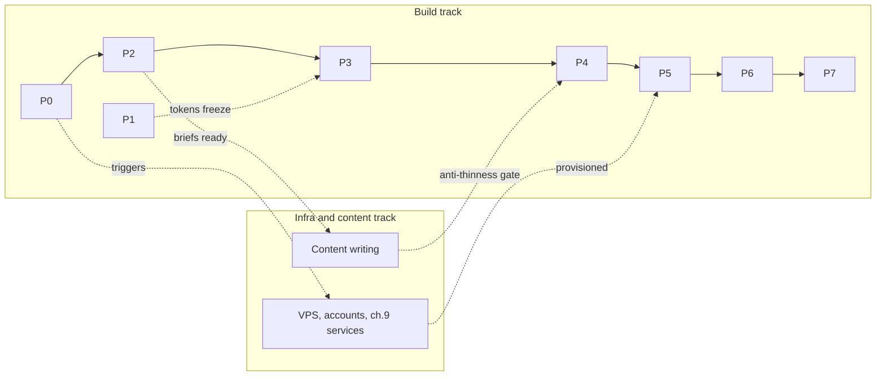

## 11. Phase-Wise Development Plan and Acceptance Criteria

This chapter converts chapters 3–10 into an executable build order: 8 phases, P0–P7, each independently shippable, each closing on binary acceptance criteria that chapter 12 quotes verbatim in its Kimi Code prompts and chapter 13 draws its risk register from. The stack is fixed: Next.js 16.2.x + Payload CMS 3.86 (embedded, PostgreSQL) + React 19 + Tailwind CSS v4 + shadcn/ui, delivered as a single Dockerfile.

### 11.1 Delivery model, estimation basis, and phase gates

#### 11.1.1 8 phases P0–P7; estimates are judgment bands assuming 1–2 devs, not researched velocity; every phase independently shippable; phase-gate evidence rule

Three rules govern the plan. **Estimates are judgment bands** — person-day ranges (judgment call) derived from deliverable counts, assuming 1–2 full-time developers, calibrated only against market context: specialist builds run 6–8 / 12–16 / 16–24 weeks by complexity tier[^23^], migration work tiers at 1 / 3 / 5 months[^39^]; the 11.10 roll-up lands inside these bands as a sanity check, not a basis. **Every phase is independently shippable** — each gate ends deployed to staging in a coherent state, so a scope cut after any gate leaves a working site. **Phase-gate evidence rule** — a criterion closes only with runnable evidence (a URL, a CI run, admin state, a scripted test), never a prose assertion; one failure keeps the phase open.

**Phase overview.**

| Phase | Name | Scope center | Deliverable count | Estimate (person-days, judgment call) |
|---|---|---|---|---|
| P0 | Foundation and scaffold | Repo, tooling, CI, first deploy | 1 app, 1 pipeline, 4 environments | 5–8 |
| P1 | Design system | Tokens, primitives, shell | Token set, ~10 primitives, catalog | 6–9 |
| P2 | CMS collections and content model | Full ch.5 schema + seed | 16 collections, 5 globals, 13 block schemas | 10–14 |
| P3 | Core marketing pages | Money pages + block renderers | 13 block renderers, 20 routes | 18–24 |
| P4 | Proof and content engine | Case studies, insights, migrations, markets | 26 routes/templates + launch content | 22–27 |
| P5 | Conversion and integrations | Booking, forms, email, calculator, analytics | 5 forms, 4 email templates, 8 events, 1 tool | 12–16 |
| P6 | SEO/GEO, performance, hardening | Schema, budgets, a11y, security | 5 JSON-LD types, 10.2 register enforced | 8–12 |
| P7 | Deployment, monitoring, operations | Cutover, backups, handover | 9-step cutover, restore test, monitor matrix | 4–6 |

The distribution is deliberate. P3+P4 hold roughly half the effort (40–51 of 87–119 person-days) because they carry 46 of the 54 launch routes and all thirteen block renderers; the addendum's expansion lifts each band ~30–40% over the commerce-only baselines of 14–18 and 16–20 (D8). P2 ranks third because schema rework converts into far costlier P3/P4 page rework. P0's small band is the outlier: the single-Dockerfile architecture makes foundation work configuration, not construction. Implication for GenMedha Hub: effort concentrates where content meets template, so the parallel content track (11.10), not developer availability, most often gates P4.

**Reusable phase work-package template.** Each phase spec in 11.2–11.9 fills these nine fields; chapter 12 maps them one-to-one into prompt sections.

| Field | Content rule |
|---|---|
| Objective | One sentence: the coherent capability this phase adds |
| Entry criteria | What must be demonstrably true before work starts |
| Scope in | Exhaustive build list; anything unlisted is out |
| Scope out | Exclusions preventing drift into other phases' ownership |
| Deliverables | Named artifacts: routes, components, scripts, configs |
| Dependencies | Phases, chapters, and external services consumed |
| Acceptance criteria | Binary, testable statements quoting the owning chapter |
| Estimate band | Person-day range + deliverable-count justification |
| Risk note | Most likely failure mode + mitigation; feeds ch.13 |

### 11.2 Phase 0 — Foundation and scaffold

#### 11.2.1 Repo, environments, baseline Next.js+Payload app, Postgres connectivity, tooling, CI quality checks, initial deploy path; acceptance: app boots, admin reachable, CI green

**Objective:** the delivery machinery exists before any feature does. **Entry criteria:** medium VPS (9.1); GitHub/GHCR/Dokploy/R2 accounts active.

- **Scope in:** 6.2 repo layout; Next.js 16.2.x + Payload 3.86 embedded baseline pinned per 6.1[^1^]; PostgreSQL 16; TypeScript strict, ESLint, Vitest; non-root standalone Dockerfile; the 9.3 CI chain to GHCR and Dokploy; `/api/health`; 6.8 env vars with zod boot validation; four environments (9.2).
- **Scope out:** tokens (P1); collections (P2); marketing routes (P3); production DNS (P7).
- **Deliverables/dependencies:** repo + CI workflow, Dockerfile, health endpoint, staging URL — chapters 6, 9.
- **Acceptance criteria:**
  - [ ] App boots locally against Postgres; `/admin` login succeeds.
  - [ ] Full 9.3 pipeline green on `main`; image in GHCR; Dokploy deploys to staging.
  - [ ] `GET /api/health` returns 200 within 60 s of deploy (DB + `PAYLOAD_SECRET`).
  - [ ] Boot fails loudly on any missing 6.8-required env var.
- **Estimate band:** 5–8 person-days (judgment call — 1 scaffold, 1 pipeline, 4 env configs). **Risk note:** local/staging environment drift — zod boot check; SQLite confined to local/CI (9.2).

### 11.3 Phase 1 — Design system

#### 11.3.1 Tailwind @theme tokens, shadcn/ui primitives, layout primitives, global shell, a11y states, component catalog page

**Objective:** every visual decision downstream pages need is made once, in code. **Entry criteria:** P0 gate passed.

- **Scope in:** Tailwind v4 `@theme` tokens, contrast ≥4.5:1 verified[^86^]; ~10 shadcn/ui primitives; layout primitives (container, grid, section, stack); the 4.2 global shell — header, grouped Services dropdown (Commerce / Build & Grow), footer, breadcrumbs, sticky mobile CTA; 10.3 interactive states; a noindex `/dev/catalog` page rendering every primitive in every state.
- **Scope out:** block renderers (P3); page composition; content.
- **Deliverables/dependencies:** `@theme` stylesheet, primitive library, shell components, catalog page — P0; chapters 4.2, 6.3, 10.3.
- **Acceptance criteria:**
  - [ ] Catalog renders all primitives and states; axe reports zero violations.
  - [ ] Visible focus indicator on every interactive element; `prefers-reduced-motion` honored.
  - [ ] Shell renders the 3.3 nav order and grouped dropdown (desktop) / accordion (mobile).
  - [ ] Grep-level audit: every @theme token value matches the ch.6.5 token spec exactly; contrast ratios for all text/background token pairs ≥4.5:1 recorded on the component catalog page (ch.10.3).
- **Estimate band:** 6–9 person-days (judgment call — ~10 primitives, 4 shell parts, 1 catalog). **Risk note:** token churn after P3 reworks every page — `@theme` freezes at this gate.

### 11.4 Phase 2 — CMS collections and content model

#### 11.4.1 Globals, collections, relationships, validation, media, workflow, preview, seed content; acceptance: schema matches ch.5 exactly, seeds render, draft/preview works

**Objective:** the entire ch.5 contract as running Payload config — schema, not pages, is the product. **Entry criteria:** P0 gate passed (P1 runs in parallel; P2 does not consume it).

- **Scope in:** all 16 collections and 5 globals per the ch.5 field tables, incl. every D4 field (`servicePillar`, `parentService`, Markets, extended CaseStudies metrics/`markets`); the 13-block layout-builder schema incl. PillarCards (5.11); Media via storage-s3 → R2, alt mandatory[^56^]; slug/redirect/cycle-guard hooks (5.8); drafts + access matrix (5.9); Live Preview via Draft Mode[^56^]; the full 5.10.1 seed checklist incl. three substantive Markets seeds.
- **Scope out:** block renderer components and templates (P3); editorial copy (parallel track); form wiring beyond plugin install (P5).
- **Deliverables/dependencies:** collection/global configs, generated types, seed script, `docs/editorial.md` — P0; chapter 5 in full; 3.4 slug rules.
- **Acceptance criteria:**
  - [ ] Grep-level audit: every ch.5 collection, global, and required field exists; `bp:`/`ad:` tags complete (5.10.1).
  - [ ] Fresh-database seed runs idempotently, creating every 5.10.1 checklist item.
  - [ ] Editor cannot publish (5.9); Live Preview renders a draft via Draft Mode.
  - [ ] Slug hooks enforce 3.4.1 (`{source}-to-{target}` pair slugs; `parentService` cycle guard).
- **Estimate band:** 10–14 person-days (judgment call — 16 collections, 5 globals, 13 block schemas, ~20 hooks, 30-item seed). **Risk note:** the plan's largest rework surface — seed-first verification catches schema errors before P3 renders against them.

### 11.5 Phase 3 — Core marketing pages

#### 11.5.1 Homepage, six capability pillars, 4 platform hubs, About, Contact, Book shell, utility pages, nav/footer, baseline metadata; scope-out: no integration embeds yet

**Objective:** the nav's money surface is live and CMS-driven — all six capability pillars, so the Services dropdown never ships half-built (3.2.1). **Entry criteria:** P1 and P2 gates passed.

- **Scope in:** all 13 block renderers (5.11) as RSC-first components (6.3); 20 routes: `/` with the D9 PillarCards band, `/services` + six pillars (three Commerce + Web App, Mobile App, Digital Marketing per D8), `/platforms` + four hubs, `/about`, `/contact` display-only, `/book` static shell, `/legal/*` ×3, `/404`; nav/footer from the Navigation global; baseline metadata from the `seo` group.
- **Scope out:** all integration embeds and forms (P5); all P4 routes; JSON-LD (P6).
- **Deliverables/dependencies:** block renderer library, 20 routes, metadata helper — P1, P2; chapters 3.3, 3.6, 4.2–4.10, 4.18, 6.3.
- **Acceptance criteria:**
  - [ ] Every listed route returns 200 from seeded CMS content; `/book` renders with the embed slot empty (7.2 sequencing).
  - [ ] Each page's primary CTA matches its 3.6 row; offer CTAs pillar-locked (3.6.1).
  - [ ] Nav dropdown renders both groups; breadcrumbs match URL hierarchy at depth 2+.
  - [ ] No orphan routes — every live page reachable from nav, footer, or breadcrumbs (3.7).
- **Estimate band:** 18–24 person-days (judgment call — 13 renderers + 20 routes; baseline 14–18, +~35% per D8). **Risk note:** scope drift into embeds and forms — the gate explicitly accepts an empty embed slot and display-only contact page.

### 11.6 Phase 4 — Proof and content engine

#### 11.6.1 Work index + case-study template, insights engine, authors/categories, 6 migration pages, 5 solution pages, launch content set

**Objective:** every trust-and-search surface is live — the routes that rank and the proof that converts. **Entry criteria:** P3 gate passed; launch copy arriving from the content track.

- **Scope in:** `/work` + case-study template (three-tag related block, 3.7); `/insights` + article template with authors/categories; `/migrate` hub + six pair pages on the field-for-field 4.11/5.3.1 template incl. `whenNotToMigrate`[^40^]; `/solutions` + five model pages; four digital-marketing child pages; `/markets` index + three region pages; `/pricing`; launch content set: ≥3 case studies (placeholder-flagged, 5.4.1), ≥3 posts (one per priority migration cluster, 3.2.2), six pair pages written to blueprint.
- **Scope out:** gated landings and TCO calculator (P5); schema emission (P6); newsletter module (P5).
- **Deliverables/dependencies:** 26 routes/templates, launch content set — P3; chapters 4.11–4.16, 4.19–4.20, 3.7, 5.4–5.5; content track. (Counting convention: each index counts as one route, plus one route per template instance — `/work` + case study, `/insights` + article, `/migrate` + 6 pairs, `/solutions` + 5 models, 4 marketing children, `/markets` + 3 regions, `/pricing` = 26.)
- **Acceptance criteria:**
  - [ ] All 26 routes render from CMS documents; the 3.7 linking checklist passes per template (three-tag rule, pair↔hub, child→pillar, region→service links).
  - [ ] Anti-thinness gate: no indexable page under 800 words unique copy; marketing child pages carry own-engine proof; region pages carry market context, logistics, compliance notes (3.1.1, 5.3.2) — thin pages block sign-off.
  - [ ] Every migration page's mandatory fields populated, incl. sourced EOS anchors (2.4.4 → 2026-04-14; 2.4.5/2.4.6 → 2026-08-11)[^44^].
  - [ ] Every case-study metrics row carries `context`; no bare-number stat ships.
- **Estimate band:** 22–27 person-days (judgment call — 26 routes/templates + content integration; baseline 16–20, +~35% per D8). **Risk note:** content writing, not code, is the de facto critical path — the anti-thinness gate converts missing copy into a hard blocker.

### 11.7 Phase 5 — Conversion and integrations

#### 11.7.1 Cal.com (inline + pop-up + routing form), form-builder forms, Resend templates, Listmonk sync, HubSpot CRM sync, lead magnets, TCO calculator, Umami events; acceptance: end-to-end lead flow

**Objective:** every ch.7 lead flow works end to end; the site starts capturing demand. **Entry criteria:** P3 gate passed; Listmonk, Umami, R2 live (ch.9 infra track); Cal.com Cloud, Resend, SES, HubSpot free accounts provisioned.

- **Scope in:** Cal.com inline embed, pop-up, and Routing Form per 7.2[^60^]; the five 7.3.1 forms via plugin-form-builder[^3^] with honeypot/time/rate-limit controls; four React Email templates via the Resend adapter (7.4.1)[^64^]; Listmonk sync with double opt-in, retries, nightly reconciliation (7.5, 7.9); HubSpot contact/booking upserts with the D15 source-tag taxonomy, property writes, and nightly CRM reconciliation (7.3.1 CRM sync, 7.10)[^94^]; three gated checklist landings + `/resources` with signed-URL delivery[^56^]; the TCO calculator island with email-gated results (7.6.1)[^51^]; the eight-event Umami inventory (7.8.1)[^81^]; `/thank-you/*` ×3.
- **Scope out:** schema, sitemap, and performance work (P6); production cutover (P7).
- **Deliverables/dependencies:** booking surface, form renderers + server hooks, email templates, sync jobs, calculator, event wiring — P2 models, P3 shell; chapter 7 in full; ch.9 infra.
- **Acceptance criteria:**
  - [ ] Booking completes end-to-end per the ch.7.2 contract: routing form qualifies, slot confirms, `booking_completed` fires, /thank-you/booking renders; fallback card renders with the embed disabled (6.9).
  - [ ] Each of the five forms lands a Postgres row first, then its downstream action — scripted staging submission per form (7.3.1).
  - [ ] Newsletter path verified in Listmonk: subscribe → double opt-in → list entry → unsubscribe (7.5.1).
  - [ ] Calculator result email carries the estimate disclaimer (7.6.1); all eight Umami events fire with no PII in props (7.8.1).
  - [ ] HubSpot receives each staged form lead and test booking as an upserted contact with the correct source tag (7.10); CRM reconciliation job reports zero drift against Postgres.
- **Estimate band:** 14–19 person-days (judgment call — 5 forms, 4 templates, 3 embed patterns, 4 sync jobs incl. HubSpot contact/booking upserts + reconciliation, 1 calculator, 8 events, source-tag taxonomy). **Risk note:** third-party sandbox flakiness can stall evidence — accounts and DNS records are provisioned in the infra track weeks earlier.

### 11.8 Phase 6 — SEO/GEO, performance, and launch hardening

#### 11.8.1 Structured data, sitemap/robots/OG/llms.txt, redirects, perf optimization to budgets, a11y remediation, security checks; Lighthouse CI gate enforced

**Objective:** the site passes the ch.10 register as a release-blocking gate — GenMedha Hub's scores are its own sales evidence (10.1). **Entry criteria:** P4 and P5 gates passed; scope frozen except operations.

- **Scope in:** JSON-LD builders (Organization, Service, Article, FAQPage, BreadcrumbList) per the ch.8 schema plan[^68^][^69^]; `sitemap.ts`, `robots.ts` with the ch.8 crawler policy, per-page OG images, `llms.txt` as ship-as-hygiene[^74^]; Redirects validation (no chains, trailing-slash canonicalization)[^48^]; performance to the 10.2 budgets — text-LCP templates, image caps, first-load JS ≤200KB; WCAG 2.2 AA remediation against the 10.3 checklist[^86^]; 10.4 controls verified row by row; Lighthouse CI + axe stages in the pipeline (10.7).
- **Scope out:** new routes, features, or content; DNS and cutover (P7).
- **Deliverables/dependencies:** schema/metadata builders, hardened templates, CI gate stages, signed audit artifacts — P4, P5; chapters 8, 10, 3.4, 6.3.
- **Acceptance criteria:**
  - [ ] Lighthouse mobile ≥90 Performance / 100 Accessibility / ≥95 Best Practices / 100 SEO on home, platform hub, and migration-pair templates, merge-blocking in Lighthouse CI per ch.10.2[^87^][^88^].
  - [ ] TTFB <800ms on key templates against the staging ISR cache (10.2)[^85^].
  - [ ] JSON-LD validates on every template; sitemap enumerates exactly the launch URLs; robots.txt live.
  - [ ] The 10.3 checklist passes 100% on key templates, dated sign-off; every 10.4 control row verified.
- **Estimate band:** 8–12 person-days (judgment call — 5 schema builders, 4 metadata surfaces, remediation across 6 templates). **Risk note:** INP is the most-failed CWV metric (~43% of sites)[^85^] — a JS-budget breach found here means P3/P4 rework, so the ≤200KB check runs from P3 onward.

### 11.9 Phase 7 — Deployment, monitoring, and post-launch operations

#### 11.9.1 Production deploy, DNS cutover, backups + restore test, monitoring, rollback readiness, operational handover, post-launch review

**Objective:** the site goes live on `genmedhahub.com` with proven recovery and a named operator. **Entry criteria:** P6 gate passed; content frozen 24 h ahead; DNS TTL at 300 s (9.8).

- **Scope in:** the nine-step 9.8 cutover runbook (TLS, cache-warming, smoke tests, analytics verification); nightly `pg_dump` for all three Postgres instances, rclone off-VPS (9.5)[^79^]; one full restore test into a throwaway Dokploy instance; the 9.6 monitoring matrix incl. the non-negotiable external monitor[^82^][^83^]; rollback armed — previous GHCR tag recorded, runbook rehearsed on staging (9.4); operational handover (patch calendar, alert triage); +14-day review comparing CrUX field data against the 10.2 budgets.
- **Scope out:** any feature or content work; scaling changes (trigger-based per 9.8).
- **Deliverables/dependencies:** live production site, backup/restore evidence, monitor dashboard, handover document, review note — P6; chapter 9 in full; 10.7 checklist.
- **Acceptance criteria:**
  - [ ] Every 10.7 launch quality-gate checklist item passes, incl. form/booking/newsletter end-to-end tests against production.
  - [ ] The 9.8 runbook executes in order: HTTPS 200 with valid certificates on `/`, `/services`, `/work`, `/insights`, `/contact`; second-pass TTFB <800ms.
  - [ ] Restore test signed off — production dumps rebuild a throwaway instance with matching row counts (9.5).
  - [ ] External monitor and Uptime Kuma both green; rollback runbook step 1 output recorded (9.4).
- **Estimate band:** 4–6 person-days (judgment call — 9 cutover steps, 1 restore test, 7-row monitor matrix, handover). **Risk note:** DNS propagation variance and untested restores are the classic day-one surprises — the restore test and rehearsed rollback are mandatory gate evidence.

### 11.10 Dependency critical path and estimate roll-up

#### 11.10.1 Critical path P0→P2→P3→P4→P5→P6→P7; parallel tracks (P1 ∥ infra setup; content writing ∥ P3–P4 build; ch.9 infra ∥ P3); total estimate range + assumptions

**Phase dependency map.**

| Phase | Depends on | Can parallel with | Unblocks | Primary chapters referenced |
|---|---|---|---|---|
| P0 | — | VPS/account provisioning | All phases | 6, 9 |
| P1 | P0 | P2; infra setup | P3 | 4.2, 6.3, 10.3 |
| P2 | P0 | P1; content writing starts | P3, P4, P5 | 5, 3.4 |
| P3 | P1, P2 | Content writing; ch.9 infra (Listmonk, Umami, R2, SES, Cal.com) | P4, P5 | 3, 4.2–4.10, 4.18, 6.3 |
| P4 | P3 | Content writing (gating input) | P5, P6 | 4.11–4.16, 4.19–4.20, 3.7, 5 |
| P5 | P3; ch.9 infra live | P4 tail (content integration) | P6, P7 | 7, 5.6 |
| P6 | P4, P5 | — | P7 | 8, 10, 3.4 |
| P7 | P6 | — | Launch | 9, 10.7 |

Usage note: a phase starts only when its "Depends on" column is gated green; the "Can parallel with" column is where calendar time is recovered.

**Critical-path figure (describe to designer).** Two horizontal lanes across a P0–P7 timeline. Top lane — **build track** (critical path, bold arrow chain): P0 → P2 → P3 → P4 → P5 → P6 → P7, with a slim P1 block beneath P2–P3, joined by a dashed "tokens freeze before page work" line. Bottom lane — **infra/content track**: a "VPS + accounts + ch.9 services" bar from P0 to the P3/P4 boundary, dashed arrow into P5 ("integrations provisioned before wiring"); a "content writing" bar from mid-P2 through P4, ending at a hard gate marker on the P4 anti-thinness check. Annotate the P4→P5 junction: "content, not code, is the usual long pole". Mark merge points: infra→P5, content→P4.

**Total estimate and assumptions.**

| Roll-up row | Value | Basis |
|---|---|---|
| Total effort, low | 87 person-days | Sum of phase lows (5+6+10+18+22+14+8+4) |
| Total effort, high | 119 person-days | Sum of phase highs (8+9+14+24+27+19+12+6) |
| Calendar, 1 developer | ~17–24 weeks | 87–119 days at 5 days/week, no parallel tracks |
| Calendar, 2 developers | ~10–14 weeks | Parallel tracks exploited; ~10–15% coordination overhead (judgment call) |
| Content writing (tracked separately) | ~30–40 person-days, parallel | ~40 routes of blueprint-constrained copy (judgment call) |
| Market-context check | 12–16-week mid-complexity band[^23^]; 1/3/5-month migration tiers[^39^] | Two-developer calendar sits inside the observed band |

The roll-up is consistent with its inputs: the two-developer calendar (10–14 weeks) matches the mid-complexity tier of observed specialist builds[^23^] — expected, since 54 routes, thirteen block renderers, and five integration flows sit squarely mid-tier. The largest sensitivity is P4: its content dependency can add calendar weeks without adding one development person-day, which is why the content track starts at P2. The addendum's effect is explicit: P3+P4 carry ~30–40% uplifts over commerce-only baselines (D8), ~12–16 of the 87–119 person-days; the v3 CRM addition (D10–D15) adds 2–3 person-days inside the P5 band. Planning implication for GenMedha Hub: staff two developers to hold the 10–14-week window; a solo developer plans against the 17–24-week row and treats any scope addition as a re-roll trigger, not an absorption.

**Assumptions (all judgment calls; a violated assumption re-rolls the affected phase):**

- [ ] Team is 1–2 developers at full-time allocation; bands are judgment estimates, not measured velocity (11.1.1).
- [ ] Content writing is resourced separately, running parallel from mid-P2 at the anti-thinness standard (3.1.1).
- [ ] Client review turnaround at each gate is ≤3 business days; longer stalls move the calendar, not the person-day totals.
- [ ] Scope is frozen at the addendum D8 baseline — 54 routes, 13 blocks, 5 integrations; additions follow change control (ch.13.4).
- [ ] Third-party accounts (Cal.com, Resend, SES, R2) and ch.9 services are provisioned in the parallel infra track; entry tiers suffice at launch volumes[^60^][^64^][^66^].
- [ ] No paid media, localization, or hreflang work is in scope (single-language launch, 3.8).
